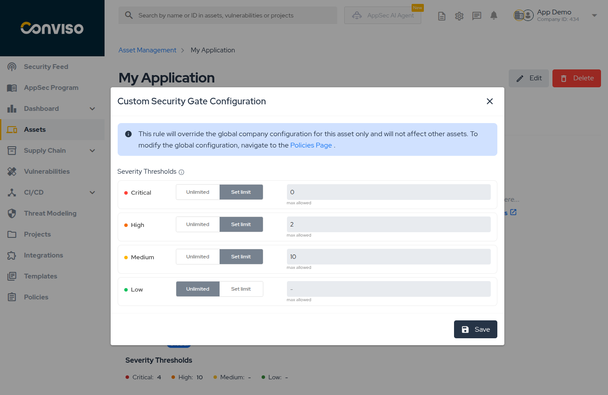

## Introduction

The **Security Gate** ensures that your applications meet specific security criteria before proceeding in the deployment pipeline. By defining policies based on vulnerability severity and counts, you can automatically block builds that don't meet your security standards.

The Platform allows you to configure global company-wide policies, override them with asset-specific custom rules, and monitor all Security Gate executions.

## Usage
You can monitor all Security Gate runs across your company from the **CI/CD > Security Gate** menu.

This page lists all executions, showing the Status (Passed/Failed), Asset, and Execution Date.

**Features:**
*   **Filtering:** Filter by **Status** (Passed/Failed), **Asset**, or **Executed at** date.
*   **Search:** Use the search bar to find executions by **ID** or **Asset Name**.
*   **Sorting:** Sort the table by ID, Status, or Execution Date.
*   **Save Filter:** You can save your current filter configuration to be the default view whenever you access this page.

### Execution Details

Clicking on any execution in the list opens the **Execution Details** page.

This view provides comprehensive information about why a pipeline passed or failed:

*   **Execution Info:** ID, Asset links, and timestamp.
*   **Security Gate Rules:** Displays the rule used (Global or Custom) and a breakdown of each severity.
    *   It shows the **Threshold** (limit configured) vs. **Found** (actual vulnerabilities detected).
    *   Statuses like **BLOCKED** (exceeded limit) or **PASSED** (within limit) are clearly marked.
*   **Latest Asset Scans:** A card at the bottom showing the most recent scans for this asset, providing context on where the vulnerabilities might have originated.

## Configuring your Security Gate policy

Security Gate policies define the maximum number of vulnerabilities allowed by severity level. You can configure these policies in two ways:

- **Global Policy:** A default rule that applies to all assets in your company
- **Asset-Specific Custom Rules:** Override the global policy for individual assets that require different thresholds

### Global Policy Configuration

The global policy serves as the default Security Gate rule for all assets. This is useful for establishing a company-wide security baseline.

1. Navigate to **Policies** in the main menu.
2. Locate the **Security Gate (Global)** section.
3. Set the maximum allowed number of vulnerabilities for each severity level (**Critical**, **High**, **Medium**, **Low**).
   - Click **Set limit** to define a maximum threshold.
   - Click **Unlimited** to allow any number of vulnerabilities for that severity level.
4. Click **Save Policies**.

:::info
Setting limits (e.g., "Max 0 Critical") ensures that any asset exceeding this threshold during a pipeline scan will fail the Security Gate check. All assets will use these limits unless they have a custom rule configured.
:::

### Asset-Specific Custom Rules

For specific assets that require different thresholds, you can configure custom rules that override the global policy. This is useful for:

- **Legacy applications** that need more lenient rules during gradual security improvements
- **Critical applications** that require stricter security standards
- **Special projects** with unique security requirements

#### Viewing Active Rule

Navigate to **Assets**, select an asset, and go to the **CI/CD** tab. You will see the **Security Gate** card displaying which rule is currently active (Global or Custom) along with the configured limits for each severity level.

#### Creating a Custom Rule

1. On the Security Gate card, click the **options menu (...)** and select **Configure Custom Rule**.
2. In the modal, define the specific vulnerability limits for this asset.
3. Click **Save**.

:::tip
When a custom rule is active, the card will display **Active rule: Custom**. The custom rule will be used instead of the global policy when Security Gate runs in the pipeline for this asset.
:::

#### Removing a Custom Rule

To revert an asset to the global policy:

1. Click the **options menu (...)** on the Security Gate card.
2. Select **Remove Custom Rule**.
3. In the confirmation modal, click **Yes, remove it** to confirm.
4. The asset will now use the global policy.

## Running Security Gate with the AST

After configuring your policies in the Platform, integrate Security Gate into your CI/CD pipeline using the Conviso AST.

The AST will evaluate vulnerabilities against your configured policies and block the pipeline if thresholds are exceeded.

**[View the complete CI/CD integration guide →](/cli/security-gate/#2-running-security-gate-with-the-ast)**

