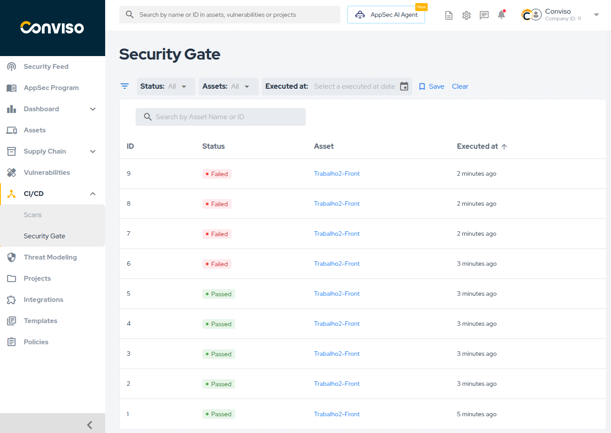
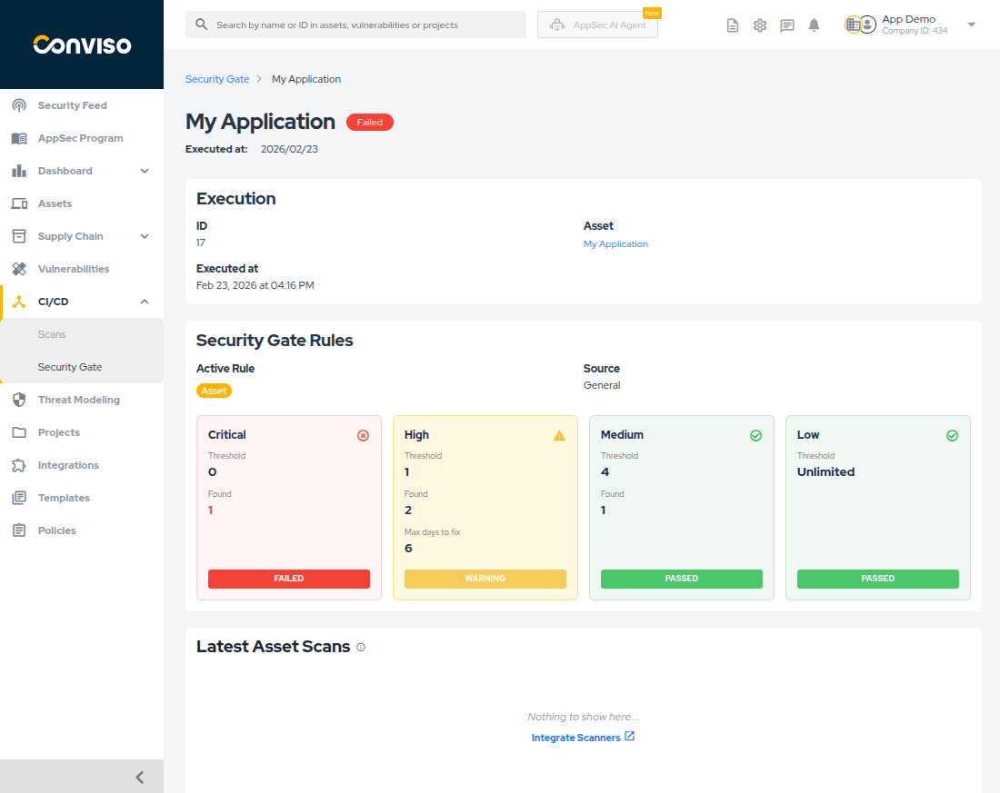
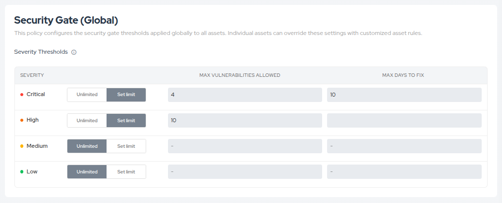
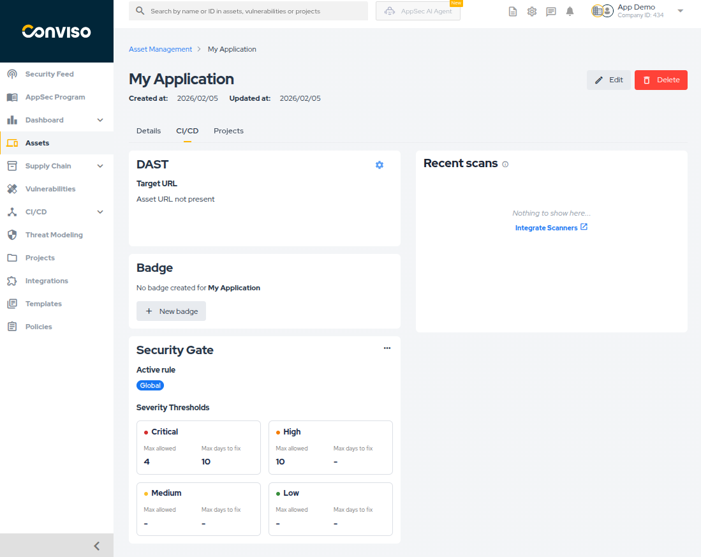
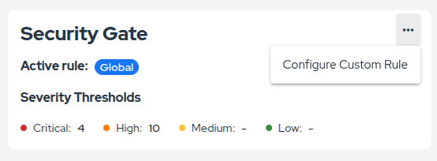
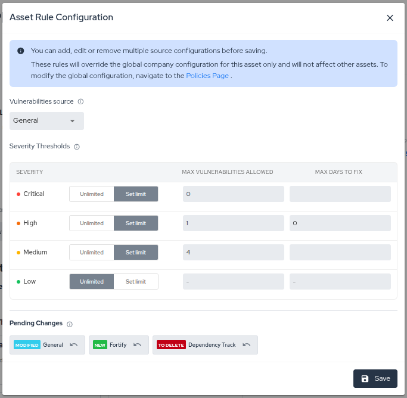
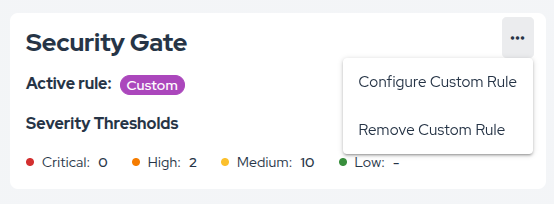
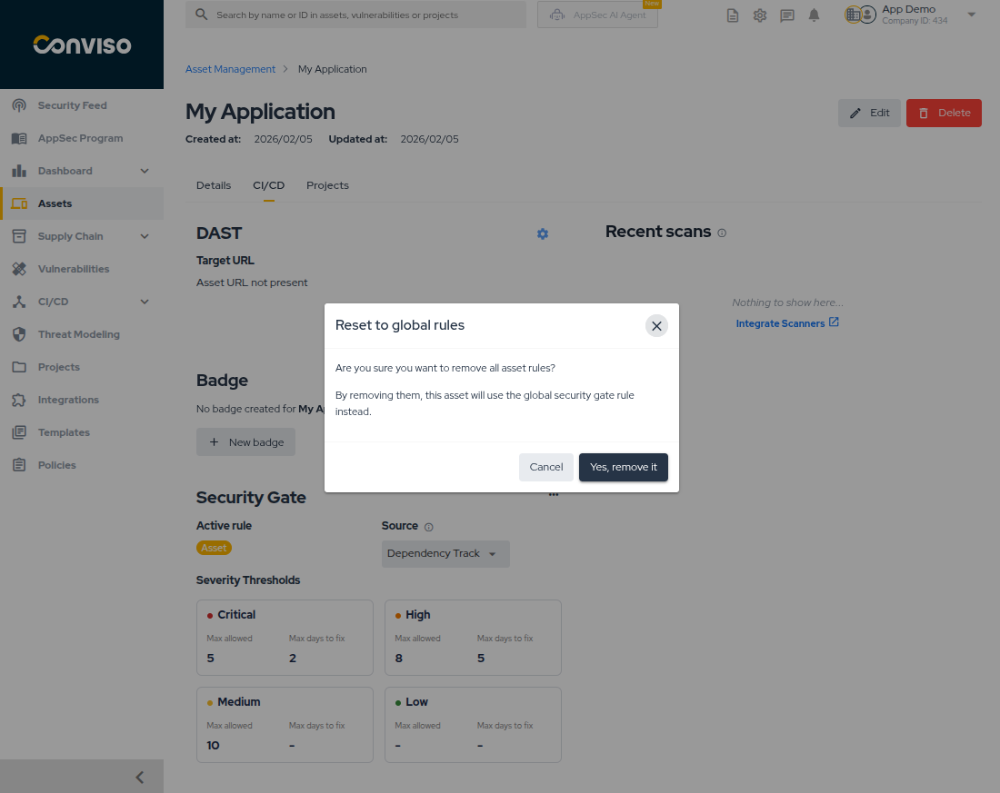

## Introduction

The **Security Gate** ensures that your applications meet specific security criteria before proceeding in the deployment pipeline. By defining policies based on vulnerability severity and counts, you can automatically block builds that don't meet your security standards.

The Platform allows you to configure global company-wide policies, override them with asset-specific custom rules, and monitor all Security Gate executions.

## Usage
You can monitor all Security Gate runs across your company from the **CI/CD > Security Gate** menu.

This page lists all executions, showing the Status, Asset, and Execution Date.

**Features:**
*   **Filtering:** Filter by **Status** (Passed/Failed/Warning), **Asset**, or **Executed at** date.
*   **Search:** Use the search bar to find executions by **ID** or **Asset Name**.
*   **Sorting:** Sort the table by ID, Status, or Execution Date.
*   **Save Filter:** You can save your current filter configuration to be the default view whenever you access this page.

**Status Definitions:**

*   **Passed:** All vulnerability counts are within the set limits.
*   **Failed:** At least one vulnerability has exceeded the `Max days to fix` deadline.
*   **Warning:** At least one vulnerability exceeds the `Max vulnerabilities allowed` threshold, but **none** have exceeded the `Max days to fix` limit yet.

### Execution Details

Clicking on any execution in the list opens the **Execution Details** page.

This view provides comprehensive information about why a pipeline passed or failed:

*   **Execution Info:** ID, Asset links, and timestamp.
*   **Security Gate Rules:** Displays the rule used and a breakdown of each severity.
    *   **Rule Types:**
        *   **Global:** Company-wide default rule applied to all assets.
        *   **Asset:** Custom rule configured per asset through the Platform.
        *   **Custom:** Rules defined directly in your repository using a YAML file or via the GraphQL API, providing an alternative for code-based configuration. You can find more information here [View the YAML configuration guide](/security-scans/security-gate/#creating-the-security-gate-rules-in-the-yaml-file) and here [View the GraphQL API documentation](/api/graphql/documentation/operations/queries/security-gate-run).
    *   It shows the **Threshold** (limit configured) vs. **Found** (actual vulnerabilities detected).
    *   **Max days to fix:** The amount of days a vulnerability can remain open before it blocks the pipeline.
    *   **Expired:** Shows the count of vulnerabilities that have already exceeded the allowed days to fix.
    *   Statuses like **Failed** (exceeded deadline or limit), **Warning** (exceeded limit but within deadline), or **Passed** (within limits) are clearly marked.
*   **Latest Asset Scans:** A card at the bottom showing the most recent scans for this asset, providing context on where the vulnerabilities might have originated.

## Configuring your Security Gate policy

Security Gate policies define the maximum number of vulnerabilities allowed by severity level. You can configure these policies in two ways through the Platform:

- **Global Rule:** A default rule that applies to all assets in your company.
- **Asset Rules:** Override the global rule for individual assets that require different thresholds.

### Global Rule Configuration

The global rule serves as the default Security Gate rule for all assets. This is useful for establishing a company-wide security baseline.

1. Navigate to **Policies** in the main menu.
2. Locate the **Security Gate (Global)** section.
3. Set the thresholds for each severity level (**Critical**, **High**, **Medium**, **Low**):
   - **Max Vulnerabilities Allowed:**
     - Click **Set limit** to define a maximum threshold.
     - Click **Unlimited** to allow any number of vulnerabilities for that severity level.
   - **Max Days to Fix:** Define the number of days a vulnerability has to be corrected before the pipeline is blocked. If this field is left blank, it is equivalent to setting it to 0, meaning there are no extra days allowed for vulnerability resolution.
4. Click **Save Policies**.

:::info
Setting limits ensures that any asset exceeding these thresholds during a pipeline scan will trigger a Security Gate result of either **Warning** or **Failed**.  All assets will use these limits unless they have a custom rule configured.
:::

### Asset Rules

For specific assets that require different thresholds, you can configure custom rules that override the global rule. This is useful for:

- **Legacy applications** that need more lenient rules during gradual security improvements
- **Critical applications** that require stricter security standards
- **Special projects** with unique security requirements

#### Viewing Active Rule

Navigate to **Assets**, select an asset, and go to the **CI/CD** tab. You will see the **Security Gate** card displaying which rule is currently active (Global or Asset) along with the **Max allowed** and **Max days to fix** configuration for each severity level.

#### Creating an Asset Rule

1. On the Security Gate card, click the **options menu (...)** and select **Add/Edit configuration**.
2. In the modal, define the specific vulnerability limits and fix deadlines for this asset.
   - You can configure rules for multiple **vulnerability sources** (e.g., General, Sonarqube, Dependency Track) in a single session.
3. Review your changes in the **Pending Changes** section at the bottom of the modal.
   - You can **Undo** any specific change before saving.
4. Click **Save** to apply all pending changes simultaneously.

#### Removing an Asset Rule

To revert an asset to the global rule:

1. Click the **options menu (...)** on the Security Gate card.
2. Select **Reset to global rule**.
3. In the confirmation modal, click **Yes, remove it** to confirm.
4. The asset will now use the global rule.

## Running Security Gate with the AST

After configuring your policies in the Platform, integrate Security Gate into your CI/CD pipeline using the Conviso AST.

The AST will evaluate vulnerabilities against your configured policies and block the pipeline if thresholds are exceeded.

**[View the complete CI/CD integration guide →](/security-scans/security-gate/#2-running-security-gate-with-the-ast)**
