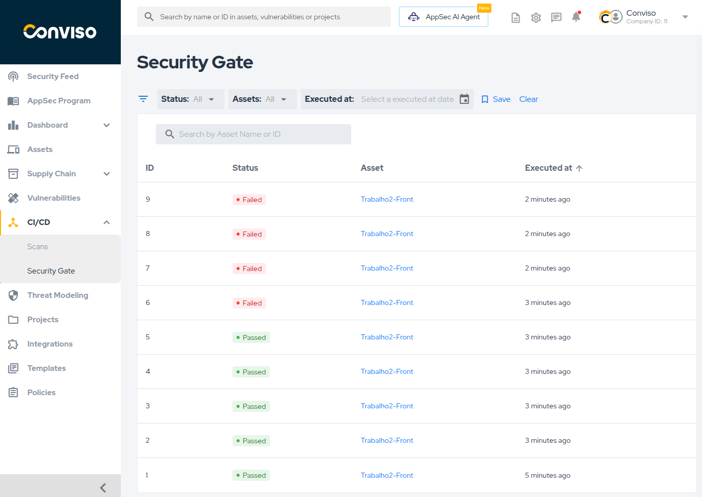
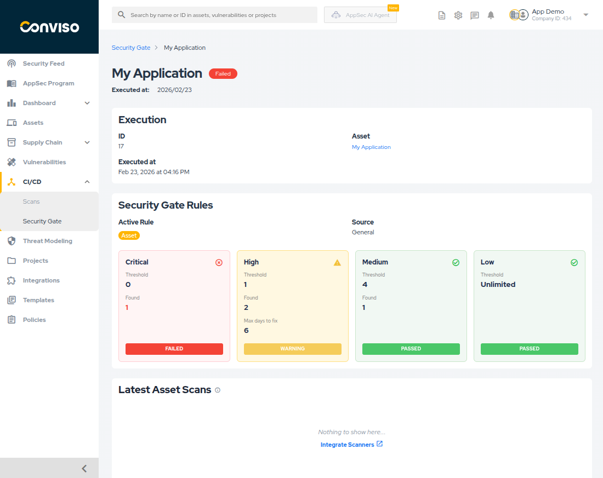

## Overview

The **Security Gate** ensures that your applications meet specific security criteria before proceeding in the deployment pipeline. By defining policies based on vulnerability severity and counts, you can automatically block builds that don't meet your security standards.

In the Conviso Platform, this feature allows you to:

* monitor Security Gate executions across assets;
* review the reason a pipeline passed, failed, or generated a warning;
* understand which rule was applied to the execution.

For the complete setup flow, policy options, YAML configuration, and CI/CD execution commands, see the [Security Gate guide](../security-scans/security-gate.md).

## Access the Screen

You can monitor all Security Gate runs across your company from the **CI/CD > Security Gate** menu.

This page lists all executions, showing the status, asset, and execution date.

## What You Can Do on This Screen

The main screen supports:

* filtering by **Status**, **Asset**, and **Executed at** date;
* searching by **ID** or **Asset Name**;
* sorting by ID, status, or execution date;
* saving the current filter as the default view.

## Execution Statuses

Execution results are shown with the following statuses:

* **Passed:** all vulnerability counts are within the configured limits.
* **Failed:** at least one vulnerability has exceeded the `Max days to fix` deadline.
* **Warning:** at least one vulnerability exceeds the `Max vulnerabilities allowed` threshold, but none have exceeded the `Max days to fix` deadline yet.

### Vulnerabilities Considered

The Security Gate evaluates and counts vulnerabilities that are in any of the following statuses, as they represent risks that have been validated or are still pending final resolution:

*   **Identified**
*   **In Progress**
*   **Awaiting Validation**

Vulnerabilities marked as **Fixed**, **Risk Accepted**, or **False Positive** are **not** counted toward policy thresholds and will not block the pipeline.

For the platform's vulnerability status definitions, see [Workflow Status](../vulnerability-management/workflow-status.md).

### Execution Details

Clicking on any execution in the list opens the **Execution Details** page:

This view helps you understand:

* execution ID, asset, and timestamp;
* which rule type was applied:
  * **Global**
  * **Asset**
  * **Custom**
* threshold versus found vulnerabilities by severity;
* expired vulnerabilities that exceeded the configured days to fix;
* latest scans for the asset, to help explain the outcome.

## Learn More

Use the detailed guide when you need to:

* configure global or asset-level rules;
* create YAML-based policies in the repository;
* run Security Gate in CI/CD with Conviso AST;
* understand command responses and policy behavior.

**[Open the complete Security Gate guide →](../security-scans/security-gate.md)**
