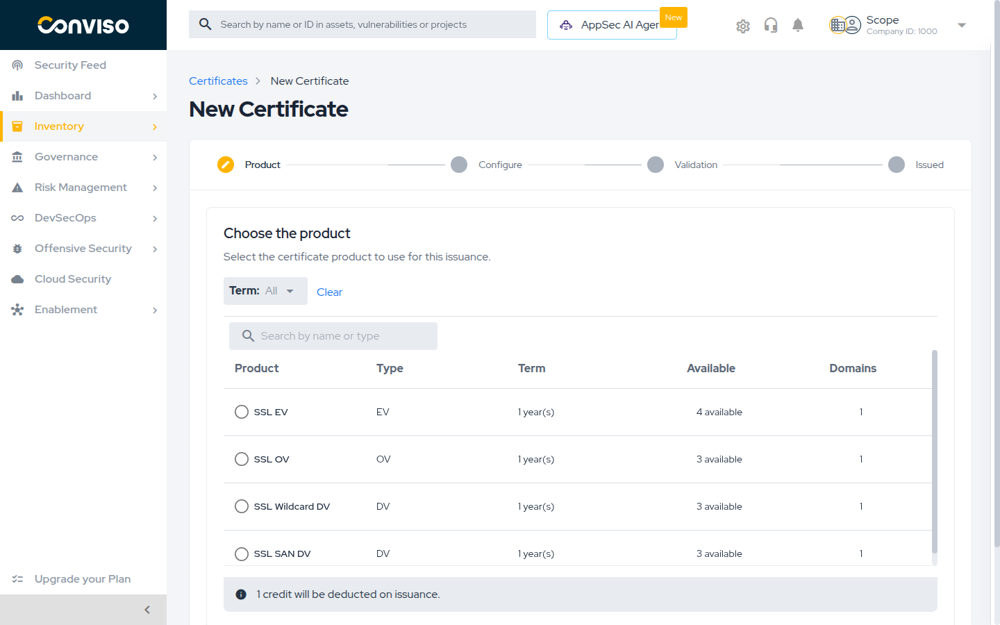
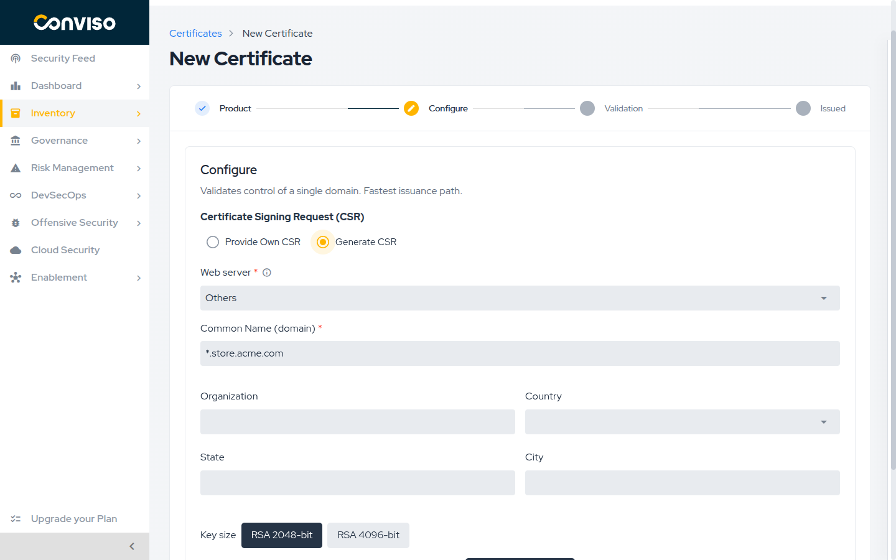
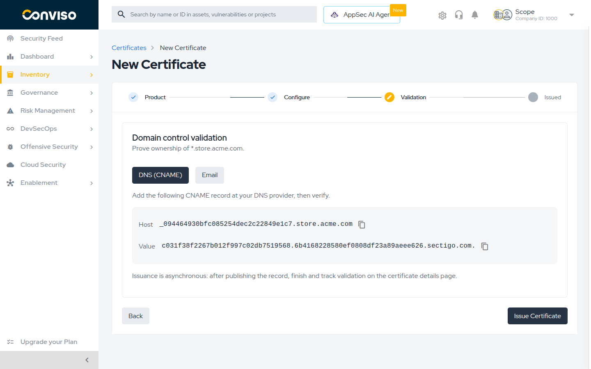

## Objective

Issue an SSL/TLS certificate through the Conviso Platform: choose the product, prepare the
Certificate Signing Request, provide the organization data your validation level requires, and
publish the record that proves you control the domain.

## Prerequisites

* The SSL Certificates module enabled for your account, and permission to create certificates. See
  [Before You Start](./ssl-certificates.md#before-you-start).
* At least one credit with status **Available** for the product you want to issue. See
  [Certificate Credits](./ssl-certificates.md#certificate-credits).
* Access to publish a **DNS record** for the domain, to **upload a file** to its web server, or to
  **receive e-mail** at one of its approved addresses — one of the three is required to prove
  control.
* If you will provide your own CSR, generate it before starting.

Open **Inventory > Assets > Certificates** and select **New Certificate** to start the wizard.

:::note
The wizard adapts to the product you choose. The **Organization** step appears only for OV and EV
products, and the **Review** step only for multi-domain products. A single-domain DV certificate
goes straight from **Configure** to **Validation**.
:::

## Step 1: Choose the Product

The first step lists the credits you can spend, grouped by product:

| Column | Content |
| --- | --- |
| **Product** | The certificate product |
| **Type** | `DV`, `OV` or `EV` |
| **Term** | The subscription length, in years |
| **Available** | How many credits of that product you hold |
| **Domains** | How many domains the product covers |

Filter by **Term** or search by name or type to narrow the list, then select the product's radio
button. Only credits with status **Available** appear here; if the table is empty you will see
`No credits available to issue.` and need to
[request credits](./ssl-certificates.md#requesting-credits) first.

The banner `1 credit will be deducted on issuance.` is a reminder that the credit is spent when the
order is placed.

:::caution
Changing the product **resets everything you have already filled in** in the wizard. Pick the
product first, and change it only if you are prepared to start over.
:::

Select **Continue**.

## Step 2: Configure the Certificate

This step produces the **Certificate Signing Request (CSR)** — the file that carries your public
key and the domain names the certificate will cover.

First choose the **Web server** where the certificate will be installed. The field defaults to
`Others`, which is the right answer when your server is not on the list or you are not sure.

Then choose how to obtain the CSR.

### Option A: Provide Own CSR

This is the default. Paste the CSR you generated on your server into the **CSR** field and select
**Verify CSR**. The platform parses it and shows a **CSR details** summary: key size, Common Name,
organization, country, state, city and any additional domains it carries.

Use this option whenever the private key must stay on the server — which is the usual practice.

Select **Change CSR** if you need to replace it.

### Option B: Generate CSR

The platform generates the CSR and the private key for you. Fill in:

| Field | Required | Notes |
| --- | --- | --- |
| **Common Name (domain)** | Yes | The main domain, up to 64 characters. For a wildcard product it must start with `*.`, for example `*.acme.com` |
| **Additional domains (SAN)** | No | Multi-domain products only. Type a domain and press Enter; commas, semicolons and spaces also separate entries |
| **Organization** | For OV and EV | The organization's legal name |
| **Country**, **State**, **City** | For OV and EV | The organization's location |
| **Key size** | Yes | `RSA 2048-bit` (default) or `RSA 4096-bit` |

Select **Generate CSR & key**.

:::danger The private key is shown only once
The generated private key is **never stored by the platform**. It is displayed once, on this
screen, and cannot be recovered afterwards.

Select **Download private key** or copy it, and store it securely, **before you continue**. If you
lose it, the certificate that gets issued is unusable and you have to issue a new one — spending
another credit.
:::

### If a certificate already exists for this domain

When your account already holds a valid certificate for the same Common Name, the wizard warns you
before you spend a credit, showing when the existing one expires. Continuing places a **second**
certificate and consumes another credit. If you meant to renew, close the wizard and use
[Reissue](./managing-certificates.md#renewing-with-reissue) on the existing certificate instead —
it consumes no credit.

Select **Continue**.

## Step 3: Organization Details

This step appears **only for OV and EV products**. A chip breadcrumb shows the sections you have to
complete: **Organization** and **Contact** for OV, plus **Jurisdiction** and **Vetting** for EV. A
section turns green when it is valid.

If you provided your own CSR, these fields are prefilled from it and can be edited.

### Organization

All fields are required: **Organization**, **Street address**, **City**, **State**,
**Postal code** and **Country**. Use the organization's legal registration data — this is what the
certificate authority verifies.

The optional **Prioritise the CSR values on conflict** checkbox is off by default. Leave it off
unless you want the certificate authority to prefer the values inside your CSR whenever they differ
from what you type here.

### Contact

The **Contact details** section registers the **Application Representative** for the organization.
Use **Prefill from a user** to copy the data of a platform user, or type it in: **First name**,
**Last name**, **E-mail** and **Telephone** are required, **Job title** is optional.

:::caution This person will be contacted
The certificate authority contacts this person, by phone or e-mail, to confirm the request was
authorized. **Issuance stays pending until they respond.** Register someone reachable, and let them
know a verification call or e-mail is coming.
:::

### Jurisdiction — EV only

The **Extended validation details** section records where the organization is legally registered:

| Field | Required |
| --- | --- |
| **Company registration number** | Yes |
| **Jurisdiction country** | Yes |
| **Jurisdiction city**, **Jurisdiction state** | No |
| **Date of incorporation** | No |
| **Assumed name** | No |
| **Organization category** — `Private organization`, `Government entity` or `Business entity` | No |

### Vetting — EV only

The **Vetting details** section holds the **Incorporating agency** and the **Main telephone
number**, plus three contacts the certificate authority requires: **Certificate requester**,
**Certificate approver** and **Contract signer**. Each contact needs a full name, job title,
telephone, e-mail and postal address. Use **Copy from…** to reuse data you already entered.

You can defer this: choose **Fill in later** instead of **Fill in now**. The order is placed, but
the certificate is only issued after you complete the vetting details on the certificate's detail
page. See
[Completing EV vetting details](./managing-certificates.md#completing-ev-vetting-details).

Select **Continue**.

## Step 4: CSR Review

This step appears **only for multi-domain products**. It is read-only: check the key size, Common
Name, organization and location, then the full list of domains the certificate will cover.

Confirm the domain list carefully — it is fixed when the order is placed. Select **Continue**.

## Step 5: Domain Control Validation

Domain Control Validation (DCV) is how you prove to the certificate authority that you control each
domain in the certificate. Choose one of three methods per domain.

### DNS (CNAME)

The default, and the most reliable. The platform shows a **Host** and a **Value**; create that
CNAME record at your DNS provider, exactly as shown.

This is the only method that works for every domain, including wildcards, and it does not require
the domain to be serving traffic yet.

### HTTPS

The platform shows a **File URL** under `/.well-known/pki-validation/` and the **File contents**.
Create that file on the domain's web server so it is reachable at the URL shown.

This method requires the domain to already answer over HTTPS, and it is **not available for
wildcard domains**.

### Email

The platform sends a validation e-mail to an address you choose from an approved list. The
certificate authority only accepts a fixed set of addresses at the domain and its parent domains:
`admin@`, `administrator@`, `hostmaster@`, `postmaster@` and `webmaster@`. That is why the dropdown
is short — arbitrary addresses cannot be used.

### Multi-domain certificates

For a certificate covering several domains, choose a method for **each** domain in the table
(**Domain**, **Method**, **Record**). Select **View record** to see the record for a domain, or
select several domains and use **Change DCV method** to set the same method for all of them.

**Issue Certificate** stays disabled until every domain has a valid method, and every domain
validated by e-mail has an address chosen. If you apply HTTPS in bulk and some domains are
wildcards, the platform reports `HTTPS not applied to {n} wildcard domain(s).` and leaves those
domains on their previous method.

Publish the record, then select **Issue Certificate**.

:::note Issuance is asynchronous
Placing the order does not issue the certificate. The certificate authority checks your record on
its own schedule, and the certificate is issued once the check passes. You can leave this screen —
validation is tracked on the certificate's detail page.
:::

## Step 6: Certificate Requested

The wizard confirms with **Certificate requested** and a summary of the Common Name and type.
Select **Go to certificate** to open the detail page and follow the rest of the process there.

## Validation

You have issued the certificate correctly when:

1. The certificate appears in **Inventory > Assets > Certificates** with the status
   **Pending Validation**.
2. On its detail page, the **Domain Control Validation** card lists every domain with the state
   **Pending** and the method you chose.
3. The **Lifecycle** timeline shows **Requested** completed.

After the certificate authority confirms your record, the domains turn **Validated**, the status
becomes **Valid**, and the **Issued** and **Expires** dates are filled in. This is not instantaneous
— see [Tracking a Certificate](./managing-certificates.md#tracking-a-certificate) for how to follow
it and how to force a re-check.

## Troubleshooting

| Message or symptom | Cause and what to do |
| --- | --- |
| `No credits available to issue.` | You hold no credit with status **Available**. [Request credits](./ssl-certificates.md#requesting-credits). |
| `The Common Name for this product must start with *.` | You chose a wildcard product but entered a plain domain. Enter `*.example.com`, or choose a non-wildcard product. |
| `This product does not accept a wildcard Common Name` | The opposite case: use a wildcard product, or a plain domain. |
| `EV certificates do not accept wildcard Common Names or SANs` | EV cannot cover wildcards. Use a DV or OV wildcard product. |
| `Multi-domain certificates do not accept wildcards in the Common Name or SANs` | Remove the wildcard entries, or issue a separate wildcard certificate. |
| `This product does not accept additional SAN domains` | The product covers a single domain. Choose a multi-domain product. |
| `This CSR contains {n} domains, but the selected product allows at most {max}...` | Your CSR carries more domains than the credit covers. Use a CSR with fewer domains, or request a credit with more domains. |
| `Enter a valid DNS domain` | The domain is not a valid DNS name. Check for typos, trailing dots or a protocol prefix such as `https://`. |
| `Wildcard domains only accept CNAME or email.` | HTTPS validation was selected for a wildcard. Use DNS (CNAME) or e-mail. |
| The e-mail dropdown is empty for a domain | The certificate authority has no approved address for it. Use DNS (CNAME) or HTTPS instead. |
| The order was placed but the status is `Manual reconciliation required` | The certificate authority did not confirm the submission. The credit was not returned automatically — contact Conviso Support to reconcile the order. |

## Related Areas

* [SSL Certificates](./ssl-certificates.md) — certificate types, permissions and credits.
* [Managing Certificates](./managing-certificates.md) — what to do after the order is placed.

## Support

Should you have any questions or require assistance while using the Conviso Platform, feel free to reach out to our dedicated support team.
