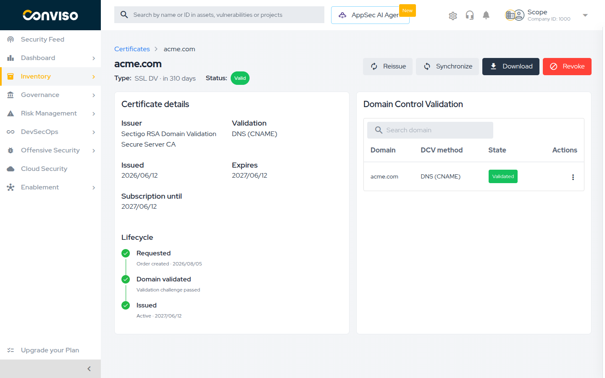
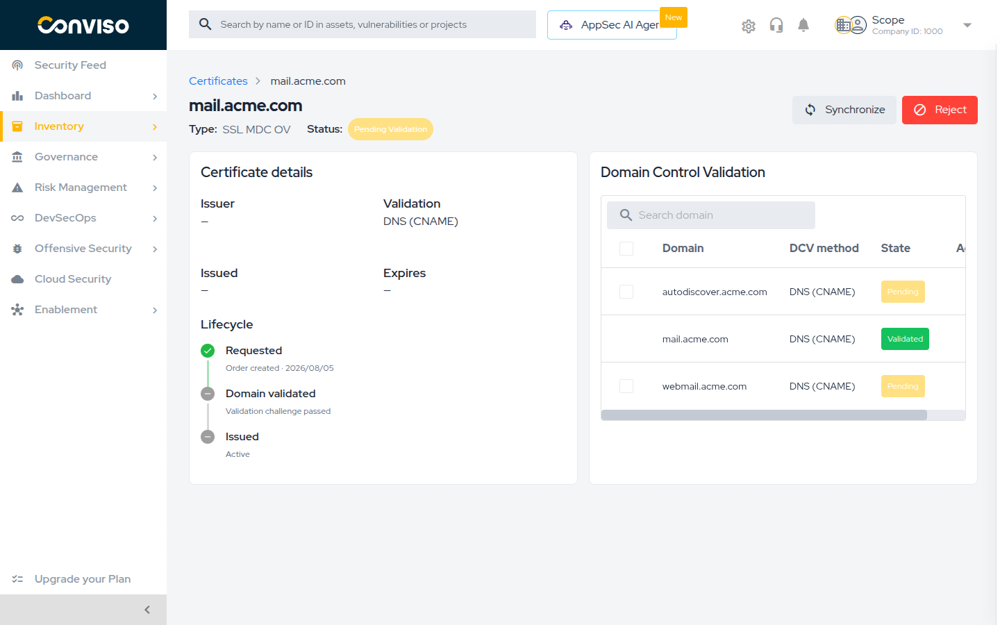
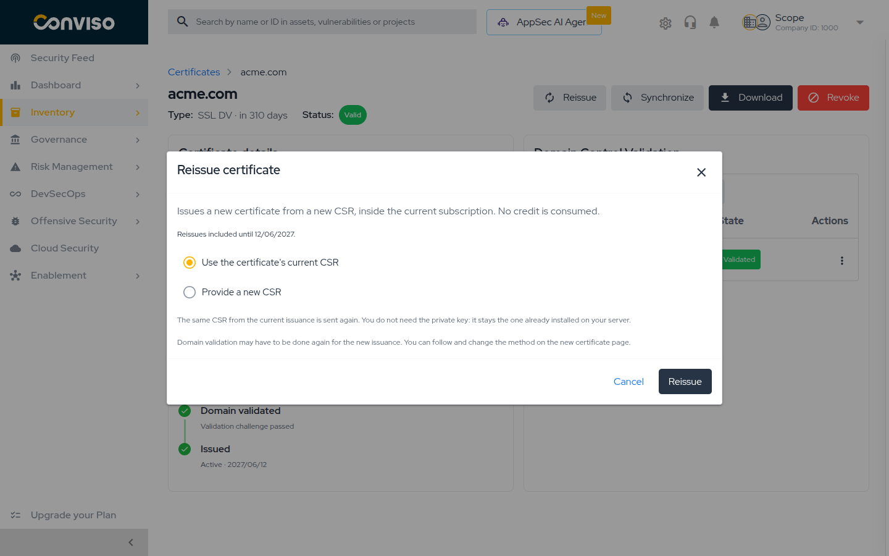

## Objective

Follow a certificate through its lifecycle after the order is placed: check its status, keep domain
control validation moving, download it once issued, renew it with a reissue, and revoke it when it
should stop being trusted.

## The Certificates List

**Inventory > Assets > Certificates** lists every certificate in your account:

| Column | Content |
| --- | --- |
| **ID** | The certificate's identifier in the platform |
| **Common Name** | The main domain the certificate covers |
| **Type** | The product, for example `SSL DV` or `SSL Wildcard OV` |
| **Status** | The current state — see [Certificate Statuses](#certificate-statuses) |
| **Issued** | When the certificate authority issued it |
| **Expires** | The expiry date, with the remaining time below it |
| **Actions** | Download, Synchronize, Revoke or Reject |

Every column is sortable, and the whole row is clickable — selecting it opens the certificate's
detail page. Dates use the `YYYY/MM/DD` format, and the line under **Expires** reads
`in {n} days` while the certificate is valid, or `{n} days ago` once it is past due, shown in red.

Narrow the list with the **Status** and **Type** filters, or search by Common Name or ID. Your
filter selection is remembered between visits.

:::note
There is no "expiring soon" status. How close a certificate is to expiry is shown by the relative
line under **Expires**, and the status only changes to **Expired** once the date has passed. The
platform does not send expiry notifications — review the list, sorted by **Expires**, as part of
your routine.
:::

## Certificate Statuses

| Status | Meaning |
| --- | --- |
| **Pending Validation** | The order is placed and the certificate authority is waiting on domain control validation, or on the EV vetting details |
| **Valid** | Issued and in force |
| **Expired** | The expiry date has passed. The platform updates this automatically |
| **Revoked** | Revoked at the certificate authority; clients no longer trust it |
| **Rejected** | The issuance was cancelled before the certificate was produced |
| **Replaced** | Superseded by a reissue. It is kept in the issuance history |
| **Error** | The issuance failed, or the certificate authority rejected the EV vetting details |

Two situations also show a banner at the top of the detail page:

* **EV details error** — `The certificate authority rejected the vetting details. Review and
  resubmit in the form below.` Correct the data in the form on the same page and submit again.
* **Manual reconciliation required** — `The certificate authority submission could not be
  confirmed. Contact support for manual reconciliation.` The platform could not confirm what
  happened to the order, so it will not guess. Contact Conviso Support.

## Tracking a Certificate

The detail page opens on the certificate's Common Name, with its type and status underneath, and
the actions available for its current state in the header:

| Action | Available when |
| --- | --- |
| **Reissue** | The certificate is **Valid** or **Expired** and its subscription term is still open |
| **Synchronize** | Almost always — it asks the certificate authority for the order's current state |
| **Download** | The certificate has been issued |
| **Revoke** | The certificate is **Valid** |
| **Reject** | The certificate is still **Pending Validation** |

The **Certificate details** card shows the **Issuer**, the **Validation** method, the **Issued** and
**Expires** dates, and **Subscription until** — the date up to which reissues are included.

The **Lifecycle** timeline below it shows how far the certificate has progressed:
**Requested** → **Domain validated** → (**EV details**, for EV certificates) → **Issued**. A
certificate that did not complete ends on **Rejected**, **Replaced** or **Revoked** instead.

:::tip
The platform reconciles pending orders with the certificate authority automatically, about once an
hour. Use **Synchronize** when you have just published a validation record and do not want to wait
for the next automatic check.
:::

:::caution Orders pending for more than a week stop updating on their own
A certificate that has been **Pending Validation** for over a week is dropped from the automatic
check — at that point the order has usually stalled because the validation record was never
published, and it will expire at the certificate authority.

The certificate does not disappear and the order is not cancelled: it simply stops refreshing by
itself. If you publish the validation record late, select **Revalidate** on the domain and then
**Synchronize** to bring the certificate up to date manually.

Certificates waiting on **EV vetting details** are not subject to this and keep updating
automatically.
:::

## Domain Control Validation

The **Domain Control Validation** card lists every domain in the certificate and how each one is
being validated:

| Column | Content |
| --- | --- |
| **Domain** | The domain being validated |
| **DCV method** | `DNS (CNAME)`, `HTTPS` or `Email` |
| **State** | `Validated`, `Pending`, or `Cancelled` when the certificate is no longer active |
| **Actions** | View details, change the method, revalidate |

Search by domain name to find one in a long list.

### Getting the record to publish

Select **View details** on a row to open **Validation details**, which shows the **Record name** and
the **Value** to publish, each with a copy button. For e-mail validation it shows the address the
validation e-mail was sent to.

### Changing the validation method

Select **Change DCV method** on a row to switch a domain between DNS, HTTPS and e-mail — useful
when, for example, you cannot upload a file to the server but can create a DNS record. For e-mail
you must also pick an approved address.

To change several domains at once, tick their checkboxes and use the **Change DCV method** button
above the table. HTTPS is not offered when any selected domain is a wildcard.

Only domains that are still pending can be changed. A domain that is already **Validated**, and a
certificate that has been revoked or rejected, cannot be edited.

### Revalidating

Select **Revalidate** on a pending row to ask the certificate authority to test the record again.
Use it after you have published or corrected a DNS record or a validation file, instead of waiting
for the next automatic check.

When the method is e-mail, the same action is labelled **Resend validation email** and sends the
message again.

## Downloading the Certificate

Select **Download**, from the detail page or from the row's actions menu, once the certificate has
been issued. The platform produces a `.pem` file named after the Common Name, containing the
certificate followed by its CA bundle — which is what most web servers expect.

:::note
The download never contains the **private key**. If you generated the CSR on your own server, the
key never left it. If you let the platform generate the CSR, the key was shown once during
issuance and was not stored — see
[Generate CSR](./issuing-a-certificate.md#option-b-generate-csr).

Downloads are recorded in the certificate's audit trail.
:::

## Completing EV Vetting Details

If you chose **Fill in later** during issuance, or the certificate authority rejected the data you
submitted, the detail page shows a **Complete extended validation details** form.

Fill in the incorporating agency, the main telephone number and the three required contacts —
certificate requester, certificate approver and contract signer — then select **Submit vetting
details**. The certificate is only issued after this submission is accepted.

## Renewing with Reissue

**Reissue** is how you renew. It issues a new certificate inside the current subscription, so it
**consumes no credit**, and it is available while the subscription term is still open — the
**Subscription until** date on the details card. The reissued certificate becomes the live one, and
the previous one moves to the issuance history with the status **Replaced**.

Select **Reissue** and choose one of two modes.

### Use the certificate's current CSR

The same CSR is submitted again. **You do not need the private key** — the one already installed on
your server stays valid, so this is the simplest renewal: one confirmation and nothing to
reconfigure on the server.

### Provide a new CSR

Paste a new CSR and select **Verify CSR**. The platform shows the **Submitted CSR** digest and, for
multi-domain certificates, compares the domains against the current issuance, tagging each one
**Kept**, **New** or **Dropped**. Domains tagged **Dropped** stop being covered.

This mode requires you to type `CONTINUE` to confirm.

:::danger Changing the primary domain revokes the old certificate
On a **single-domain or wildcard** certificate, submitting a CSR for a different primary domain
makes the certificate authority **revoke the certificates already issued for the old domain**. They
stop working immediately, wherever they are installed.

On **multi-domain** certificates this does not happen: previous issuances keep working until they
expire and move to the history as replaced.

If you want a certificate for a different domain, issue a new one instead of reissuing this one.
:::

Domain control validation may have to be done again for the new issuance. After confirming, the
platform opens the new certificate's page, where you can follow and adjust its validation.

## Revoking or Rejecting

Which action you get depends on the certificate's state: an issued certificate is **revoked**, and
an order that has not been issued yet is **rejected**.

### Revoking an issued certificate

:::danger Revoking cannot be undone
Revoking ends the certificate's subscription:

* The certificate **stops working immediately**, wherever it is installed.
* It **cannot be reissued** within the contracted term.
* The **credit is not returned**.
* **Earlier generations share the same order** at the certificate authority and may be revoked
  along with it.

Install the replacement certificate **before** revoking the one it replaces.
:::

Select **Revoke**, choose a **Reason (RFC 5280)** — `Superseded (replaced by a new certificate)` is
the default and the usual answer when you have already replaced it — then type `CONTINUE` to
confirm and select **Revoke Certificate**.

Choose **Key compromise** if the private key may have been exposed. That is the case where revoking
is urgent, and where you should issue the replacement first only if you can do so within minutes.

### Rejecting a pending issuance

For a certificate still **Pending Validation**, the action is **Reject issuance**: it cancels the
order at the certificate authority. No typed confirmation is required, but it cannot be undone
either.

## Issuance History

The **Issuance history** card appears once a certificate has been reissued at least once. It lists
every generation inside the subscription, newest first, starting from the **Initial issuance**.

Each entry shows its status, its Common Name and its issue and expiry dates, and links to that
generation's own detail page — so a replaced certificate remains fully inspectable.

## Troubleshooting

| Symptom | Cause and what to do |
| --- | --- |
| Status stays **Pending Validation** | The certificate authority has not confirmed your record. Check the record is published and matches **Validation details** exactly, then select **Revalidate**. For DNS, allow for propagation. |
| A certificate pending for over a week never updates | It has been dropped from the automatic check. Publish the validation record, then select **Revalidate** and **Synchronize** manually. |
| A validated domain, but the certificate is still pending | On a multi-domain certificate, **every** domain must be validated. Check the DCV table for rows still **Pending**. |
| **Reissue** is not offered | The subscription term has ended — check **Subscription until**. Renewal then requires a new credit and a new issuance. |
| **Download** is not offered | The certificate has not been issued yet. It is only available once the status is **Valid**. |
| Status is **Error** with an EV banner | The certificate authority rejected the vetting details. Correct them in the form on the page and submit again. |
| Status is **Manual reconciliation required** | The platform could not confirm the submission with the certificate authority. Contact Conviso Support — do not place a second order for the same domain first. |
| The e-mail validation message never arrived | Confirm the address is monitored, check the spam folder, then use **Resend validation email**. If it still fails, switch the domain to DNS (CNAME). |

## Related Areas

* [SSL Certificates](./ssl-certificates.md) — certificate types, permissions and credits.
* [Issuing a Certificate](./issuing-a-certificate.md) — the issuance wizard, step by step.
* [Asset Management](../asset-management.md) — the asset list your certificates also appear in.

## Support

Should you have any questions or require assistance while using the Conviso Platform, feel free to reach out to our dedicated support team.
