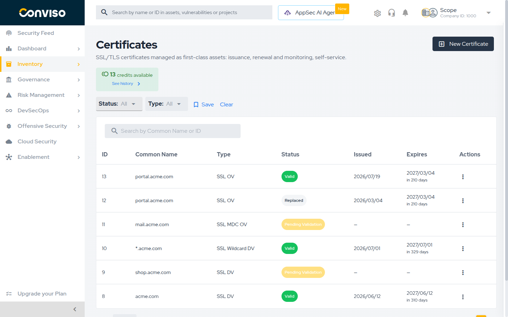
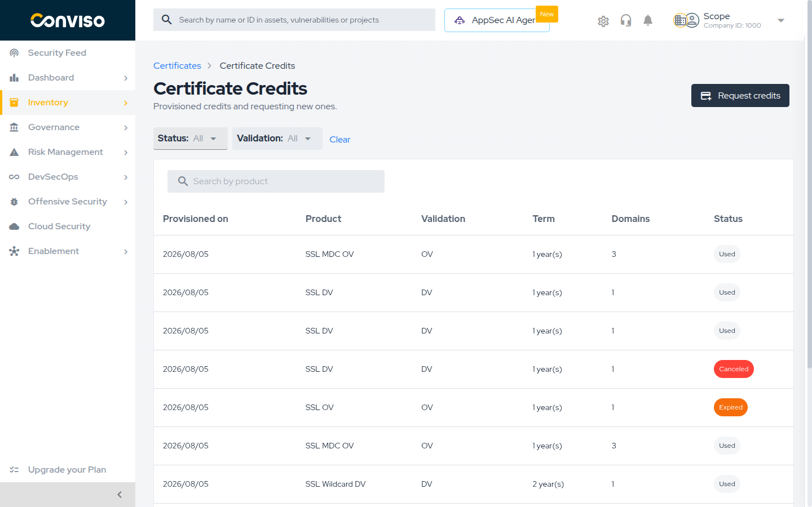
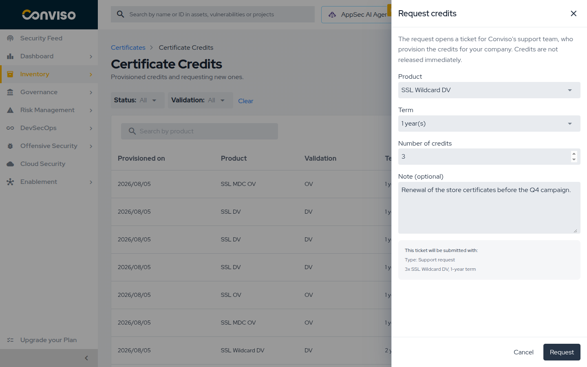

## Overview

SSL/TLS certificates are managed in Conviso Platform as a **first-class asset type**. They are not
a tab inside another asset: certificates have their own list, their own detail page and their own
issuance flow, under **Inventory > Assets > Certificates** in the left menu, alongside
**Repositories**, **Cloud**, **FQDN** and **API**.

From that area you can:

- **Issue** a certificate through a certificate authority, without leaving the platform.
- **Validate** control of the domains it covers, by DNS record, HTTPS file or e-mail.
- **Track** the certificate through its lifecycle, from the order to issuance and expiry.
- **Reissue** it — the renewal path — and **revoke** it when it should stop being trusted.
- **Download** the issued certificate and its CA bundle.

Certificates also appear in your general asset inventory, so a certificate is inventoried like any
other asset in your account.

:::note
The platform **issues** certificates through a certificate authority. It does not scan your
infrastructure to discover certificates you already have, and it does not produce self-signed
certificates. Only certificates issued here are listed.
:::

## Certificate Types

Two independent choices define a certificate: **how much the certificate authority verifies before
issuing it**, and **how many domains it covers**. A product combines one of each — for example a
wildcard certificate with domain validation, or a multi-domain certificate with organization
validation.

### Validation level: DV, OV and EV

The validation level is what the certificate authority checks about you before issuing. It does not
change the encryption — it changes what the certificate asserts, and how much work issuance takes.

| Level                            | What the certificate authority verifies                                      | What you provide                                                          | Typical effort                                            |
| -------------------------------- | ---------------------------------------------------------------------------- | ------------------------------------------------------------------------- | --------------------------------------------------------- |
| **DV** — Domain Validation       | That you control the domain                                                  | A CSR and a validation record                                             | Fastest, fully self-service                               |
| **OV** — Organization Validation | Domain control **and** that your organization legally exists                 | Everything in DV, plus the organization's legal data and a contact person | Slower: the certificate authority contacts that person    |
| **EV** — Extended Validation     | Everything in OV, plus the jurisdiction where the organization is registered | Everything in OV, plus jurisdiction data and three named vetting contacts | Longest: the most documentation and the most verification |

:::caution OV and EV issuance is not instant
For **OV** and **EV**, the certificate authority contacts the person you register as the
**Application Representative**, by phone or e-mail, to confirm the request was authorized.
Issuance stays pending until that person responds. Register someone who is reachable — an
unreachable contact is the most common reason an OV or EV order stalls.
:::

### Domain coverage: single, wildcard and multi-domain

The coverage decides which host names the certificate is valid for.

| Coverage                         | Shown in the **Type** column as | Covers                                                             |
| -------------------------------- | ------------------------------- | ------------------------------------------------------------------ |
| **Single**                       | `SSL DV`, `SSL OV`, `SSL EV`    | One fully qualified domain name, for example `www.acme.com`        |
| **Wildcard**                     | `SSL Wildcard DV`               | A domain and one level of its subdomains, for example `*.acme.com` |
| **Multi-domain (MDC)**           | `SSL MDC OV`                    | Several distinct domains in a single certificate                   |
| **SAN / Unified Communications** | `SSL SAN EV`                    | Several host names listed as Subject Alternative Names             |
| **Multi-domain with wildcard**   | `SSL MDC Wildcard DV`, `SSL SAN Wildcard DV` | Several domains, where any of them may be a wildcard  |

The **Type** column combines both axes, so `SSL Wildcard DV` is a wildcard certificate with domain
validation, and `SSL MDC OV` is a multi-domain certificate with organization validation.

### Which combinations are allowed

Not every coverage works with every validation level, and the platform refuses invalid combinations
before the order reaches the certificate authority:

- **EV certificates cannot cover wildcard domains.** A wildcard needs DV or OV.
- **Whether a multi-domain certificate can contain a wildcard depends on the product you spend.**
  `SSL MDC DV` and `SSL SAN DV` reject one, in the Common Name and in the additional domains alike.
  `SSL MDC Wildcard DV` and `SSL SAN Wildcard DV` accept one in either place, and each wildcard
  takes one of the certificate's domain slots, exactly like an ordinary domain. Multi-domain **EV**
  products never accept one.
- A **wildcard product requires a Common Name starting with `*.`**, and a non-wildcard product
  rejects one.
- **Wildcard domains cannot be validated over HTTPS.** They accept DNS (CNAME) or e-mail
  validation only.

:::tip Choosing
If you need to protect an unpredictable set of subdomains, choose a **wildcard**. If you need to
protect a fixed set of _different_ domains, choose a **multi-domain** certificate and list them as
additional domains. If you need both at once — a fixed set of domains where one of them has to be a
wildcard — choose one of the **multi-domain wildcard** products. If a browser padlock showing your
legal identity matters to your business, choose **OV** or **EV** — and plan for the extra
verification.
:::

## Before You Start

The SSL Certificates module is **licensed separately** from the rest of the platform. If the
**Certificates** item does not appear under **Inventory > Assets**, the module is not enabled for
your account — contact Conviso to have it enabled.

Once the module is enabled, access is still controlled by your access profile. Four separate
permissions exist for certificates, and they can be granted independently:

| Permission | Allows                                                                 |
| ---------- | ---------------------------------------------------------------------- |
| Read       | Viewing the certificate list, the detail page and the credits          |
| Create     | Requesting credits and issuing new certificates                        |
| Update     | Changing validation methods, revalidating, synchronizing and reissuing |
| Delete     | Revoking a certificate and rejecting an issuance                       |

Ask your account administrator to review these on the access profile if you can see certificates
but cannot act on them.

## Certificate Credits

Issuing a certificate consumes one **credit**. A credit is bought in advance and carries the
product it can be spent on: the validation level, the coverage, the number of domains and the
subscription term in years.

Two rules are worth memorizing:

- **Issuing a certificate consumes one credit.**
- **Reissuing consumes none.** Within the subscription term, you can reissue a certificate as often
  as you need — that is how renewal works. See
  [Renewing with Reissue](./managing-certificates.md#renewing-with-reissue).

### Checking your balance

The **Certificates** list shows your available balance above the table, with a hint when it is
running out:

| Balance             | What you see                                                         |
| ------------------- | -------------------------------------------------------------------- |
| More than 3 credits | The count of `credits available`                                     |
| 1 to 3 credits      | A warning and `Request more credits before continuing`               |
| No credits          | An alert and `No credits: request some before issuing a certificate` |

Select **See history** to open the **Certificate Credits** page, which lists every credit
provisioned for your company:

| Column             | Content                                            |
| ------------------ | -------------------------------------------------- |
| **Provisioned on** | When the credit was added to your account          |
| **Product**        | The certificate product the credit can be spent on |
| **Validation**     | `DV`, `OV` or `EV`                                 |
| **Term**           | The subscription length in years                   |
| **Domains**        | How many domains the credit covers                 |
| **Status**         | `Available`, `Used`, `Expired` or `Canceled`       |

Only credits with status **Available** can be spent. Filter the list by **Status** and by
**Validation**, or search by product name.

### Requesting credits

Credits are not self-served. Requesting them opens a support ticket, and the Conviso team
provisions them for your company.

1. Open **Inventory > Assets > Certificates**, then select **See history**.
2. Select **Request credits**.
3. Fill in the request:

   | Field                 | Required | Notes                                                       |
   | --------------------- | -------- | ----------------------------------------------------------- |
   | **Product**           | Yes      | The certificate product you want credits for                |
   | **Term**              | Yes      | Limited to the terms that product offers, from 1 to 5 years |
   | **Number of credits** | Yes      | Defaults to `1`, up to `100` per request                    |
   | **Note (optional)**   | No       | Context that helps support fulfil the request               |

4. Review the summary under **This ticket will be submitted with:** and select **Request**.

The platform confirms with `Request sent to support.` and opens the ticket it created, so you can
follow the request there.

:::note
Credits are **not released immediately**. The request is fulfilled by the Conviso team, so plan
ahead of the date you need the certificate — particularly for OV and EV, where issuance itself also
takes longer.
:::

## What to Read Next

- [Issuing a Certificate](./issuing-a-certificate.md) — the issuance wizard, step by step, from
  choosing a product to publishing the validation record.
- [Managing Certificates](./managing-certificates.md) — tracking, validating, downloading,
  reissuing and revoking a certificate.

## Related Areas

- [Asset Management](../asset-management.md) — the asset list, filters and export flows that also
  cover your certificates.
- [Repositories and Branches](../repositories-and-branches.md) — the repository asset type.
- [User Management](../user-management.md) — access profiles and the permissions described above.

## Support

Should you have any questions or require assistance while using the Conviso Platform, feel free to reach out to our dedicated support team.
