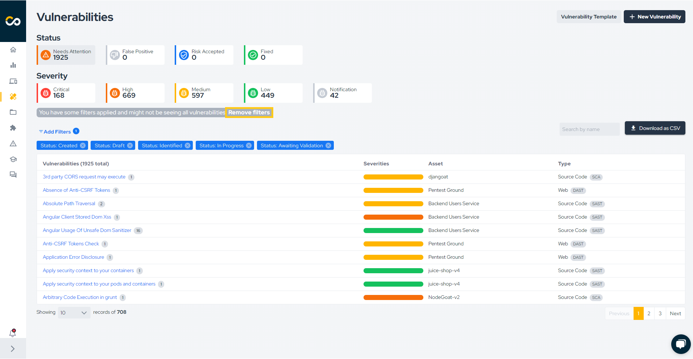
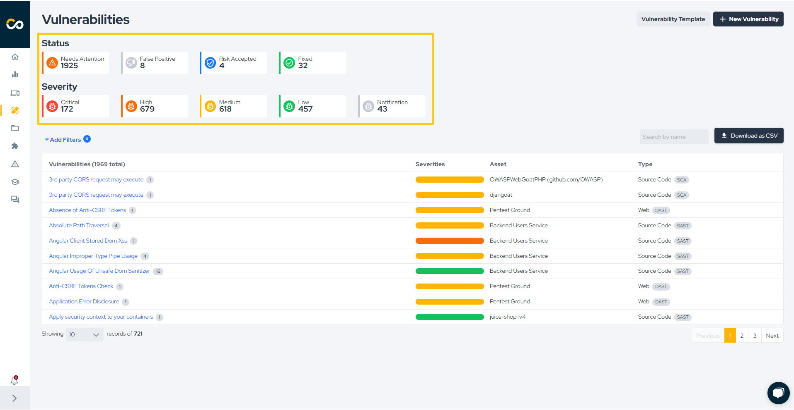
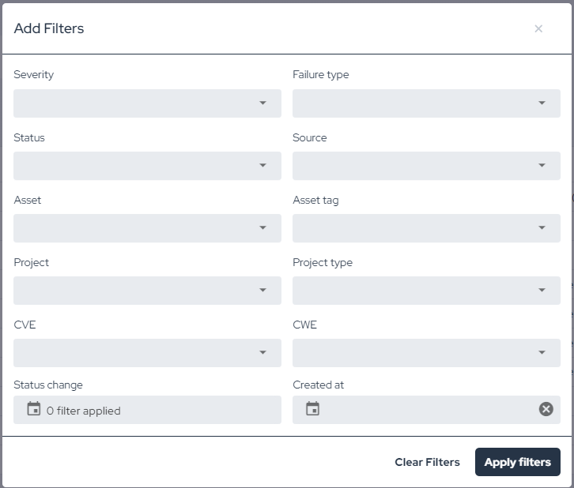
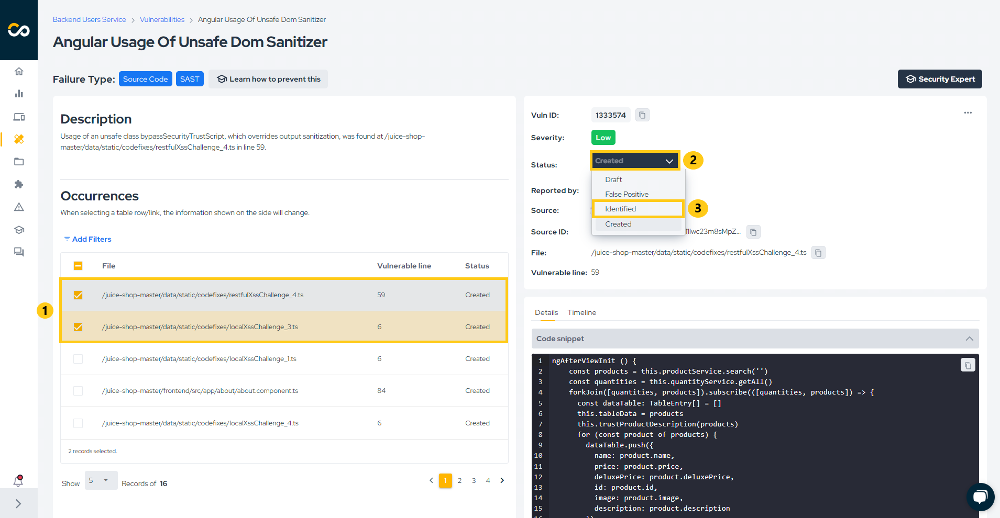
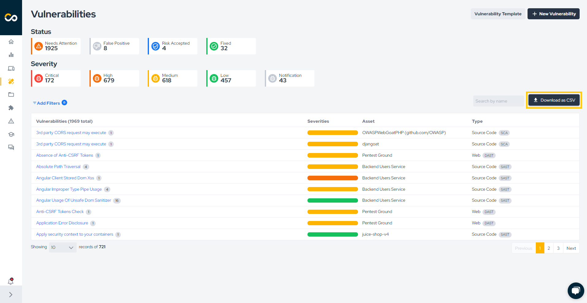
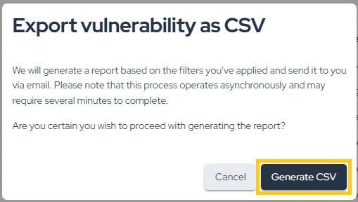

## Introduction

Conviso Platform has a complete workflow for vulnerability management, such as the process cycle to evaluate, remediate, and mitigate security weaknesses in systems or applications.

## Usage
In the left menu, click on **Vulnerabilities** to view all the vulnerabilities of your company:

:::note
Once selected, all open vulnerabilities will be listed, including those with the statuses "Created," "Draft," "Identified," "In Progress," and "Awaiting Validation."
:::

### Filtering Vulnerabilities

If you wish to view all vulnerabilities in your company at once, click "Clear" as indicated below:

To apply specific filters, you have two options:

1. Choose from the quick filter options highlighted below:

2. Click "More filters" for a more detailed search:

### Understanding Vulnerabilities

In the vulnerabilities list, vulnerabilities are grouped by title, asset, and type. This allows you to easily view different occurrences of the same vulnerability in a single asset. To do this, follow these steps:

1. Click on the vulnerability title:

2. In the image above, the left column displays common information for all occurrences of the vulnerability, such as the title, type, description, solution, and references. The area marked with number 1 shows the different occurrences of the vulnerability within the asset. You can select multiple occurrences by checking the box, which is already selected for the first row in the image (this is useful for bulk status changes).

3. On the right-hand column (highlighted with number 2), you will find detailed information about the currently selected occurrence, including its ID, severity, status, source, vulnerable file and lines, code snippet, timeline, and attachments.

### Status Update

To update the status of a vulnerability, check how many lines are selected in the "Occurrences" table. In the image below, **two vulnerabilities are selected (1)**. Then, **click on the current status of the vulnerability (2)** and **select the new status (3)**:

A warning will appear to confirm the status change. Simply click "Confirm" to proceed:

If more than one vulnerability is selected, the change will be processed in the background, which may take a few moments to complete (don't worry — if there is an error, you will be notified via email). If only one vulnerability is selected, the change will be immediate. You can see the time of all status changes by viewing the "Timeline," as shown below:

### Fixing Vulnerabilities

The process for fixing vulnerabilities depends on their source. For example:

1. External Scanners (Checkmarx, Dependency Track, Fortify, SonarCloud, SonarQube): The vulnerability must be recognized as fixed by the scanner. On the next synchronization, the status will change to "Fixed" on the platform;
2. DAST Vulnerabilities: After remediation, a new scan must be performed. If the vulnerability is no longer found, its status will automatically change to "Fixed" on the platform;
3. Conviso AST Vulnerabilities: After remediation, if the flag --vulnerability-auto-close is used, the fix will be detected and the vulnerability status will change automatically to "Fixed";
4. Manually Created Vulnerabilities: For manually created vulnerabilities (e.g., from Code Review or Pentest), the status change is not automatic. These must be manually updated to "Fixed" on the platform after being remediated.

#### False Positive Analysis

The **AppSec AI Agent** features an incredible False Positive Analysis that analyzes your vulnerabilities with our AI, providing greater accuracy and faster response time.
When accessing the **Vulnerabilities** area, you will find our agent activated in the icon above the filtered issue list in the **False Positive Analysis Enabled** image.

In the example below, we will review our agent's analysis of an issue where the status was changed to False Positive.
Upon entering the issue and checking the **Timeline** tab located below the main vulnerability information, we can see that the agent changed the status to False Positive and provided a justification for its analysis.

In this other example, we will review our agent's analysis of an issue that was changed to Identified status.
Again, by checking its **Timeline**, we can see the status change and its justification.

To use **False Positive Analysis**, you must first enable it in the **Policies**.

#### How to Fix

As a way to help developers, our **AppSec AI Agent** proposes to assist in solving these identified vulnerabilities.
In the lower left corner, we have a dedicated area with a mitigation suggestion for the vulnerability found, and now with the agent providing the **How to fix**.

By clicking the **How to fix** button, our **AppSec AI Agent** will open, showing step-by-step instructions on how to fix the vulnerability, thus speeding up and assisting the developer in prioritizing code correction.

### Exporting Vulnerabilities Information

To export vulnerability information from the platform, click on the highlighted button below:

As indicated, a CSV file will be generated based on the applied filters. If no filters are applied, a CSV of all vulnerabilities in your company will be created. The process is asynchronous, and the file will be sent to your email. Depending on the number of vulnerabilities, this may take a few minutes. Confirm the report generation by clicking the button below:

**Enhance your development lifecycle's security with the Conviso Platform. Join us today and foster a security-first culture!**

## Support

Should you have any questions or require assistance while using the Conviso Platform, feel free to reach out to our dedicated support team.

## Resources

By exploring our comprehensive content, you’ll discover resources that will enhance your understanding of AppSec.

[Conviso Blog](https://bit.ly/3JtXM8A): Access a wealth of informative videos covering various topics related to AppSec. Please note that the content is primarily in Portuguese.

[Conviso's YouTube Channel](https://bit.ly/3NIbbfM): Engage with our informative podcast, where we discuss AppSec-related subjects, providing valuable insights and discussions. The podcast is conducted in Portuguese.

[AppSec to Go - Conviso's Podcast on AppSec](https://spoti.fi/43UJQwN): Explore our blog, which offers a collection of articles and posts covering a wide range of AppSec topics. The content on the blog is primarily written in English.

