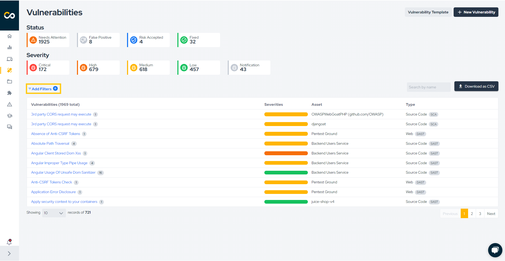
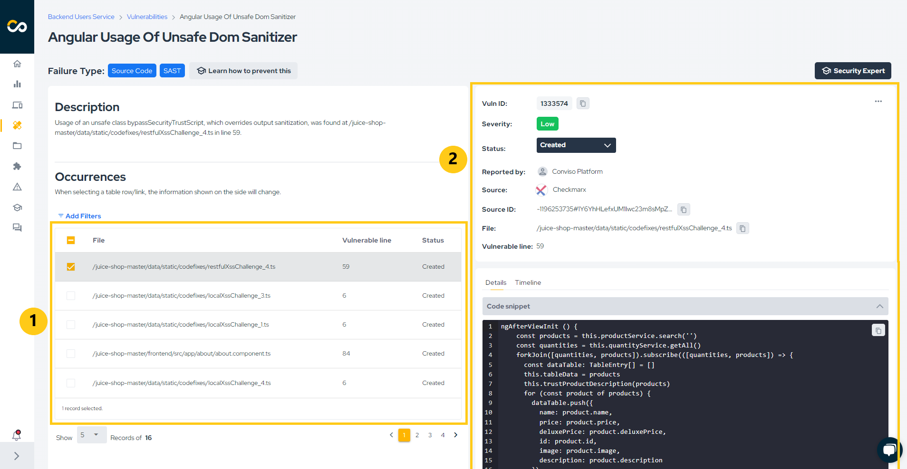

## Introduction

The Conviso Platform provides a complete vulnerability management workflow, supporting the full process of identifying, prioritizing, remediating, validating, and continuously monitoring security weaknesses across applications, infrastructure, and software supply chain components.
The vulnerability lifecycle is designed to be evidence-driven, audit-friendly, and aligned with modern Application Security Posture Management (ASPM) practices.

## Accessing Vulnerabilities
To access vulnerabilities:
1. In the left navigation menu, click **Vulnerabilities**.

2. The platform will display the vulnerability list for your company.
Once accessed, the vulnerability view becomes the central hub for analysis, remediation tracking, and validation.

:::note
Once selected, all open vulnerabilities will be listed, including those with the statuses "Created," "Draft," "Identified," "In Progress," and "Awaiting Validation."
:::

### Vulnerability Listing and Visibility
By default, the vulnerability list displays all open vulnerabilities, including the following statuses:
* Created
* Identified
* In Progress
* Awaiting Validation

Statuses such as Fixed, Risk Accepted, and False Positive may appear depending on the selected filters.

### Filtering Vulnerabilities

**Clear Filters**
To view all vulnerabilities in your company, click **Clear** in the filters area.

**Quick Filters**
Quick filters allow rapid segmentation of vulnerabilities based on commonly used criteria such as severity, status, or source.

To apply specific filters, you have two options:

1. Choose from the quick filter options highlighted below:

2. Click "More filters" for a more detailed search:

**Advanced Filters**
Click More filters to apply detailed criteria, including:
* Asset
* Vulnerability type
* Source (SAST, DAST, SCA, Container, etc.)
* Status
* Severity
* Date ranges
All exports and views reflect the filters applied at the moment of action.

### Understanding Vulnerabilities

In the vulnerabilities list, vulnerabilities are grouped by title, asset, and type. This allows you to easily view different occurrences of the same vulnerability in a single asset. To do this, follow these steps:

1. Click on the vulnerability title:

2. In the image above, the left column displays common information for all occurrences of the vulnerability, such as the title, type, description, solution, and references. The area marked with number 1 shows the different occurrences of the vulnerability within the asset. You can select multiple occurrences by checking the box, which is already selected for the first row in the image (this is useful for bulk status changes).

3. On the right-hand column (highlighted with number 2), you will find detailed information about the currently selected occurrence, including its ID, severity, status, source, vulnerable file and lines, code snippet, timeline, and attachments.

### Updating Vulnerability Status

To update the status of a vulnerability, check how many lines are selected in the "Occurrences" table. In the image below, **two vulnerabilities are selected (1)**. Then, **click on the current status of the vulnerability (2)** and **select the new status (3)**:

A warning will appear to confirm the status change. Simply click "Confirm" to proceed:

If more than one vulnerability is selected, the change will be processed in the background, which may take a few moments to complete (don't worry — if there is an error, you will be notified via email). If only one vulnerability is selected, the change will be immediate. You can see the time of all status changes by viewing the "Timeline," as shown below:

All changes are recorded in the Timeline, ensuring full auditability.

### Fixing Vulnerabilities

The remediation flow depends on the vulnerability source. For example:

1. External Scanners (Checkmarx, Dependency Track, Fortify, SonarCloud, SonarQube): The vulnerability must be recognized as fixed by the scanner. On the next synchronization, the status will change to "Fixed" on the platform;
2. DAST Vulnerabilities: After remediation, a new scan must be performed. If the vulnerability is no longer found, its status will automatically change to "Fixed" on the platform;
3. Conviso AST Vulnerabilities: After remediation, if the flag --vulnerability-auto-close is used, the fix will be detected and the vulnerability status will change automatically to "Fixed";
4. Manually Created Vulnerabilities: For manually created vulnerabilities (e.g., from Code Review or Pentest), the status change is not automatic. These must be manually updated to "Fixed" on the platform after being remediated.

#### False Positive Analysis

The **AppSec AI Agent** features an incredible False Positive Analysis that analyzes your vulnerabilities with our AI, providing greater accuracy and faster response time.

When enabled via Policies, the agent:
* Analyzes vulnerabilities using AI
* May update the status to False Positive or Identified
* Records justification in the Timeline

All AI-driven decisions remain fully transparent and auditable.

When accessing the **Vulnerabilities** area, you will find our agent activated in the icon above the filtered issue list in the **False Positive Analysis Enabled** image.

In the example below, we will review our agent's analysis of an issue where the status was changed to False Positive.
Upon entering the issue and checking the **Timeline** tab located below the main vulnerability information, we can see that the agent changed the status to False Positive and provided a justification for its analysis.

In this other example, we will review our agent's analysis of an issue that was changed to Identified status.
Again, by checking its **Timeline**, we can see the status change and its justification.

To use **False Positive Analysis**, you must first enable it in the **Policies**.

#### How to Fix

As a way to help developers, our **AppSec AI Agent** proposes to assist in solving these identified vulnerabilities.
In the lower left corner, we have a dedicated area with a mitigation suggestion for the vulnerability found, and now with the agent providing the **How to fix**.

By clicking the **How to fix** button, our **AppSec AI Agent** will open, showing step-by-step instructions on how to fix the vulnerability, thus speeding up and assisting the developer in prioritizing code correction.

#### Autofix

The **AppSec AI Agent** goes beyond providing guidance: it can automatically generate code fixes for identified vulnerabilities through the **Autofix** capability.

With Autofix, the agent can create pull requests containing the necessary code changes to remediate vulnerabilities, streamlining the remediation process and reducing the time developers spend on security fixes.

**How Autofix Works**

There are two ways to leverage the Autofix capability:

1. **Manual Trigger**: By clicking the **Generate Fix** button within the vulnerability details, the AppSec AI Agent will analyze the vulnerability context, generate the appropriate code fix, and create a pull request in your repository with the proposed changes.

2. **Automatic Mode**: When the Autofix policy is enabled in your **Policies** settings, the agent will automatically generate pull requests for eligible vulnerabilities without manual intervention, enabling a proactive and continuous remediation approach.

All generated fixes are submitted as pull requests, allowing your team to review, test, and approve changes before merging into your codebase.

## Vulnerability Lifecycle in Conviso Platform[​](https://docs.convisoappsec.com/platform/vulnerabilities/#lifecycle)

In the Conviso Platform, vulnerabilities follow a structured lifecycle that supports continuous validation and traceability.

**Standard Lifecycle Flow**

Created > Identified > In Progress > Awaiting Validation > Fixed ↺ 
If detected again → Identified

This flow ensures that vulnerabilities are never considered permanently resolved without technical evidence.

### Status Categories and Behavior

Statuses are divided into technical statuses and decision statuses.

#### Status Overview

**Created**
* Category: Technical
* Automatic Change: Yes
* Description: Initial registration of the vulnerability.

**Identified**
* Category: Technical
* Automatic Change: Yes
* Description: Vulnerability confirmed after human review or AI Agent analysis. This status is assigned once the finding has been analyzed and validated, whether it originated from an automated scan or was created manually.

**In Progress**
* Category: Decision
* Automatic Change: No
* Description: Remediation activities are currently underway.

**Awaiting Validation**
* Category: Decision
* Automatic Change: No
* Description: The remediation has been completed by the development team and is awaiting validation or approval by another responsible party, such as a security team or a security champion. This status is used when the fix requires an additional internal review before being considered resolved, for example in organizations where changes deployed to production must be reviewed by a security team prior to final closure.

**Fixed**
* Category: Technical
* Automatic Change: Yes
* Description: The vulnerability is no longer detected or has been validated as resolved.

**Risk Accepted**
* Category: Decision
* Automatic Change: No
* Description: The risk associated with the vulnerability has been formally accepted.

**False Positive**
* Category: Decision
* Automatic Change: No
* Description: The vulnerability has been confirmed as non-exploitable.

### Final vs Non-Final Statuses

**Final statuses**
* Risk Accepted
* False Positive

These represent explicit human decisions and cannot be reverted automatically.

**Non-final statuses**

* Created
* Identified
* In Progress
* Awaiting Validation
* Fixed

These may change based on human interaction or new scan evidence.

### Understanding the Fixed Status

The Fixed status represents a validated outcome, not a permanent decision.
A vulnerability may be marked as Fixed in two situations:
* Scan-based Evidence (Automatic): The vulnerability is not detected in the most recent scan for the same fingerprint (file, dependency, endpoint, image, etc.).
* Human Declaration Awaiting Validation (Manual): A developer or security engineer declares that remediation is complete. The vulnerability is marked as Fixed, pending confirmation via a new scan.

**Important Characteristics**
* Fixed can be set **automatically** (scan evidence) or **manually** (remediation declaration)
* If detected again, the status automatically reverts to Identified
* Fixed does not imply risk acceptance
* Continuous scans are required to maintain confidence
* This model prevents false confidence and ensures continuous validation.

### Exporting Vulnerabilities Information

To export vulnerability information from the platform, click on the highlighted button below:

As indicated, a CSV file will be generated based on the applied filters. If no filters are applied, a CSV of all vulnerabilities in your company will be created. The process is asynchronous, and the file will be sent to your email. Depending on the number of vulnerabilities, this may take a few minutes. Confirm the report generation by clicking the button below:

**Enhance your development lifecycle's security with the Conviso Platform. Join us today and foster a security-first culture!**

## Support

Should you have any questions or require assistance while using the Conviso Platform, feel free to reach out to our dedicated support team.
