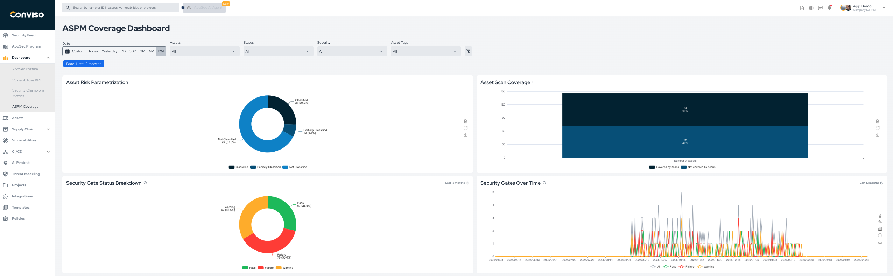

## Overview

The **ASPM Coverage** dashboard helps you assess how much of your environment is being covered by security monitoring and how assets are classified.

It is useful for:

* understanding asset coverage by scans;
* monitoring asset classification progress;
* reviewing security gate distribution;
* following security gate behavior over time.

## Main Metrics

The dashboard includes the following key views:

1. **Asset Risk Parametrization**: classification breakdown of assets such as classified, partially classified, and not classified.
2. **Asset Scan Coverage**: proportion of assets covered and not covered by scans.
3. **Security Gate Status Breakdown**: current distribution of gate results such as pass, warning, and failure.
4. **Security Gates Over Time**: trend view of security gate results across the selected period.

## Filters

Use the dashboard filters to refine the analysis by:

* date range;
* assets;
* vulnerability status;
* severity;
* asset tags.

## Example

