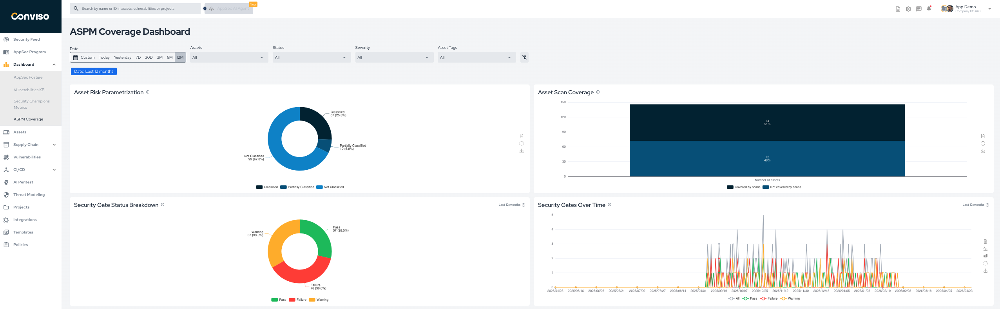

## Overview

The **ASPM Coverage** dashboard helps you assess how much of your environment is being covered by security monitoring and how assets are classified.

It is useful for:

* understanding asset coverage by scans;
* monitoring asset classification progress;
* reviewing security gate distribution;
* following security gate behavior over time;
* finding the assets the security gate blocks most often;
* finding the repositories the security gate does not cover yet.

## Main Metrics

The dashboard includes the following key views:

1. **Asset Risk Parametrization**: classification breakdown of assets such as classified, partially classified, and not classified.
2. **Asset Scan Coverage**: proportion of assets covered and not covered by scans.
3. **Security Gate Status Breakdown**: current distribution of gate results such as pass, warning, and failure.
4. **Security Gates Over Time**: trend view of security gate results across the selected period.
5. **Security Gate Block Rate by Asset**: the assets whose security gate runs failed most often in the selected period, ranked by block rate.
6. **Security Gate Coverage**: how many repositories have a security gate rule that sets a limit and ran the gate in the selected period.

The security gate charts appear only for companies with [Security Gate](../platform/security-gate.md).

### Security Gate Block Rate by Asset

The **block rate** of an asset is the share of its security gate runs in the selected period that failed and blocked the delivery. A run that ends with a warning counts as a run but not as a block. Every run counts, whether it came from a pull request scan, an integration sync, or a manual or CLI run, on any branch.

The chart ranks up to 10 assets by block rate, and assets with the same rate by their number of blocked runs. Each bar shows the rate and the blocked runs out of all runs, for example **75% (6/8)**. Read the rate together with the number of runs: an asset with a single failed run reaches 100%.

* **See the blocked runs**: click a bar or an asset name to open the [Security Gate](../platform/security-gate.md) list filtered by that asset, its failed runs, and the dashboard period.
* **See every asset**: when more than 10 assets ran the security gate in the period, **See all assets** at the bottom of the card opens a side panel with all of them. Search by asset name, sort by any column, and click a row to open that asset's blocked runs.
* **Filters**: the chart follows the dashboard's date, asset, asset tag, and archived asset filters.
* **Access**: users with access restricted to some assets only see those assets in the ranking.

The metric is also available in the dashboard's executive report, as a chart and a table of the same 10 assets.

### Security Gate Coverage

The coverage shows how many of your repositories the security gate actually protects. Each repository falls into one of three states:

* **Covered**: the security gate rule that applies to the repository sets at least one limit, and the gate ran on the repository in the selected period.
* **Configured, not run**: the rule sets a limit, but the gate did not run on the repository in the period. Check whether its scans or its pipeline run the security gate.
* **Not configured**: the rule sets no limit, so the gate passes every run. A repository can run the gate and still be in this state.

The rule that applies is the repository's [asset rule](../security-scans/security-gate.md#asset-rules) when it has one, and the [global rule](../security-scans/security-gate.md#global-rule-configuration) otherwise. A rule sets a limit when at least one severity has a maximum number of vulnerabilities; **Max Days to Fix** alone blocks nothing. The rule is read as it is today, and the runs are those of the selected period, from any origin and branch.

Only repositories count: the security gate does not run on FQDNs, APIs, cloud assets, or certificates. The center of the chart shows the share of covered repositories.

* **See the repositories**: click a slice, or **See repositories** at the bottom of the card, to open a side panel with one tab per state. Search by asset name, sort by name, runs in the period, or last run, and click a row to open the asset on its **Security Gate** tab, where its rule is set. The **Policy** column tells whether the asset rule or the global rule applies, and **Last run** shows the latest run, even one outside the period.
* **Period**: the dashboard opens on the last 7 days. A repository that runs the gate less often shows as **Configured, not run** until you widen the period.
* **Filters**: the chart follows the dashboard's date, asset, asset tag, and archived asset filters.
* **Access**: users with access restricted to some assets only count and see those assets.

The metric is also available in the dashboard's executive report, as a chart of the same three states.

## Filters

Use the dashboard filters to refine the analysis by:

* date range;
* assets;
* vulnerability status;
* severity;
* asset tags.

## Example

