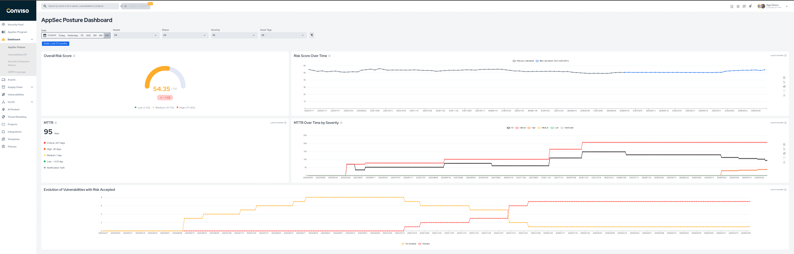
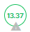
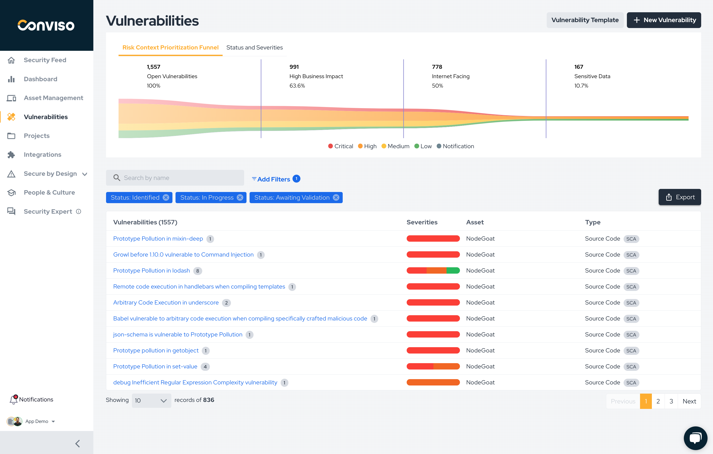

## Overview

The **Risk and Posture Management** view combines posture indicators with contextual risk analysis so teams can decide what matters first and track whether security is improving over time.

It is useful for:

* monitoring the overall risk score of your application portfolio;
* tracking how risk changes over time;
* understanding remediation speed through MTTR metrics;
* identifying overdue risk acceptance trends;
* prioritizing vulnerabilities based on business impact, exposure, and data sensitivity.

## Main Metrics

The dashboard includes the following key views:

1. **Overall Risk Score**: the current risk score calculated for the selected scope.
2. **Risk Score Over Time**: trend view of how the score changes across the selected period.
3. **MTTR**: average time to remediate vulnerabilities in the current scope.
4. **MTTR Over Time by Severity**: remediation speed split by severity over time.
5. **Evolution of Vulnerabilities with Risk Accepted**: trend view of vulnerabilities accepted on schedule or overdue.

<div style={{textAlign: 'center'}}>



</div>

## Understanding the Risk Score

The Risk Score provides a quantitative view of how much risk is associated with an asset.
It combines asset context with open vulnerability data so teams can prioritize remediation based on real exposure, not just severity labels.

The score is based on four inputs:

1. **Business Impact**: how critical the asset is to the organization.
2. **Threats**: the amount and severity of open vulnerabilities in `Identified`, `In Progress`, or `Awaiting Validation`.
3. **Attack Surface**: whether the asset is internet-facing or internal.
4. **Data Classification**: whether the asset handles sensitive data such as `PII` or `PCI`.

For the platform's vulnerability status definitions, see [Workflow Status](../vulnerability-management/workflow-status.md).

### Requirements

To calculate the Risk Score correctly, the asset should have:

* business impact defined;
* attack surface defined;
* data classification defined;
* open vulnerability data available.

Until the required information is present, the platform may show the asset with incomplete score information.

<div style={{textAlign: 'center'}}>



</div>

### Formula

```text
RiskScore = round(0.99 * [50 * (BI / 3) + 15 * (T / 10) + 10 * E + 15 * DC], 2)
```

Variable definitions:

* `BI` = business impact, where `low = 1`, `medium = 2`, `high = 3`
* `T` = threat level, where `notification = 0`, `low = 3`, `medium = 6`, `high = 9`, `critical = 10`
* `E` = exploitability, where `internal = 1`, `internet_facing = 2`
* `DC` = data classification, where `confidential`, `PII`, and `PCI` contribute `1`, and others contribute `0`

Notes:

* the final score is scaled by `0.99`;
* the result is rounded to two decimal places;
* the maximum score is approximately `99`.

## Risk Context Prioritization Funnel

The Risk Context Prioritization Funnel complements the Risk Score by helping teams narrow the remediation backlog based on context.

Instead of looking only at severity, the funnel shows how open vulnerabilities are reduced according to filters such as:

* high business impact;
* internet-facing exposure;
* sensitive data handling.

This helps answer a more useful question than "what is the highest severity issue?":
which vulnerabilities represent the highest practical risk to the business right now?

<div style={{textAlign: 'center'}}>



</div>

The funnel is especially useful when:

* there is a large backlog of open vulnerabilities;
* teams need to focus on the subset with the highest business relevance;
* severity alone is not enough to define remediation order.

## How to Use This View

Use the posture metrics and the contextual funnel together:

1. Check whether overall risk and MTTR trends are improving or deteriorating.
2. Identify whether risk acceptance and remediation delays are accumulating.
3. Use the Risk Score to understand which assets deserve more attention.
4. Use the funnel to narrow the vulnerability backlog into the highest-priority subset.

## Filters

Use the dashboard filters to adjust the data shown on screen:

* date range;
* assets;
* vulnerability status;
* severity;
* asset tags.

These filters help you focus the posture analysis on a business unit, application group, severity band, or remediation stage.
