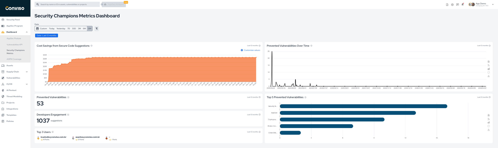
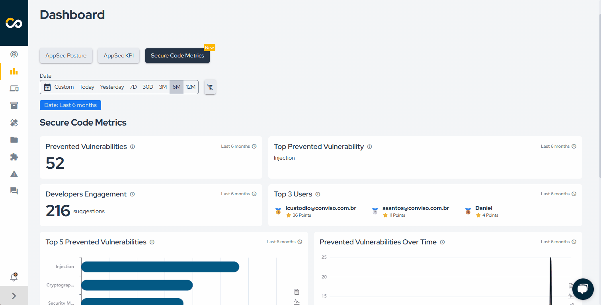

## Overview

The **Security Champions Metrics** dashboard measures how secure development practices are being adopted and what preventive impact they are generating.

It is especially useful for programs focused on developer enablement, preventive guidance, and secure coding adoption.

## Main Metrics

The dashboard includes the following key views:

1. **Cost Savings from Secure Code Suggestions**: estimated cost avoided by preventing vulnerabilities earlier in the development lifecycle.
2. **Prevented Vulnerabilities Over Time**: number of prevented vulnerabilities across the selected period.
3. **Prevented Vulnerabilities**: total number of prevented vulnerabilities in the selected scope.
4. **Developers Engagement**: volume of code improvement suggestions requested by developers.
5. **Top 3 Users**: the most active users in the selected period.
6. **Top 5 Prevented Vulnerabilities**: the most frequently prevented vulnerability types.

## Cost Savings Formula

This metric estimates the financial savings generated by preventing vulnerabilities before they are introduced into the codebase.

```text
AVOIDED_COST = PREVENTED_VULNERABILITIES × HOURS_PER_VULNERABILITY × HOURLY_RATE
```

* `PREVENTED_VULNERABILITIES`: estimated number of vulnerabilities avoided through preventive guidance.
* `HOURS_PER_VULNERABILITY`: average time needed to investigate, fix, and validate a vulnerability.
* `HOURLY_RATE`: average developer hourly cost.

Example:

```text
AVOIDED_COST = 250 × 6 × 40 = USD 60,000
```

## Filters

Use the date filter to analyze the impact of the program over a specific period.

## Example

<div style={{textAlign: 'center'}}>



</div>

<div style={{textAlign:'center'}}>



</div>
