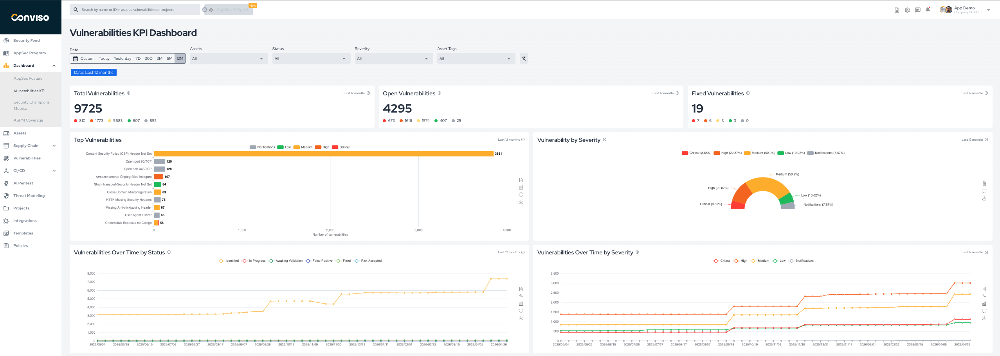

## Overview

The **Vulnerability KPI** dashboard highlights the main indicators for vulnerability volume, severity distribution, and evolution over time.

It helps teams answer questions such as:

* how many vulnerabilities are currently open;
* how many were fixed in the selected period;
* which vulnerability types are most common;
* whether the backlog is growing or stabilizing over time.

## Main Metrics

The dashboard includes the following key views:

1. **Total Vulnerabilities**: total number of vulnerabilities in the selected scope.
2. **Open Vulnerabilities**: vulnerabilities currently in active statuses such as `Identified`, `In Progress`, and `Awaiting Validation`.
3. **Fixed Vulnerabilities**: vulnerabilities currently in the `Fixed` status.
4. **Top Vulnerabilities**: the most frequent vulnerability types in the selected scope.
5. **Vulnerability by Severity**: the current distribution of vulnerabilities by severity.
6. **Vulnerabilities Over Time by Status**: how vulnerability volume changes over time by workflow status.
7. **Vulnerabilities Over Time by Severity**: how vulnerability volume changes over time by severity.

For status meanings and lifecycle rules, see [Workflow Status](../vulnerability-management/workflow-status.md).

## Filters

Use the dashboard filters to refine the analysis by:

* date range;
* assets;
* vulnerability status;
* severity;
* asset tags.

## Example

