## Overview

The **Projects** area is the central workspace for organizing security projects, tracking execution, managing participants, and following project outputs such as vulnerabilities, requirements, attachments, and reports.

This process page covers how teams typically work in that view:

* access and filter the project list;
* create, edit, and delete projects;
* review project details and timeline;
* change project statuses;
* manage users, assets, vulnerabilities, attachments, and requirements.

## Access the Project List

To access the project dashboard, navigate to **Projects** in the left-hand menu:

> ⚠️ **Important:** Tags are automatically deleted from the system when they are no longer associated with any project.

On this screen, you can review project volume by status and quickly filter by clicking the corresponding status name:

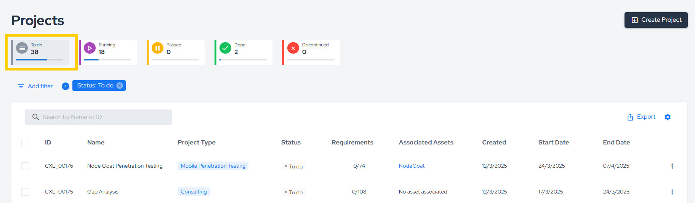

You can also filter projects by name or ID:

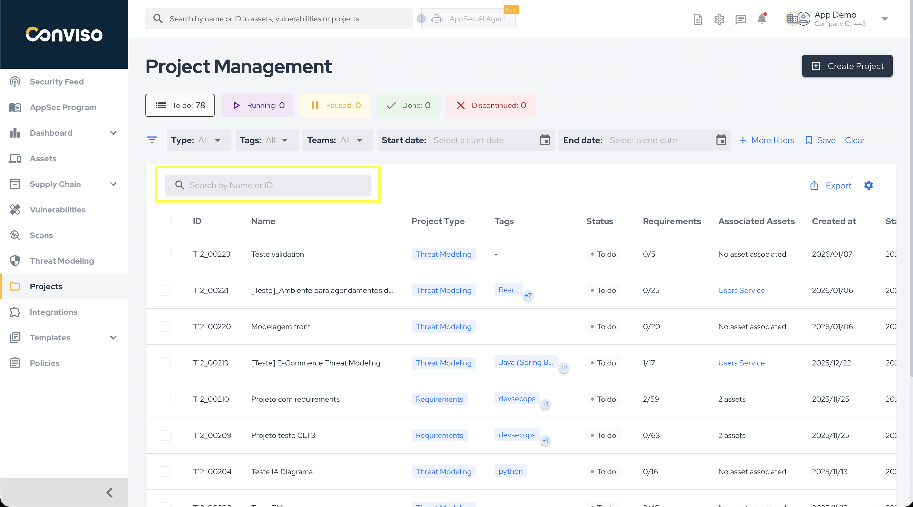

For more advanced filtering options, click **More filters**:

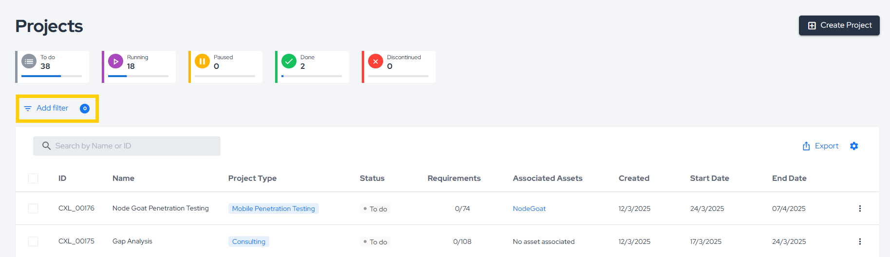

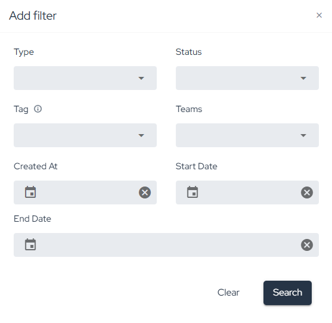

You can export a CSV report of your projects by clicking **Export**:

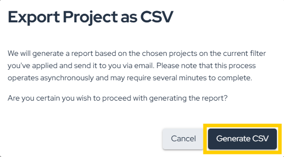

You can also customize the project list by selecting which columns to display:

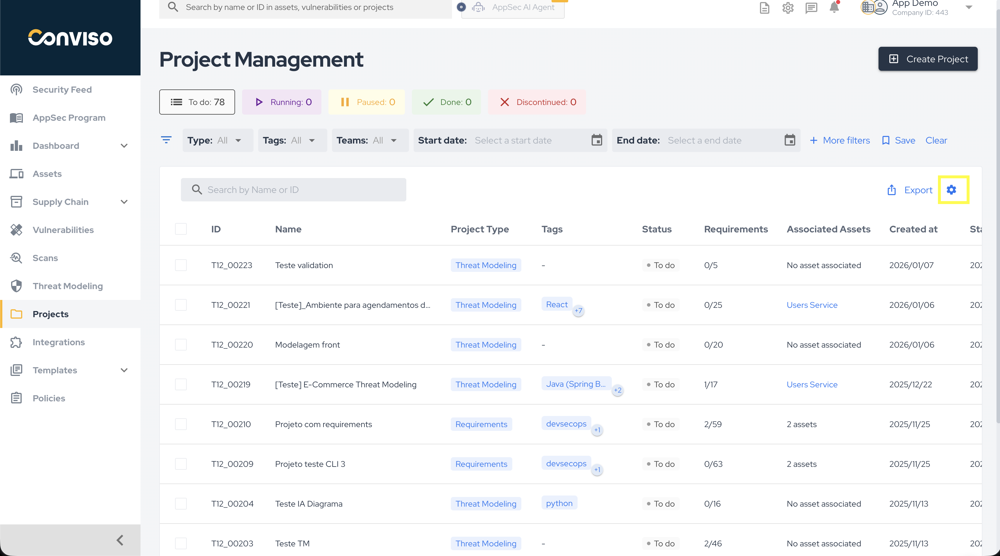

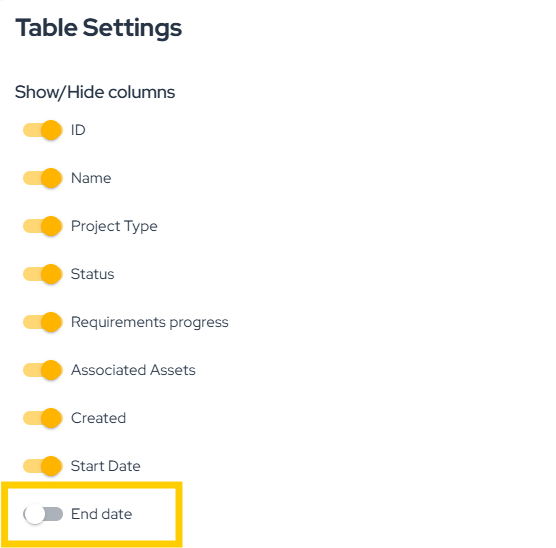

## Create, Edit, and Delete Projects

### Create a Project

To create a new project, click **Create project**, fill in the required details, and then click **Create a new project**:

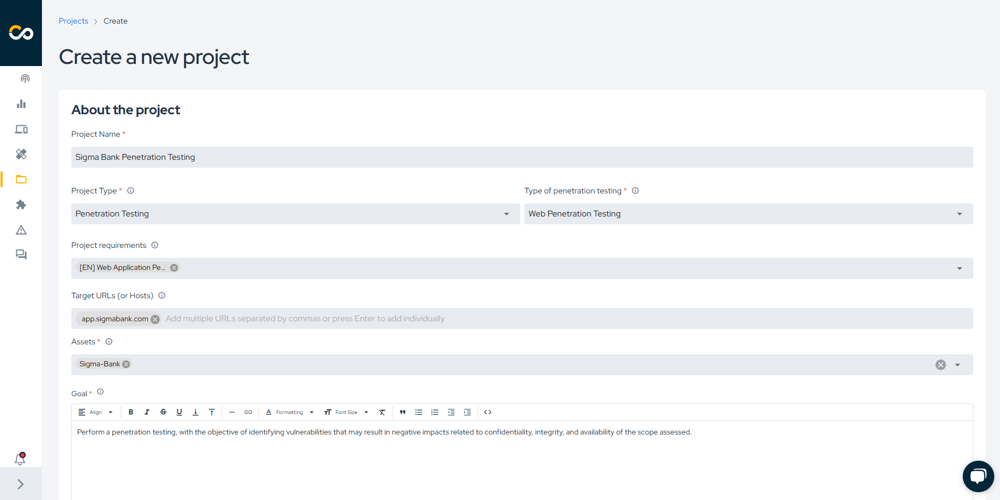

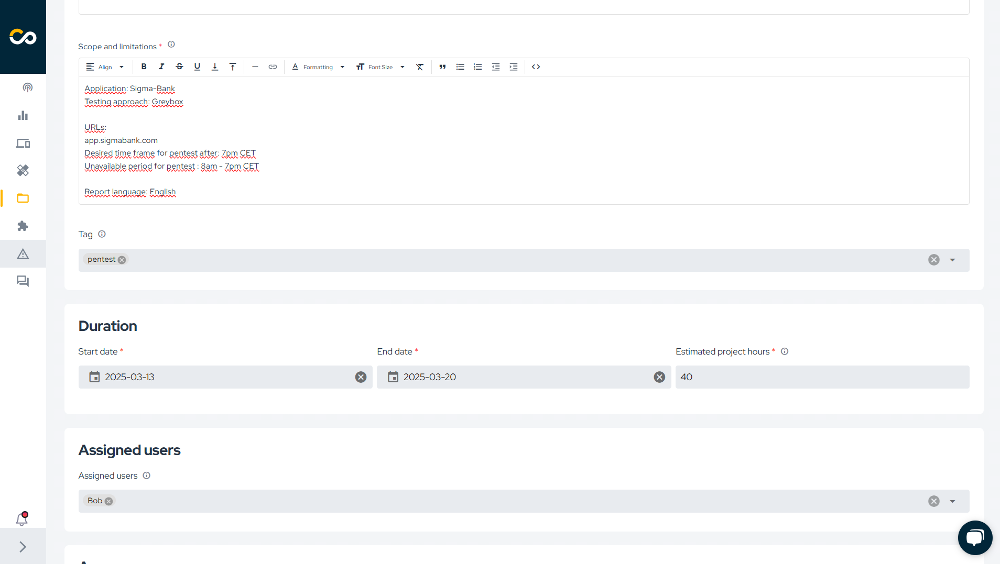

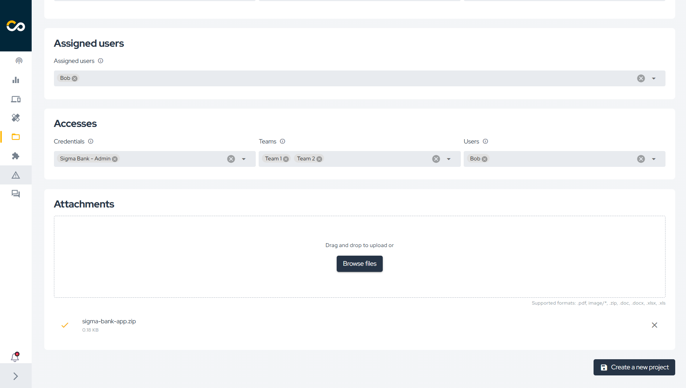

### Edit a Project

To edit an existing project, locate it in the list and click the corresponding edit button:

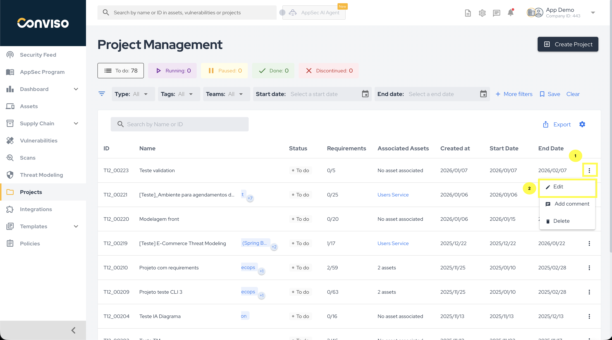

Next, update the necessary information and click **Save**.

### Delete Projects

To delete one or multiple projects, locate them in the list and use the highlighted actions below:

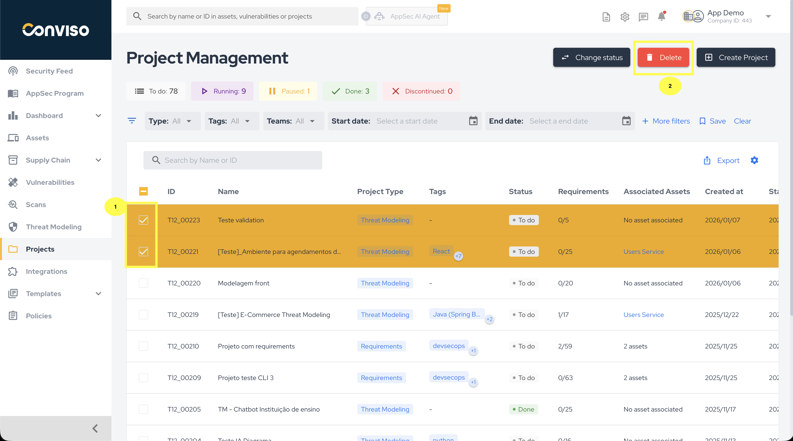

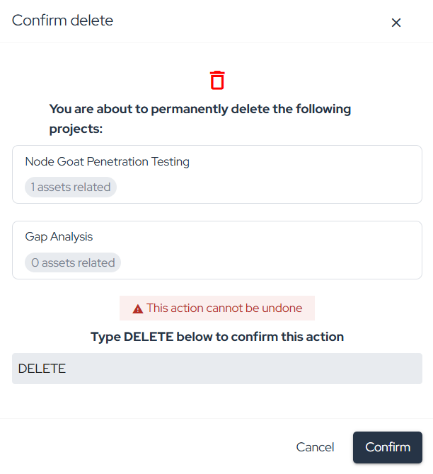

## Review Project Details

After selecting a project, the default **Details** screen is displayed. There you can review project properties, edit them, or delete the project:

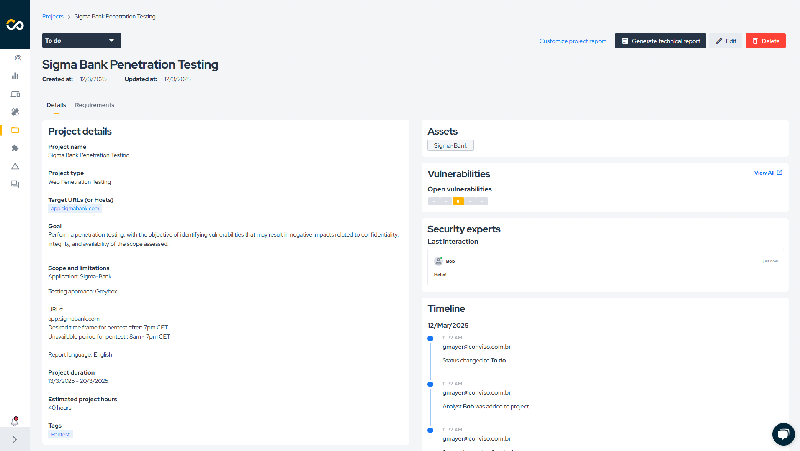

## Update Project Status

You can update the project status by clicking its current status and selecting a new one:

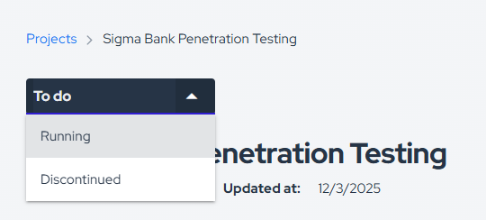

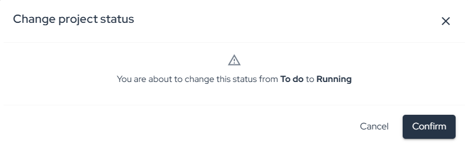

### Bulk Status Change

To update the status of multiple projects at once, select the checkboxes of the projects you want to update:

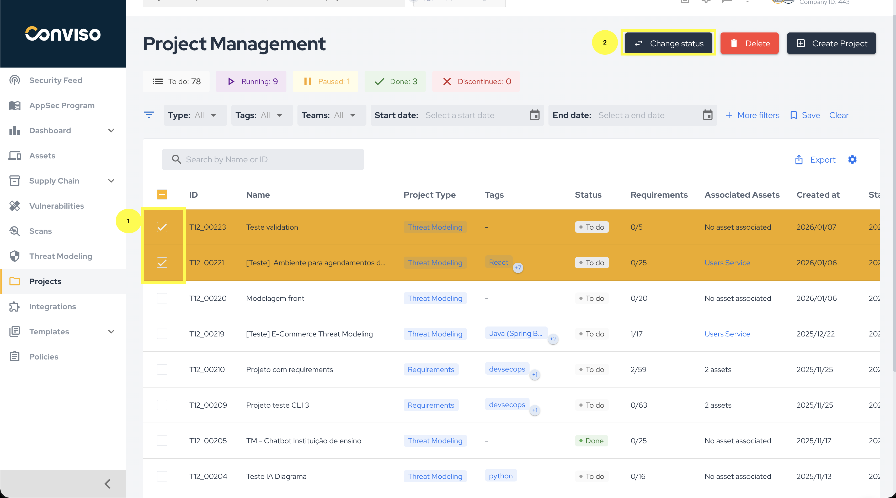

Then choose the new status, provide a reason, and click **Confirm**:

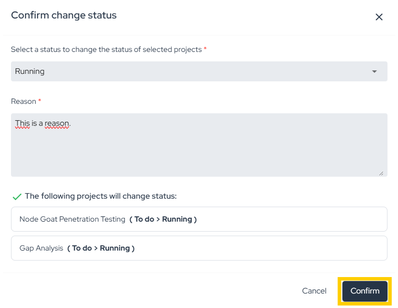

If any selected project cannot be transitioned to the chosen status, the platform displays a notification:

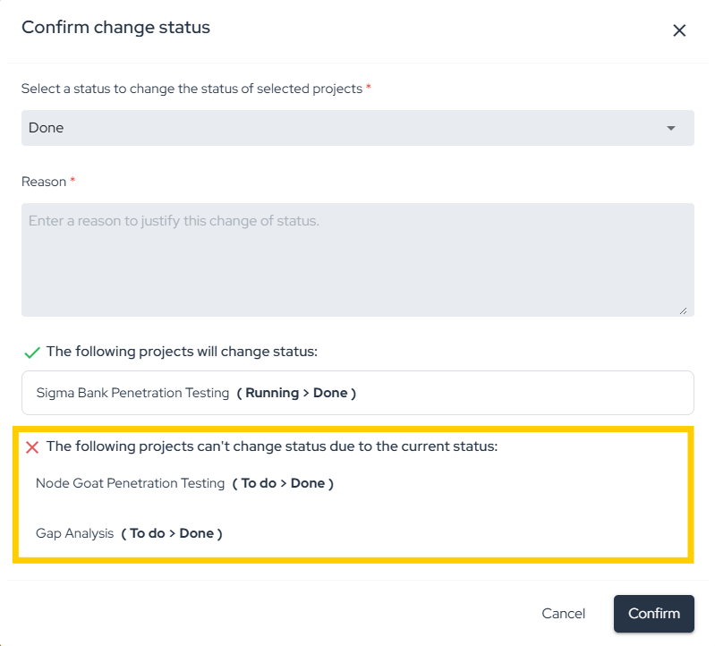

For status meanings and transition rules, see [Workflow Status](./workflow-status.md).

## Follow Project Activity

### Timeline

Use the **Timeline** section to monitor project progress and review the history of actions taken within the project:

### Accesses

In the **Accesses** section, you can manage project-level access and invite users who need visibility into the project:

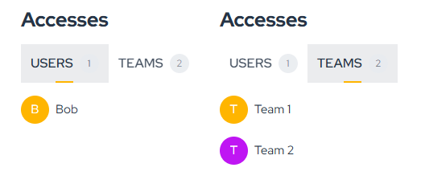

For more information, refer to the [User Management guide](../platform/user-management.md).

### Assigned Users

**Assigned Users** are the users responsible for executing the project. To associate a user with the project, ensure they have the necessary access permissions:

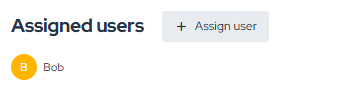

## Generate a Technical Report

The **Technical Report** feature allows you to generate a report for projects conducted within the platform.

Its purpose is to document technical aspects of the project, highlight detected security risks, and include project information provided by the assigned users.

By clicking **Customize project report**, you can add an Executive Summary and Final Considerations:

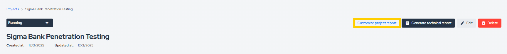

Once customization is complete, click **Save**:

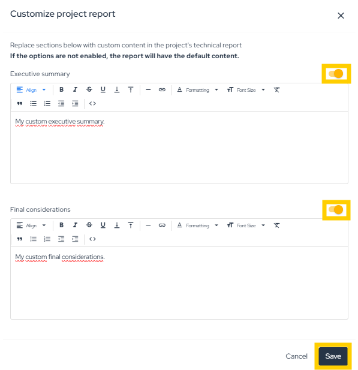

To generate the report, click **Generate Technical Report**, fill in the required details, and click **Save**:

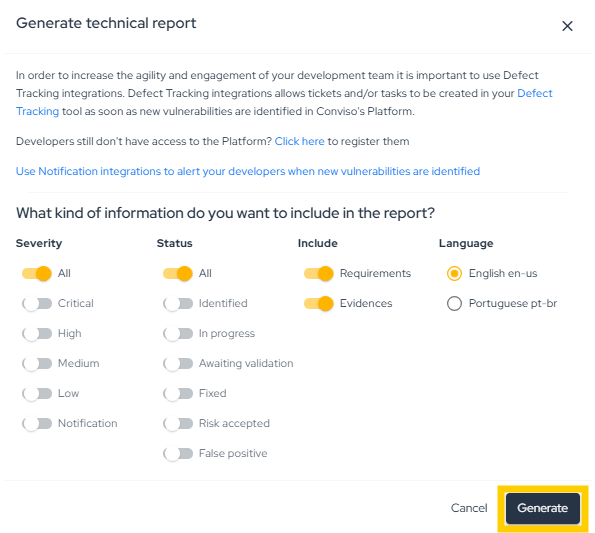

:::note
Only projects of the following types can have a Technical Report: Assessment, Code Review, Penetration Testing, Reverse Engineering, Social Engineering, and Vulnerability Retest.
:::

## Work with Related Items

### Assets

Projects represent a set of activities carried out over a specific period on one or more assets to achieve a defined objective. In the **Assets** section, you can review associated assets:

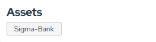

:::note
Only the following project types support association with Assets: Code Review, Reverse Engineering, AI Penetration Testing, API Penetration Testing, IoT Penetration Testing, Mobile Penetration Testing, Network Penetration Testing, Web Penetration Testing, Threat Modeling, and Consulting.
:::

### Vulnerabilities

Some project types lead to the identification and creation of vulnerabilities in the Conviso Platform. In this section, you can create a new vulnerability with **New Vulnerability** or review existing vulnerabilities with **View All**:

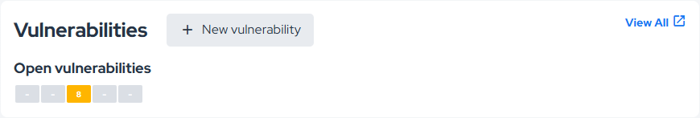

:::note
To add a new vulnerability using **New Vulnerability**, your user must be assigned to the project and the project status must be **Running**.
:::

### Attachments

The platform allows you to associate attachments with projects so files can be shared and downloaded from the project view:

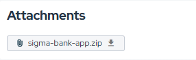

To add an attachment, edit the project.

## Manage Requirements

In the **Requirements** tab, you can create an action plan based on the tasks that need to be completed.

Requirements are categorized by status according to their progress: **To do**, **Running**, **Not According**, **Not Applicable**, and **Done**.

Each requirement can have multiple activities, which must be completed or dismissed for the project to be finalized.

To view the tasks associated with an activity, click its title:

To change an activity status, click its current status and select the desired one:

When updating an activity to **Not according**, add a reason and/or evidence:

When updating an activity to **Not applicable**, provide a reason:

When updating an activity to **Done**, add a reason and/or evidence:

After an activity status is updated, you can review who made the change in the Analyst column and when it was updated in the **Last updated** column.

If an activity is completed and has an attachment linked to it, you can download it using the **Download** icon:

