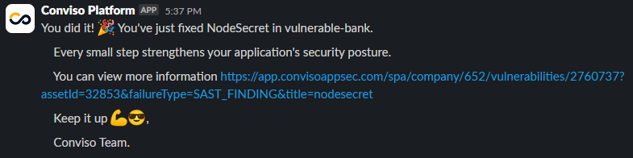

## Introduction

Conviso Platform offers a practical and integrated experience to track the full application security lifecycle. From vulnerability creation to resolution, the platform streamlines continuous risk detection, tracking, and remediation. With notifications in communication tools like Slack and Teams, integration with defect tracking systems, and a detailed view of assets and the SBOM (Software Bill of Materials), developers gain full visibility and control over application vulnerabilities. This empowers development teams to work efficiently and consistently, strengthening their ability to build secure applications.

Follow the steps below to gain a practical and integrated experience with the features that will be most present in your daily workflow as a developer.

## How to Bring your Applications into the Conviso Platform

To begin using the Conviso Platform effectively, you’ll need to onboard your applications. Here are two main approaches, tailored to your requirements:

- Execution of [Conviso AST](./bring-applications#performing-conviso-ast);
- Integration with an [External Scanner](./bring-applications#) (e.g., Checkmarx, Dependency-Track, Fortify, SonarQube, SonarCloud).

## Receiving Security Notifications

To help users stay informed about risks associated with their company, the Conviso Platform integrates with Slack and Microsoft Teams for sending notifications. Additionally, it allows notifications to be sent via email and directly within the Conviso application. For example, when a vulnerability is identified, you will receive an alert through one of these channels. Below is an example of how a vulnerability notification appears in Slack:

[Click here](../../integrations/integrations_intro#communication-and-notification) to enable notifications through integrations or [click here](https://app.convisoappsec.com/spa/user/notifications-center) to activate email/in-app notifications.

## Sending Vulnerabilities Information to a Defect Tracker Tool

Conviso Platform integrates with various Defect Tracking tools so that developers can access vulnerability details without disrupting their usual workflow. This allows for the automatic transfer of vulnerabilities from Conviso Platform to tools like Jira, Azure Boards, ClickUp, or Businessmap, ensuring seamless integration.

Once a vulnerability is created in the Defect Tracking tool via Conviso Platform, a bidirectional communication system comes into play. If the status of the vulnerability is updated on Conviso Platform, the change will be reflected in the external tool immediately. Likewise, if the status is first modified in the external tool, the update will be promptly synchronized back to Conviso Platform.

The image below shows an example of a Conviso Platform vulnerability sent to Jira: 

## View Assets

All scan information is linked to Assets in Conviso Platform. An Asset could be an application, a microservice, or a repository, for instance. To view your Assets, click on "Asset Management" in the sidebar. By default, the Assets are listed from highest to lowest Risk Score.

:::note
Risk Score provides a holistic view of an asset's risk based on factors such as open vulnerabilities, attack surface, business impact, and data classification. Understanding the real risk of each asset is crucial for informed decision-making and prioritizing security efforts.
:::

Typically, Asset names will match the repository name, but they can be customized.

To see more details about an Asset, simply click on its name.

## View Vulnerability Information on the Platform

Finally, the details of vulnerabilities can also be viewed directly on Conviso Platform. There are two main ways to access this information:

- Viewing from an Asset's detail page
- Viewing from the sidebar menu.

### Viewing from an Asset's Detail Page

On the Asset detail page, simply click on the "Open Vulnerabilities" button, as highlighted in the image below:

This action will filter for all Asset vulnerabilities with the status Identified, In Progress, or Awaiting Validation. From there, locate the relevant vulnerability and click on its title.

### Viewing from the Sidebar Menu

Alternatively, you can navigate via the sidebar by clicking on "Vulnerabilities," as shown in the image below:

This will display all vulnerabilities with the status Identified, In Progress, or Awaiting Validation. Locate the relevant vulnerability and click on its title. To simplify your search, filters are available for creation date, asset name, asset tags, vulnerability type, and many other options.

When you have multiple vulnerabilities in your company, the Risk Context Prioritization Funnel will assist you in prioritizing vulnerabilities. For this, it is necessary to have previously configured the **Business Impact**, **Attack Surface** and **Data Classification** information in [Asset Management](../platform/asset-management.md). Notice that, in the example shown in the image below, there are 1,552 Open Vulnerabilities, but only 167 have a High Business Impact, are exposed to the Internet, and deal with or store Sensitive Data:

This way, you can easily prioritize which vulnerabilities should be fixed. To do this, simply click on the line related to **Sensitive Data**, as indicated below:

Once you've accessed the vulnerability, you can view general information such as description, solution, and references. Depending on the vulnerability type, you may also find the vulnerable code snippet, file name, and line number. Other types of vulnerabilities may display different details, like the request made to exploit the vulnerability and the server's response, for example.

## Fix Vulnerability

Once you understand how to address the vulnerability with support from the Conviso Platform, the next step is to identify the vulnerable file and line, which is information also provided by the platform. After that, simply apply the fix and follow your organization’s process for submitting code to the remote repository.

At this stage, there are different paths depending on how the vulnerability was identified.

### Vulnerability Identified by Conviso AST

If the vulnerability was detected by Conviso AST, the next scan run will recognize the fix and automatically change the status of the vulnerability to **Fixed**.

Ensure the command used to run the scan includes the `--vulnerability-auto-close` parameter.

### Vulnerability Identified by Conviso DAST

If the vulnerability was detected by Conviso DAST, the next scan run will similarly identify the fix and automatically update the status to **Fixed**.

### Vulnerability Identified Manually (e.g., via pentest)

If the vulnerability was found manually, such as during a pentest, you should change its status to Awaiting Validation. The Conviso security team will then retest the vulnerability to confirm whether it has been fully resolved or if it can still be exploited.

If the vulnerability is indeed fixed, a Conviso specialist will update the status to **Fixed**. If it remains exploitable, it will revert to its previous status.

### Vulnerability Identified by External Scanners

If the vulnerability was found using an external scanner and imported into Conviso via integration, the external tool must confirm the fix. Once that happens, the next sync with Conviso Platform will update the status to **Fixed**.

## Viewing Closed Vulnerability Notification

Once a vulnerability has been fixed, you can receive a notification via Slack, Microsoft Teams, email, or directly on the Conviso Platform. Below is an example of how the closed vulnerability notification appears in Slack:

## View SBOM Information

An SBOM (Software Bill of Materials) is a detailed list of all components, libraries, and dependencies used in an application. It is crucial for building secure applications as it helps identify potential vulnerabilities and ensures transparency in software composition.

When accessing an Asset, you can view its SBOM by clicking the View all button:

Here, you can explore your Asset’s dependencies, including details like component version, technology, license, package manager, associated CVEs, and open vulnerabilities for each component.

To learn more about Conviso SBOM, click [here](../security-suite/conviso-sbom/conviso-sbom.md).

## Understanding the Dashboard
The Conviso Platform Dashboard offers three distinct views:
- AppSec Posture;
- AppSec KPIs;
- Secure Code Metrics.

### AppSec Posture
This dashboard displays information about the Risk Score and MTTR (Mean Time to Remediate). It shows the company’s current status and tracks changes over time, based on the applied filters. With this data, you can monitor the overall health of your organization’s application security and identify trends or areas requiring immediate attention.

This view enables Developers to gain insights into how risk is evolving across the organization and helps them advocate for improvements. By understanding both the current security posture and historical performance, they can prioritize efforts and guide their teams in reducing risk efficiently.

### AppSec KPIs
This dashboard provides information on:
- Open vulnerabilities;
- Fixed vulnerabilities;
- Vulnerabilities Over Time by Status;
- Vulnerabilities Over Time by Severity;
- Vulnerability by Severity;
- Project by status.

With this information, you can measure your team’s progress in resolving vulnerabilities and understand where to focus remediation efforts.

The AppSec KPIs view empowers Developers by providing concrete metrics that help track the effectiveness of security initiatives. It offers visibility into how well vulnerabilities are being managed and resolved, helping Developers to drive accountability and improvement in secure development practices.

### Secure Code Metrics
If you have Secure Code licenses, this dashboard helps you understand how developers are leveraging the feature. It displays information such as:
- Prevented Vulnerabilities;
- Developer Engagement;
- Top Prevented Vulnerability;
- Top 3 Users;
- Top 5 Prevented Vulnerabilities;
- Prevented Vulnerabilities Over Time.

With this data, you can measure developer engagement and the impact of secure coding practices.

This view provides Developers with insights into the effectiveness of secure coding efforts within the team. It highlights proactive measures taken by developers and celebrates key contributors, encouraging a culture of security awareness and continuous improvement. This helps Developersin building secure software from the ground up.

[Click here](../platform/dashboard.md) to view more information about the Conviso Platform Dashboard.

## Conviso Secure Code

Conviso Secure Code is an AI-powered IDE plugin designed to identify and suggest fixes for insecure code while providing contextual explanations for vulnerabilities. Beyond correcting issues, it acts as a learning tool, helping developers understand the "why" and "how" behind each fix. This unique approach promotes skill development and safer coding practices directly within the developer's workflow.

With seamless integration into the Conviso Platform, Conviso Secure Code tracks performance metrics, ranks common vulnerabilities, and empowers developers to learn in real-time. By ensuring an optimal balance between security and productivity, it supports efficient, secure development while safeguarding your data and intellectual property.

To use Conviso Secure Code, ensure that your Company Administrator has enabled a valid license for you. After that, **generate an API Key from the Security Feed**:

Next, install the **Conviso Secure Code** extension in VS Code:

Press **Ctrl + Shift + P** and select the option Conviso: **Add API Key**. Enter your **API Key** and press **Enter**.

Now, open any file and **select a snippet of code you want to check for vulnerabilities**. Press **Ctrl + L** to analyze it. The results will then be displayed:

If you want to apply the suggested fix, confirm the correction, copy the updated code snippet, and replace the vulnerable code segment:

With Conviso Secure Code, you'll gain valuable insights and practical knowledge on how to write safer code. This not only strengthens your skills but also ensures the development of secure and reliable applications.

## Next Steps
Congratulations on taking your first steps with the Conviso Platform! By following the guide above, you have gained insight into some of the core features that empower you to maintain a strong and proactive security posture in your development workflow.

Remember, application security is an ongoing process, and Conviso Platform is here to support you every step of the way. From tracking vulnerabilities to leveraging SBOM insights and integrating seamlessly with your preferred development and communication tools, you now have the resources to build and maintain secure applications effectively.

We encourage you to continue exploring the platform, integrating it deeper into your CI/CD pipeline, and leveraging its full potential to enhance your security practices. For more advanced guides and best practices, be sure to check out our [Getting Started page](../index.md) and [join our community of security-conscious developers](https://discord.gg/En3KyvB9).

Stay secure, and happy coding!