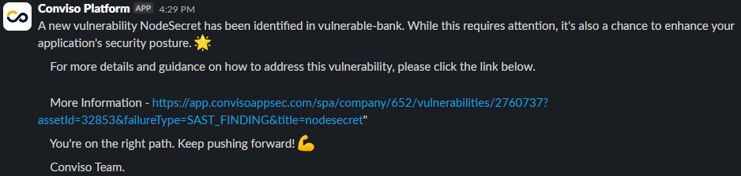
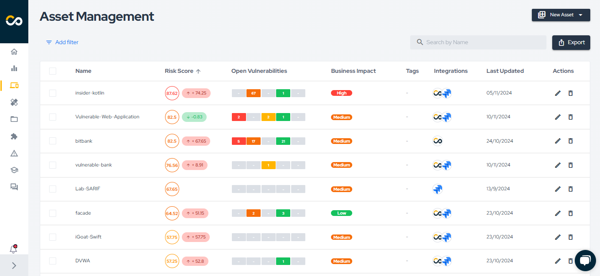
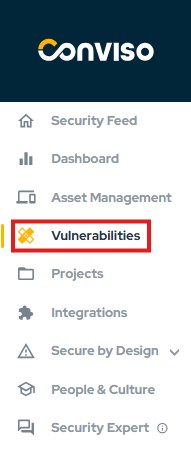
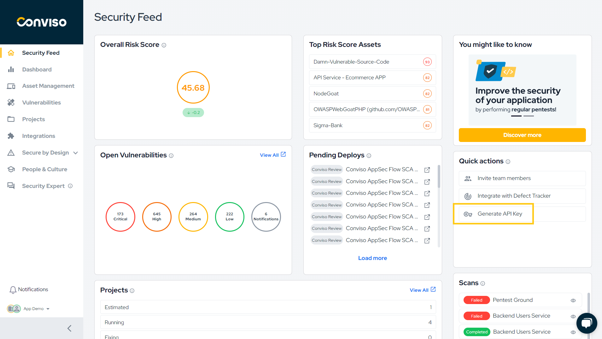
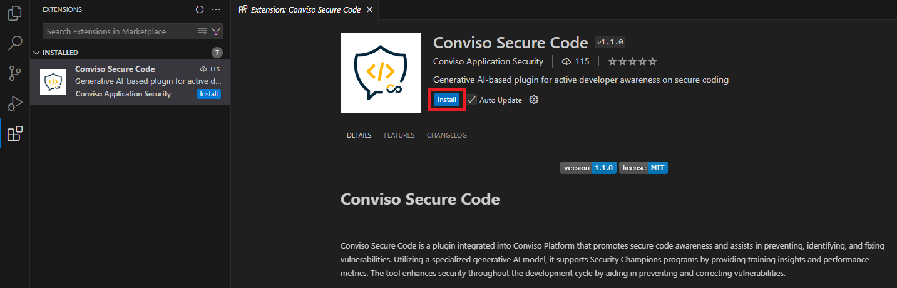

## Introduction

Conviso Platform offers a practical and integrated experience to track the full application security lifecycle. From vulnerability creation to resolution, the platform streamlines continuous risk detection, tracking, and remediation. With notifications in communication tools like Slack and Teams, integration with defect tracking systems, and a detailed view of assets and the SBOM (Software Bill of Materials), developers gain full visibility and control over application vulnerabilities. This empowers development teams to work efficiently and consistently, strengthening their ability to build secure applications.

Follow the steps below to gain a practical and integrated experience with the features that will be most present in your daily workflow as a developer.

## How to Bring Vulnerabilities into the Conviso Platform

To bring vulnerabilities into the Conviso Platform, different approaches can be taken:
- Execution of Conviso AST via [CLI](../cli/ast.md) or [CI/CD tool](../integrations/integrations_intro#conviso-platform-cicd-integration);
- Integration with an [External Scanner](../../integrations/integrations_intro/) (e.g., Checkmarx, Dependency-Track, Fortify, SonarQube, SonarCloud);
- Execution of [Conviso DAST](../security-suite/conviso-dast/conviso-dast.md);
- Importing vulnerabilities from a [SARIF file](../cli/findings.md);
- Manual registration of vulnerabilities.

## Create a Vulnerability Using Conviso AST

Your journey on the platform will begin the moment a vulnerability is created. To do this, let’s create a vulnerability. You can achieve this by copying the code below and pasting it into your IDE in a new file named "vulnerable.js":

```js
const SECRET = 'my-secret';
```

With the vulnerability added to the code, simply commit your code to trigger the analysis by Conviso AST. At this point, your company has likely already set up the scan to run in the pipeline, but an example YAML for GitHub Actions is shown below:

```yaml
name: CI
on:
  push:
    branches: [ main ]
  pull_request:
    branches: [ main ]

jobs:
  conviso-ast:
    runs-on: ubuntu-latest
    container:
      image: convisoappsec/convisocli
      env:
        CONVISO_API_KEY: ${{secrets.CONVISO_API_KEY}}
    steps:
      - uses: actions/checkout@v4

      - name: Run AST
        run: conviso ast run --vulnerability-auto-close
```

The code above is responsible for executing Conviso AST, which performs SAST, SCA, IaC analysis, secret detection, and generates the SBOM. You can find examples of other tools [here](../integrations/integrations_intro.md#conviso-platform-cicd-integration).

## Observe Scan Execution

Whenever Conviso AST runs, you can monitor its results through the log. From there, you can see how many SAST, SCA, and IaC vulnerabilities were found in that specific scan, how many vulnerabilities have been fixed, and track how many were resolved in the current execution.

```code
Run conviso ast run --vulnerability-auto-close
✅ Asset found...
✅ AST Project found...
Creating new deploy...
warning: Creating diff comparing revision[44c391c7475fa19221ceb8362808da72fe89c1ed] and the repository beginning
warning: Creating diff stats comparing revision[44c391c7475fa19221ceb8362808da72fe89c1ed] and the repository beginning
Deploy stats:
  current_version.commit=44c391c7475fa19221ceb8362808da72fe89c1ed
  current_version.tag=None
  previous_version.commit=4b825dc642cb6eb9a060e54bf8d69288fbee4904
  previous_version.tag=None
        
Running SAST on deploy ID "131458"...
Checking SASTBox authorization...
Starting SAST scan diff...
[*] Preparing Codebase...
Result saved to /tmp/prepare-codebase.20241110_192606.json
[*] Running fingerprint
Result saved to /tmp/fingerprint.20241110_192606.json
[*] Technologies detected:
    javascript,unknown
[*] Installing scanners, waiting ...
[*] Running app_inspector
    Sarif result saved to /tmp/app_inspector.20241110_192634.sarif
[*] Finished app_inspector
[*] Running secrets_scanner_gitleaks
    Sarif result saved to /tmp/secrets_scanner_gitleaks.20241110_192635.sarif
[*] Finished secrets_scanner_gitleaks
[*] Running nodejs_scanner_njsscan
    Sarif result saved to /tmp/nodejs_scanner_njsscan.20241110_192635.sarif
[*] Finished nodejs_scanner_njsscan
[*] Aggregating results from scanners...
[*] Running SastBox SARIF aggregator...
    Sarif result saved to /tmp/aggregator.20241110_192637.sarif
[*] Doing postscan analysis...
[*] Starting analysis on /tmp/aggregator.20241110_192637.sarif...
[*] Stats:
    Scanner app_inspector                 :     0 issue(s) found
    Scanner nodejs_scanner_njsscan        :     1 issue(s) found
    Scanner secrets_scanner_gitleaks      :     0 issue(s) found
    Total issue(s) found                  :     1
[*] Starting dedup process...
    No duplicated entries found
SastBoxV1 compatible result saved to /tmp/output.json
Result saved to /tmp/output.sarif
Time elapsed: 00:00:31
SAST scan diff done.
💬 0 issue(s) ignored due to duplication.
/tmp/tmpkhf9g06d/tmp/output.json
Running SCA on deploy ID "131458"...
💬 Preparing Environment...
💬 Starting SCA...
   Scanner osv_scanner is running.
💬 Processing Results...
Sending data to the Conviso Platform...
💬 0 issue(s) ignored due to duplication.
✅ SCA Scan Finished.
💬 Generating SBOM file...
✅ SBOM file generated successfully!
💬 Sending SBOM to the Conviso Platform...
✅ SBOM file sent successfully!
Running IAC on deploy ID "131458"...
💬 Preparing Environment...
💬 Starting IaC...
   Scanner iac_scanner_checkov is running.
💬 Processing Results...
💬 0 Issue/Issues ignored due to duplication.
✅ IaC Scan Finished.
```

If any issues arise during the scan execution, they will also be visible in the log. Should this happen, please contact our support team to have the issue resolved.

## Observe the vulnerability notification on Slack/Teams

To help users stay aware of risks associated with the company, Conviso Platform provides integration with Slack and Microsoft Teams for sending notifications. For instance, when a vulnerability has just been created, you can be alerted about this event in one of the mentioned tools. Below is an example of how the vulnerability notification appears in Slack:

<div style={{textAlign: 'center'}}>



</div>

## View Vulnerability Information in a Defect Tracker Tool

Conviso Platform integrates with various Defect Tracking tools so that developers can access vulnerability details without disrupting their usual workflow. This allows for the automatic transfer of vulnerabilities from Conviso Platform to tools like Jira, Azure Boards, or Businessmap, ensuring seamless integration.

Once a vulnerability is created in the Defect Tracking tool via Conviso Platform, a bidirectional communication system comes into play. If the status of the vulnerability is updated on Conviso Platform, the change will be reflected in the external tool immediately. Likewise, if the status is first modified in the external tool, the update will be promptly synchronized back to Conviso Platform.

The image below shows an example of a Conviso Platform vulnerability sent to Jira: 

<div style={{textAlign: 'center'}}>


</div>

## View Assets

All scan information is linked to Assets in Conviso Platform. An Asset could be an application, a microservice, or a repository, for instance. To view your Assets, click on "Asset Management" in the sidebar. By default, the Assets are listed from highest to lowest Risk Score.

:::note
Risk Score provides a holistic view of an asset's risk based on factors such as open vulnerabilities, attack surface, business impact, and data classification. Understanding the real risk of each asset is crucial for informed decision-making and prioritizing security efforts.
:::

<div style={{textAlign: 'center'}}>



</div>

Typically, Asset names will match the repository name, but they can be customized.

To see more details about an Asset, simply click on its name.

## View Vulnerability Information on the Platform

Finally, the details of vulnerabilities can also be viewed directly on Conviso Platform. There are two main ways to access this information:

- Viewing from an Asset's detail page
- Viewing from the sidebar menu.

### Viewing from an Asset's Detail Page

On the Asset detail page, simply click on the "Open Vulnerabilities" button, as highlighted in the image below:

<div style={{textAlign: 'center'}}>


</div>

This action will filter for all Asset vulnerabilities with the status Identified, In Progress, or Awaiting Validation. From there, locate the relevant vulnerability and click on its title.

### Viewing from the Sidebar Menu

Alternatively, you can navigate via the sidebar by clicking on "Vulnerabilities," as shown in the image below:

<div style={{textAlign: 'center'}}>



</div>

This will display all vulnerabilities with the status Identified, In Progress, or Awaiting Validation. Locate the relevant vulnerability and click on its title. To simplify your search, filters are available for creation date, asset name, asset tags, vulnerability type, and many other options.

When you have multiple vulnerabilities in your company, the Risk Context Prioritization Funnel will assist you in prioritizing vulnerabilities. For this, it is necessary to have previously configured the **Business Impact**, **Attack Surface** and **Data Classification** information in [Asset Management](../platform/asset-management.md). Notice that, in the example shown in the image below, there are 1,552 Open Vulnerabilities, but only 167 have a High Business Impact, are exposed to the Internet, and deal with or store Sensitive Data:

<div style={{textAlign: 'center'}}>


</div>

This way, you can easily prioritize which vulnerabilities should be fixed. To do this, simply click on the line related to **Sensitive Data**, as indicated below:

<div style={{textAlign: 'center'}}>


</div>

Once you've accessed the vulnerability, you can view general information such as description, solution, and references. Depending on the vulnerability type, you may also find the vulnerable code snippet, file name, and line number. Other types of vulnerabilities may display different details, like the request made to exploit the vulnerability and the server's response, for example.

## View SBOM Information

An SBOM (Software Bill of Materials) is a detailed list of all components, libraries, and dependencies used in an application. It is crucial for building secure applications as it helps identify potential vulnerabilities and ensures transparency in software composition.

When accessing an Asset, you can view its SBOM by clicking the View all button:

<div style={{textAlign: 'center'}}>


</div>

Here, you can explore your Asset’s dependencies, including details like component version, technology, license, package manager, associated CVEs, and open vulnerabilities for each component.

<div style={{textAlign: 'center'}}>


</div>

To learn more about Conviso SBOM, click [here](../security-suite/conviso-sbom/conviso-sbom.md).

## Fix Vulnerability

Once you understand how to address the vulnerability with support from the Conviso Platform, the next step is to identify the vulnerable file and line, which is information also provided by the platform. After that, simply apply the fix and follow your organization’s process for submitting code to the remote repository.

At this stage, there are different paths depending on how the vulnerability was identified:

### Vulnerability Identified by Conviso AST

If the vulnerability was detected by Conviso AST, the next scan run will recognize the fix and automatically change the status of the vulnerability to **Fixed**.

Ensure the command used to run the scan includes the `--vulnerability-auto-close` parameter.

### Vulnerability Identified by Conviso DAST

If the vulnerability was detected by Conviso DAST, the next scan run will similarly identify the fix and automatically update the status to **Fixed**.

### Vulnerability Identified Manually (e.g., via pentest)

If the vulnerability was found manually, such as during a pentest, you should change its status to Awaiting Validation. The Conviso security team will then retest the vulnerability to confirm whether it has been fully resolved or if it can still be exploited.

If the vulnerability is indeed fixed, a Conviso specialist will update the status to **Fixed**. If it remains exploitable, it will revert to its previous status.

### Vulnerability Identified by External Scanners

If the vulnerability was found using an external scanner and imported into Conviso via integration, the external tool must confirm the fix. Once that happens, the next sync with Conviso Platform will update the status to **Fixed**.

## Viewing Closed Vulnerability Notification on Slack/Teams

Once a vulnerability has been fixed, you can receive a notification via Slack, Microsoft Teams, email, or directly on the Conviso Platform. Below is an example of how the closed vulnerability notification appears in Slack:

<div style={{textAlign: 'center'}}>


</div>

## Conviso Secure Code

Conviso Secure Code is an AI-powered IDE plugin designed to identify and suggest fixes for insecure code while providing contextual explanations for vulnerabilities. Beyond correcting issues, it acts as a learning tool, helping developers understand the "why" and "how" behind each fix. This unique approach promotes skill development and safer coding practices directly within the developer's workflow.

With seamless integration into the Conviso Platform, Conviso Secure Code tracks performance metrics, ranks common vulnerabilities, and empowers developers to learn in real-time. By ensuring an optimal balance between security and productivity, it supports efficient, secure development while safeguarding your data and intellectual property.

To use Conviso Secure Code, ensure that your Company Administrator has enabled a valid license for you. After that, **generate an API Key from the Security Feed**:

<div style={{textAlign: 'center'}}>



</div>

Next, install the **Conviso Secure Code** extension in VS Code:

<div style={{textAlign: 'center'}}>



</div>

Press **Ctrl + Shift + P** and select the option Conviso: **Add API Key**. Enter your **API Key** and press **Enter**.

<div style={{textAlign: 'center'}}>


</div>

Now, open any file and **select a snippet of code you want to check for vulnerabilities**. Press **Ctrl + L** to analyze it. The results will then be displayed:

If you want to apply the suggested fix, confirm the correction, copy the updated code snippet, and replace the vulnerable code segment:

<div style={{textAlign: 'center'}}>


</div>

With Conviso Secure Code, you'll gain valuable insights and practical knowledge on how to write safer code. This not only strengthens your skills but also ensures the development of secure and reliable applications.

## Next Steps
Congratulations on taking your first steps with the Conviso Platform! By following the guide above, you have gained insight into some of the core features that empower you to maintain a strong and proactive security posture in your development workflow.

Remember, application security is an ongoing process, and Conviso Platform is here to support you every step of the way. From tracking vulnerabilities to leveraging SBOM insights and integrating seamlessly with your preferred development and communication tools, you now have the resources to build and maintain secure applications effectively.

We encourage you to continue exploring the platform, integrating it deeper into your CI/CD pipeline, and leveraging its full potential to enhance your security practices. For more advanced guides and best practices, be sure to check out our [Getting Started page](../index.md) and [join our community of security-conscious developers](https://discord.gg/En3KyvB9).

Stay secure, and happy coding!