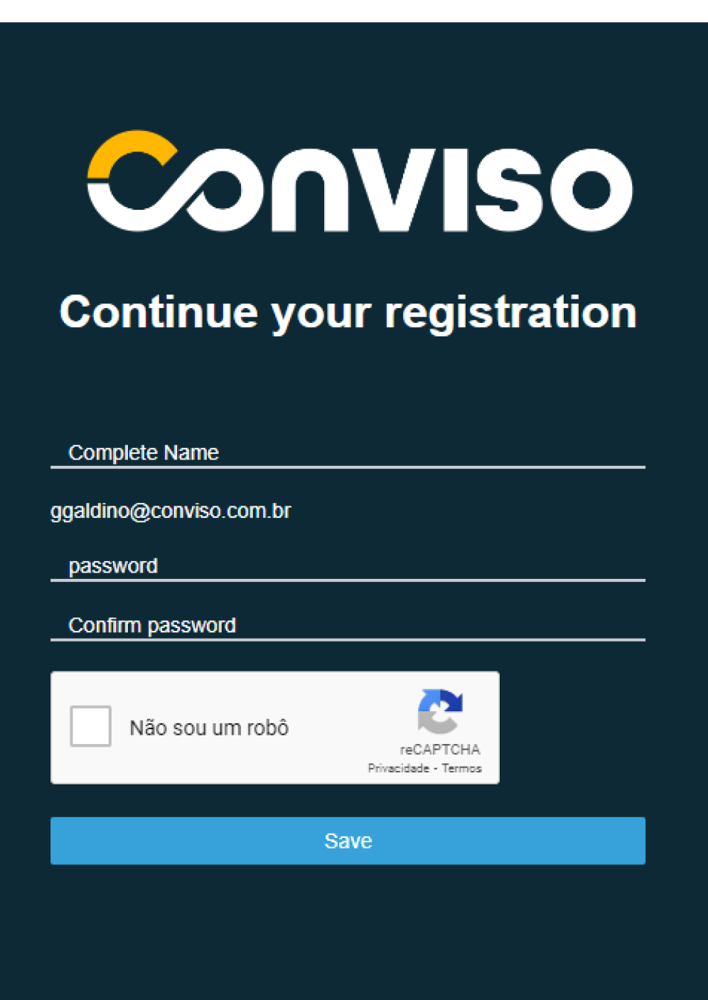
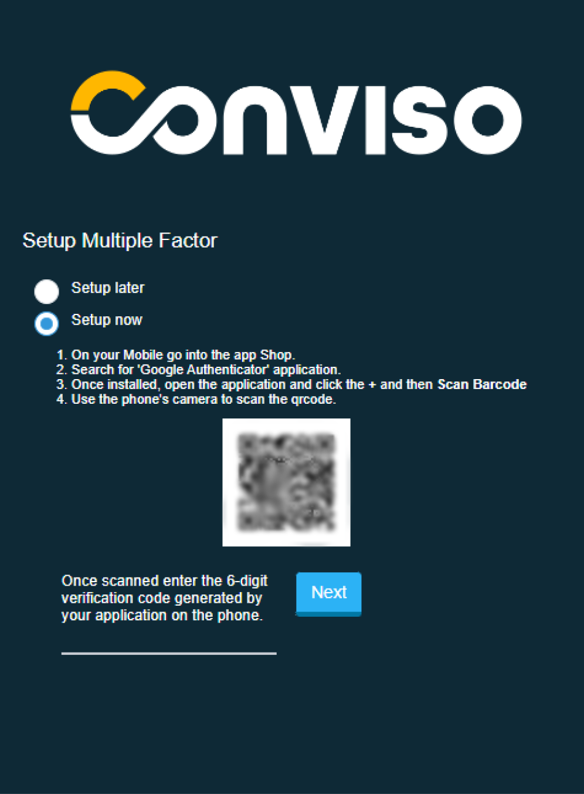
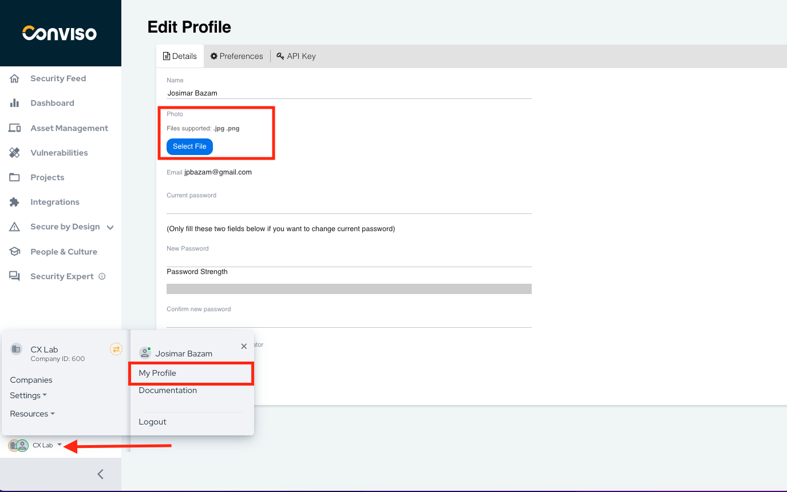
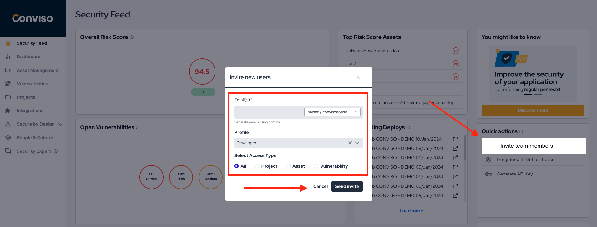
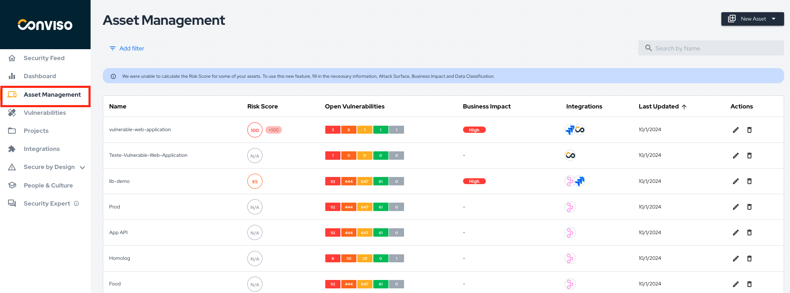
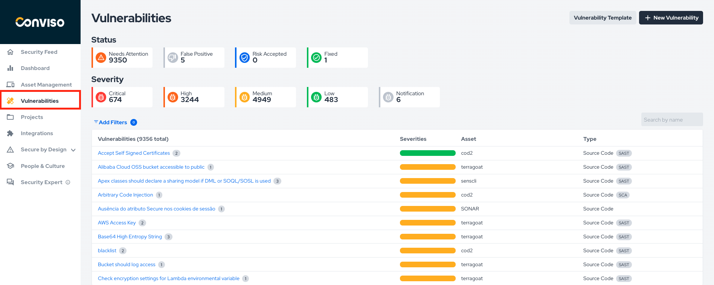
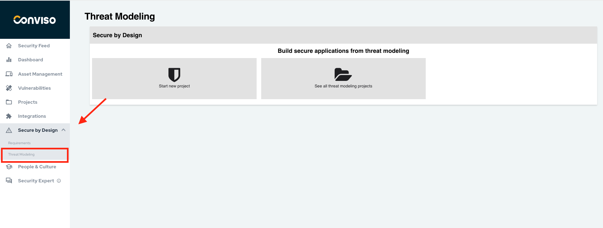

## Introduction

Hello, if you're reading this, it means you've just received your first access to the Conviso Platform! 

Let's go through the initial steps for a great experience in secure development.

## Step 1 - Login to Conviso Platform
If you are entering for the first time, the following screen will appear for you to register on the platform:

On this screen you can set your name and password. Then you can define a Multiple Factor setting.

To perform this configuration, click on "Setup now", follow the tutorial in the image, using your phone's camera to scan the code and authenticate:

When scanning the image, your cell phone will present you with a form of authentication to provide a secret 6-digit code.

Now that you have this secret code, enter it on the line to the left of "Next". That's it, 2FA authentication done!

To access the platform, you can use the traditional login with "username" and "password."  Alternatively, you can enhance your login security using a single sign-on (SSO).

Learn how to connect via [SSO based on our platform integrations](/integrations/google.md).

## Step 2 - Add a profile picture
In "Edit Profile" and “Details”,   click the “Select File” button to add your photo. This will make it easier for you to be identified by your team. Only .jpg and .png are supported.

## Step 3 - Configure email notifications

In "Edit Profile," click "Preferences," then choose when you want to receive notifications:

[See how to do it works](/general/email_notifications.md).

## Step 4 - Invite your team to strengthen the AppSec work

To invite new developers from your team to the platform, use the "Invite your team" button next to your profile or go to "Access Control" in the settings. 

[See how to do it in this documentation](/general/user_management.md).

## Step 5 - Set up a Conviso Platform integration

In "Integrations," you will have access to a wide range of technologies with which Conviso Platform integrates.

In addition to connecting with your code, we integrate with defect tracker/bug, CI/CD systems, SSO authentication, Business Intelligence tools, and various other solutions and platforms.

[See how to do it here.](/integrations/integrations_intro.md)

## Step 6 - Know your company's Assets and its attack surface

In the Assets Management section, you will obtain a comprehensive understanding of your company's assets and have the dimension of the attack surface. 

[Learn more by reading this documentation](/general/assets_management.md).

## Step 7 - Stay informed about vulnerabilities identified in your assets

In Vulnerabilities Management, you will have a broad view of the vulnerabilities found in your company's assets. You can also track the progress of the correction workflow there. 

Review the results carefully and take appropriate action based on the specific details of the identified issues.

[See how it works here](https://docs.convisoappsec.com/general/vulnerabilities_management).

## Step 8 - Prepare to handle vulnerabilities through *just in time* training

In People and Culture, you can study and practice secure coding methods in a virtualized environment that simulates real-world security challenge scenarios.

When you find a vulnerability, you will have the proper training to handle it. 

[Learn more about People & Culture here](/people-and-culture/overview.md).

## Step 9 - Create AppSec projects for your company

In Projects, you will have an overview of the AppSec initiatives, including projects focused on SAST, DAST, Pentest, and more!

Learn how to [build your project for a security initiative in your application](/general/projects_management.md).

## Step 10 - Perform threat modeling to Shift-Left

In "Secure by Design," perform automated threat modeling by defining security requirements based on MITRE CAPEC to strengthen the security of your application from the beginning! 

[See how it works here.](/secure-by-design/overview.md)

## Step 11 - Update any vulnerability templates

In "Intelligence," under the Vulnerabilities Template section, you can update and study various vulnerability templates, which provide information about the type of vulnerability and how to address it. 

[Learn the process here.](/general/vulnerabilities_templates.md)

## Step 12 - Still have questions? Reach out to our Security Experts

By clicking "Security Expert," you can request help regarding project details and vulnerabilities. 

If you need platform assistance, please chat with our Customer Experience team.

## Support

If you have any questions or need help using the Conviso Platform, please don't hesitate to contact our support team.

## Resources
By exploring our content, you'll find resources that will enhance your understanding of the importance of a Security Application Program.

[Conviso Blog](https://bit.ly/3JtXM8A): Explore our blog, which offers a collection of articles and posts covering a wide range of AppSec topics. The content on the blog is primarily in English.

[Conviso's YouTube Channel](https://bit.ly/3NIbbfM): Access a wealth of informative videos covering various topics related to AppSec. Please note that the content is primarily in Portuguese.

[AppSec to Go - Conviso's Podcast on AppSec](https://spoti.fi/43UJQwN): Tune in to our podcast, where we discuss AppSec-related subjects, providing valuable insights and discussions. The podcast is conducted in Portuguese.

