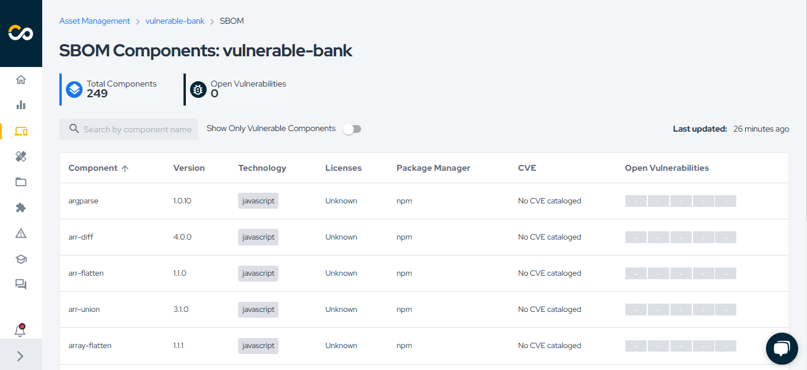

## Introduction

Conviso Platform offers a practical and integrated experience to track the full application security lifecycle. From vulnerability creation to resolution, the platform streamlines continuous risk detection, tracking, and remediation. With notifications in communication tools like Slack and Teams, integration with defect tracking systems, and a detailed view of assets and the SBOM (Software Bill of Materials), developers gain full visibility and control over application vulnerabilities. This empowers development teams to work efficiently and consistently, strengthening their ability to build secure applications.

Follow the steps below to gain a practical and integrated experience with the features that will be most present in your daily workflow as a security analyst.

## Understanding Security Feed

The Security Feed is an essential feature of the [Conviso Platform](https://cta-service-cms2.hubspot.com/web-interactives/public/v1/track/redirect?encryptedPayload=AVxigLKtcWzoFbzpyImNNQsXC9S54LjJuklwM39zNd7hvSoR%2FVTX%2FXjNdqdcIIDaZwGiNwYii5hXwRR06puch8xINMyL3EXxTMuSG8Le9if9juV3u%2F%2BX%2FCKsCZN1tLpW39gGnNpiLedq%2BrrfmYxgh8G%2BTcRBEWaKasQ%3D&webInteractiveContentId=125788977029&portalId=5613826), designed to provide users with real-time AppSec insights and actionable information related to their application security.

It serves as a centralized hub of knowledge, helping users understand the current state of their company's security and guiding them on what actions to enhance to [improve their application security](https://blog.convisoappsec.com/afinal-o-que-e-seguranca-de-aplicacoes/). 

In the Security Feed, you can observe information such as the company's Risk Score, assets with the highest Risk Score, open vulnerabilities, and project statuses. This provides a quick and comprehensive view of the most critical security concerns, empowering teams to prioritize their efforts effectively and take proactive measures to reduce risk.

## Enable Notifications

To stay updated on everything happening in the Conviso Platform, you can enable notifications to be alerted as soon as a vulnerability is identified or fixed, when an Asset is created, when there is a change in an Asset's Risk Score, or when you receive a new message from the Security Expert. This can be set up through tools like Slack and Microsoft Teams, but you can also receive notifications via email or directly on the Conviso Platform.

By enabling notifications, a Security Analyst can quickly respond to emerging security concerns, monitor the status of critical assets in real time, and ensure that the development team is aware of and can address security issues efficiently, fostering proactive and continuous application security.

[Click here](../../integrations/integrations_intro#communication-and-notification) to enable notifications through integrations or [click here](https://app.convisoappsec.com/spa/user/notifications-center) to activate email/in-app notifications.

## View Assets

An Asset refers to any entity that can be evaluated for security purposes. This includes applications, microservices, repositories, or any software component that is subject to security analysis. Assets serve as the foundational elements within the platform, linking scan results, vulnerabilities, risk scores, and related security data. By managing assets effectively, users can track and prioritize security efforts based on factors such as business impact, attack surface, and data classification.

All scan information is linked to Assets in Conviso Platform. An Asset could be an application, a microservice, or a repository, for instance. To view your Assets, click on "Asset Management" in the sidebar. By default, the Assets are listed from highest to lowest Risk Score.

:::note
Risk Score provides a holistic view of an asset's risk based on factors such as open vulnerabilities, attack surface, business impact, and data classification. Understanding the real risk of each asset is crucial for informed decision-making and prioritizing security efforts.
:::

To see more details about an Asset, simply click on its name.

From the Asset details page, you can [schedule a DAST execution](../security-scans/conviso-dast/conviso-dast.md), view the [vulnerabilities](../platform/vulnerabilities.md), the [SBOM](../security-scans/conviso-sbom/conviso-sbom.md), the [Risk Score](#understanding-risk-score), and various other information.

## Understanding Risk Score

The Risk Score on Conviso Platform is a crucial metric that enables Security Analysts to prioritize and address potential security issues effectively. It evaluates the risk of each Asset by analyzing key factors: Business Impact, Threats, Attack Surface, and Data Classification.
- Business Impact reflects the criticality of an Asset, determined by indicators such as developer activity.
- Threats represent the active vulnerabilities associated with the Asset.
- Attack Surface assesses the exposure level, considering if the Asset is accessible over the internet.
- Data Classification identifies whether the Asset handles sensitive data, like PII.

With this comprehensive view, Security Analysts can understand the overall security posture, track changes over time, and focus on actions to mitigate risks. The visibility of top high-risk and improving Assets, along with guidance on how to reduce risk, supports efficient and informed decision-making.

## View Vulnerability Information on the Platform

Finally, the details of vulnerabilities can also be viewed directly on Conviso Platform. There are two main ways to access this information:

- Viewing from an Asset's detail page
- Viewing from the sidebar menu.

### Viewing from an Asset's Detail Page

On the Asset detail page, simply click on the "Open Vulnerabilities" button, as highlighted in the image below:

This action will filter for all Asset vulnerabilities with the status Identified, In Progress, or Awaiting Validation. From there, locate the relevant vulnerability and click on its title.

### Viewing from the Sidebar Menu

Alternatively, you can navigate via the sidebar by clicking on "Vulnerabilities," as shown in the image below:

This will display all vulnerabilities with the status Identified, In Progress, or Awaiting Validation. Locate the relevant vulnerability and click on its title. To simplify your search, filters are available for creation date, asset name, asset tags, vulnerability type, and many other options.

### Risk Context Prioritization Funnel

With the vulnerabilities identified and the Risk Score information configured, the Risk Context Prioritization Funnel can assist you in prioritizing which vulnerabilities to remediate first. It considers Open Vulnerabilities and narrows them down through a series of criteria that increase the risk these vulnerabilities pose to your company. This includes filtering for assets with High Business Impact, those exposed to the internet, and those that handle or store sensitive data. 

In the example below, 1,552 vulnerabilities were initially considered. After applying the funnel, only 167 vulnerabilities matched the filters. Finally, the remaining vulnerabilities are sorted by severity, from highest to lowest.

This way, you can easily prioritize which vulnerabilities should be fixed. To do this, simply click on the line related to **Sensitive Data**, as indicated below:

Once you've accessed the vulnerability, you can view general information such as description, solution, and references. Depending on the vulnerability type, you may also find the vulnerable code snippet, file name, and line number. Other types of vulnerabilities may display different details, like the request made to exploit the vulnerability and the server's response, for example.

The Risk Context Prioritization Funnel provides Security Analysts with a clear, data-driven approach to focus their efforts on the most critical vulnerabilities. By highlighting issues that have the highest impact on business and security, this feature enables more effective risk mitigation, ensuring that the most pressing threats are addressed first and that resources are used efficiently to strengthen the organization's security posture.

## View SBOM Information

An SBOM (Software Bill of Materials) is a detailed list of all components, libraries, and dependencies used in an application. It is crucial for building secure applications as it helps identify potential vulnerabilities and ensures transparency in software composition.

When accessing an Asset, you can view its SBOM by clicking the View all button:

Here, you can explore your Asset’s dependencies, including details like component version, technology, license, package manager, associated CVEs, and open vulnerabilities for each component.

To learn more about Conviso SBOM, click [here](../security-scans/conviso-sbom/conviso-sbom.md).

## Manage your Projects

With the **Projects** feature, you can create different types of projects and centralize the results of security analyses, such as code review, penetration testing, and requirement validation (Threat Modeling), all in one place.

In the left menu, click on **Projects** to access the centralized dashboard of all projects:

On this screen, you will find an overview of the status of your projects.

### Creating New Projects

To create a new project, click on **New project**, add the necessary information, and click **Save**:

:::note
Every project must be associated with a [Requirement](#requirements).
:::

## Requirements

Requirements help keep large teams working towards the same goals, and following a pattern within a process is not the easiest of tasks. Requirements allow you to create an action plan based on tasks that must be accomplished. These tasks, in some cases, can be placed as mandatory for the closing of a project, which guarantees the manager total control over the execution.

To view all requirements, click on the **Secure by Design (1)** and **Requirements (2)** buttons:

### Creating a New Requirement

Conviso provides some standardized requirements, but if you need to create a new one, click on the "New Requirement" button:

Enter the requirement to be created, along with its **activities**, and click **Save**:

To view more details about Projects, [click here](../platform/projects.md). To view more details about Requirements, [click here](../platform/requirements.md). To view the progress of a project, [click here](../platform/projects.md#details-and-properties).

## Threat Modeling

Performing [Threat Modeling](https://bit.ly/3q8JlQw) in Secure by Design allows organizations to proactively address security risks and create robust application architectures. 

In addition to Conviso Platform, organizations can foster a culture of secure coding practices from the initial stages of development, leading to enhanced application security and a stronger defense against potential threats.

### About Threat Modeling

The purpose of Threat Modeling, on which the Secure by Design product is based, is to identify threat scenarios and create security requirements based on them. It is a collaborative process that requires the collective experience of the group of participants. 

It's an essential approach for developers, as it helps to develop more secure applications, reducing rework and avoiding errors in the code.

### Usage

To access it, click on the "Secure by Design" option in the left menu. In this first moment, let's get to know the Threat Modeling process by clicking on the "Threat Modeling" suboption:

Learn how to perform Threat Modeling on the Conviso Platform by [clicking here](../platform/threat-modeling.md).

### Understanding the Dashboard
The Conviso Platform Dashboard offers three distinct views:
- AppSec Posture;
- AppSec KPIs;
- Secure Code Metrics.

#### AppSec Posture
This dashboard displays information about the Risk Score and MTTR (Mean Time to Remediate). It shows the company’s current status and tracks changes over time, based on the applied filters. With this data, you can monitor the overall health of your organization’s application security and identify trends or areas requiring immediate attention.

This view enables Security Analysts to gain insights into how risk is evolving across the organization and helps them advocate for improvements. By understanding both the current security posture and historical performance, they can prioritize efforts and guide their teams in reducing risk efficiently.

#### AppSec KPIs
This dashboard provides information on:
- Open vulnerabilities;
- Fixed vulnerabilities;
- Vulnerabilities Over Time by Status;
- Vulnerabilities Over Time by Severity;
- Vulnerability by Severity;
- Project by status.

With this information, you can measure your team’s progress in resolving vulnerabilities and understand where to focus remediation efforts.

The AppSec KPIs view empowers Security Analysts by providing concrete metrics that help track the effectiveness of security initiatives. It offers visibility into how well vulnerabilities are being managed and resolved, helping Champions to drive accountability and improvement in secure development practices.

#### Secure Code Metrics
If you have Secure Code licenses, this dashboard helps you understand how developers are leveraging the feature. It displays information such as:
- Prevented Vulnerabilities;
- Developer Engagement;
- Top Prevented Vulnerability;
- Top 3 Users;
- Top 5 Prevented Vulnerabilities;
- Prevented Vulnerabilities Over Time.

With this data, you can measure developer engagement and the impact of secure coding practices.

This view provides Security Analysts with insights into the effectiveness of secure coding efforts within the team. It highlights proactive measures taken by developers and celebrates key contributors, encouraging a culture of security awareness and continuous improvement. This helps Champions support and guide developers in building secure software from the ground up.

[Click here](../platform/dashboard.md) to view more information about the Conviso Platform Dashboard.

## Security Expert

The Security Expert feature allows you to directly contact Conviso's experts. This helps you understand your vulnerabilities, learn how to fix them, and clarify any doubts related to your company's projects.

## Usage
To use the Security Expert feature, you can access or create a chat from the vulnerability/project detail screen or from the sidebar menu. Let's do this by clicking on **Security Expert** in the sidebar menu:

In the image below, the area highlighted with number 1 represents all company chats. The button highlighted with number 2 is used to start a new chat:

[Click here](../platform/security-expert.md) to learn more about the Security Expert feature.

## Attachments

Manage attached files in Conviso Platform. This feature allows you to securely share files with Conviso's Security Experts, ensuring a safe way to grant access to sensitive information that needs to be shared, such as application source code and vulnerability reports, for example.
This ensures control over who should have access to this critical information.

To learn how to attach files to the platform, [click here](../platform/attachments.md#creating-attachments).

## Credentials

Conviso Platform has a complete workflow for vulnerability management, such as the process cycle to evaluate, remediate, and mitigate security weaknesses in systems or applications.

To learn how to share credentials on the platform, [click here](../platform/credentials.md#creating-credentials).

## Next Steps

Congratulations on taking your first steps with the Conviso Platform! By following the guide above, you have gained insight into some of the core features that empower you to maintain a strong and proactive security posture in your development workflow.

Remember, application security is an ongoing process, and Conviso Platform is here to support you every step of the way. From tracking vulnerabilities to leveraging SBOM insights and integrating seamlessly with your preferred development and communication tools, you now have the resources to build and maintain secure applications effectively.

We encourage you to continue exploring the platform, integrating it deeper into your CI/CD pipeline, and leveraging its full potential to enhance your security practices. For more advanced guides and best practices, be sure to check out our [Getting Started page](../index.md) and [join our community of security-conscious developers](https://discord.gg/En3KyvB9).

Stay secure, and happy coding!