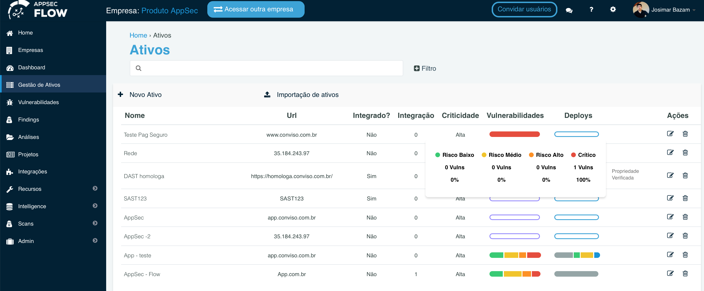
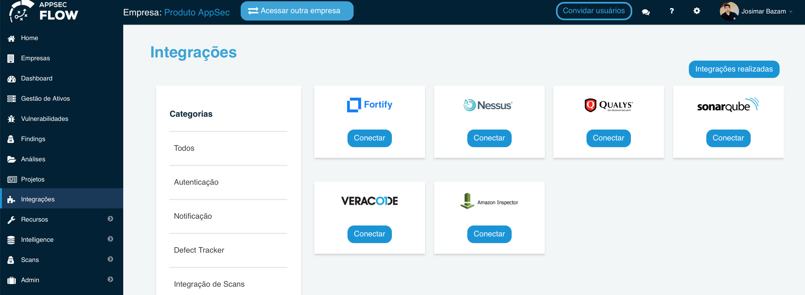
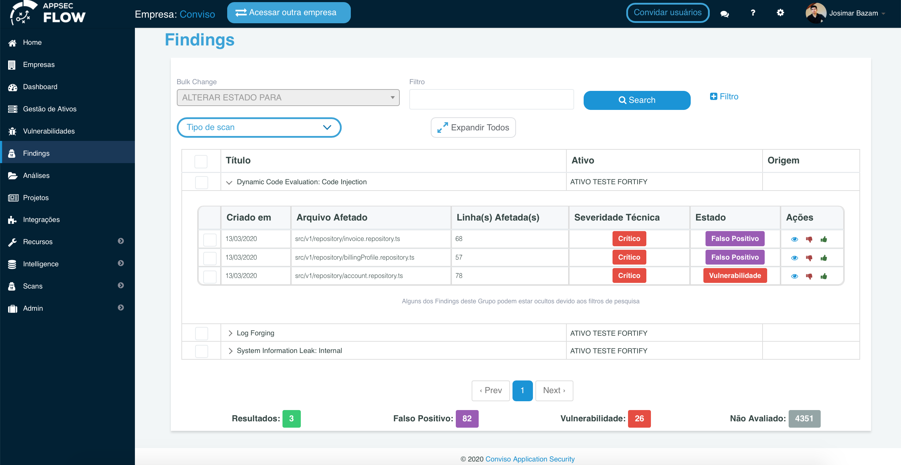
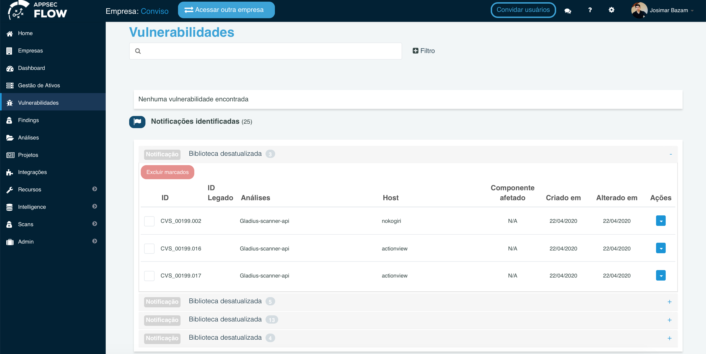
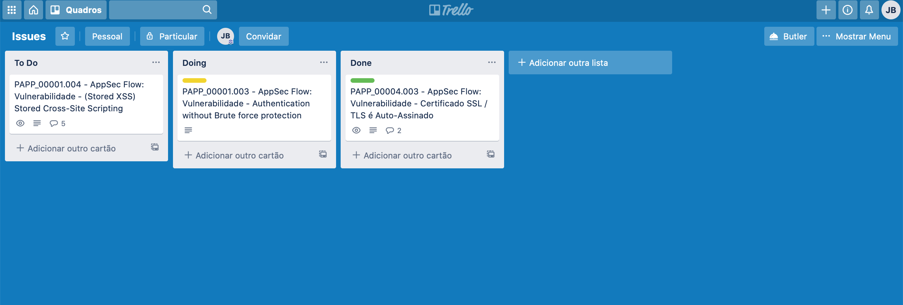
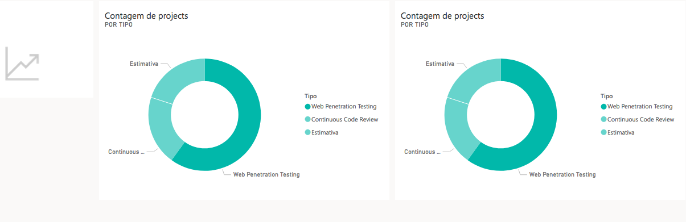

<iframe width="800" height="450" src="https://www.youtube.com/embed/UGteZS-rRzs" title="YouTube video player" frameborder="0" allow="accelerometer; autoplay; clipboard-write; encrypted-media; gyroscope; picture-in-picture" allowfullscreen></iframe>

The platform has released a new version, with some features that will help our customers with some troubles.

## New Features

- Playbooks;

- Assets importing;

- New integrations (Qualys, Sonarqube, Fortify, Slack, Github, Nessus, Datasets, Veracode, Amazon Inspector and Trello);

## Benefits

The **Playbook** aims to help large teams working with the same goals, following a pattern within a process. Playbooks allow you to create an action plan based on tasks that must be carried out; in some cases they can be placed as mandatory for project closure, which guarantees the manager control over the execution.

The **Assets Importing** is a feature that we created for the user to import their assets from platforms and .csv file. With the assets registered in Appsec Flow, the customer has a vision of the life cycle of each asset, facilitating the follow-up and monitoring of possible weaknesses.

## New integrations

### Network Scan and Cloud Platform (Nessus, Qualys and Amazon Inspector)

Consolidate network vulnerabilities. From a single console, you can consolidate and apply vulnerability analysis identified by network and development scans, develop action plans for the treatment of vulnerabilities.

### Cloud Vulnerability

Consolidate all identified company vulnerabilities into your AWS Cloud platform and develop a single action plan to address the vulnerabilities.

- **Sonarqube and Fortify**

Consolidation of **SAST** and **DAST** vulnerabilities: Associate analysis with assets and promote all actions to address vulnerabilities using complete workflow.

- **Github SCA**

Manage 3rd party library vulnerabilities, all company vulnerabilities identified by Github in 3rd party libraries, consolidate using full workflow.

### Demand and Notification Management

Integrate security with the dev team and optimize communication. Send vulnerabilities to the demand management platform and notify teams in Slack channels.

- **Slack**

- **Trello**

### Datasets

Integration with Data Analytics and Data Science. Optimize your time by easily issuing custom reports. This feature allows you to extract and analyze data in various BI platforms such as Tableau, Google Studio, Power BI and others.

To learn more about BI, click here [Business Intelligence](../../integrations/datastudio/#!)