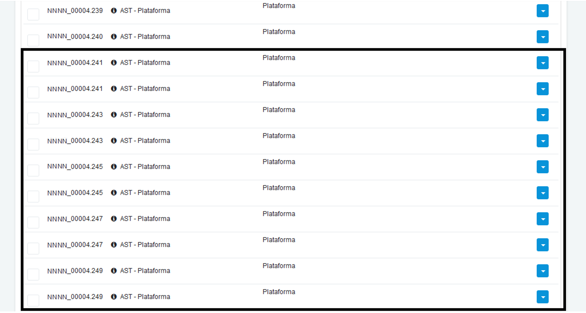

We are happy to share with all customers and partners the availability of another AppSec Flow release - version 3.0.5!

This release is an additional step towards our strategy of putting Flow at the center of the DevSecOps pipeline, supporting our customers in the implementation of their "secure by design" application building program.

## Main Highlights of version 3.0.5

### Flag to consider all Finding as Vulnerability in Policies

The setting to classify all findings as vulnerabilities will be valid once this option is selected. It is also possible to classify by its severity.

<div style={{textAlign: 'center'}}>


</div>

### Two-way communication with Jira

When a customer changes the Jira state of a given task to "in fix" (or similar), Flow now updates the vulnerability state as well. Vulnerability statuses are synchronized.

### Duplicate/Triplicate Vulnerabilities

Vulnerabilities must and will be unique. This setting has been fixed for all clients.

<div style={{textAlign: 'center'}}>



</div>

## Performance tweaks

- Correction applied to the error message when trying to save an Analysis, without the amount of hours filled.

- The notification via e-mail referring to comments made in Security Champions, has returned to work.

- Adjusted character encoding interpretation in deploy review, making it easier to remove malicious characters.

- Integrations with Bitbucket and Fortify have been fixed.

- Adjustments in the Education module, allowing the start of all activities.

- Adjustments were made to the states of user-initiated estimates.

- We've made improvements to the layout of the vulnerability history timeline, allowing for better visibility of changes made.

- We fixed sending evidence of AppSec Flow vulnerabilities to Jira.

## Coming Soon...

The next release (3.0.6) will include

- New Contract Registration Flow

In the meantime, do not hesitate to contribute with your criticisms, ideas and suggestions at ```product@convisoappsec.com```.