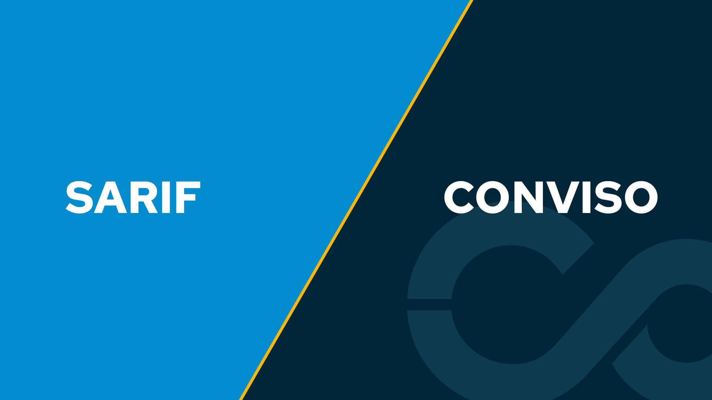

Release date: January 24th, 2023

## What's New

Welcome to our first 2023 product release note! We are constantly implementing changes to optimize user experience on our platform and to integrate it even more with the developer's ecosystem.

### Support for SARIF format is now available!

Conviso Platform now has the ability to import results from external scanners that use SARIF format as their output.
With this new feature, developers can automate the whole vulnerability management process of those tools using our platform and worry more about fixing the vulnerabilities instead of doing manual work. Let the automation with us!
You can configure this with your CI/CD of preference using our CLI in just a few steps and start taking advantage of it.

Check [our documentation](https://docs.convisoappsec.com/cli/findings/#import-findings) to learn more. 

## Bug Fixes

To make Conviso Platform a more reliable product, these are some bugs that we fixed recently:

- Fortify integration fixes;
- Dependency Track integration fixes;

