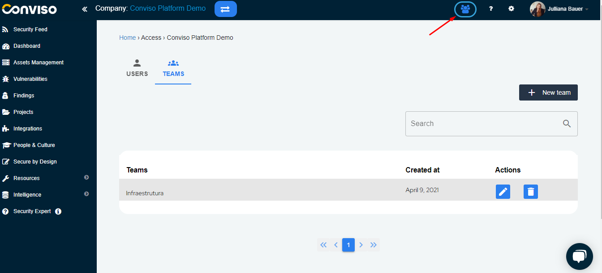
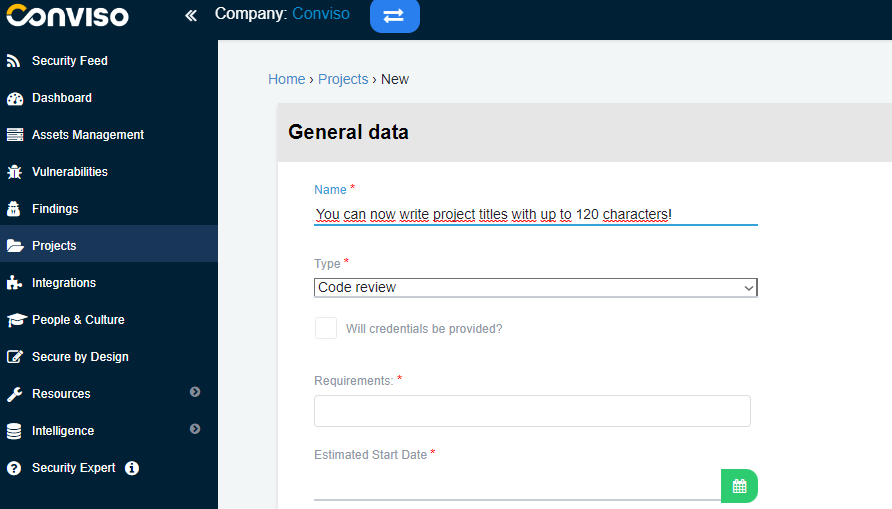

Release Date: December 20th, 2022

## What's New

Welcome to our Release 3.8! We are constantly refining Conviso Platform to empower developers to build secure applications. We have recently implemented several changes to improve the user experience on our platform. Check them out:

### A new dashboard experience for better decision making

Welcome to Conviso Platform's new, improved dashboard experience, focused on leveraging your decision-making process. We enhanced it not only to make it more attractive but also to improve your experience. For all these purposes, we included better graphics and even more information, so you can have a better vision and gain better insights regarding your applications, improving your decision-making process with the platform.

<div style={{textAlign: 'center'}}>


</div>

###  Managing Teams in access control is now easier

We are glad to present you with a new experience for managing teams in Access Control, with more organized and optimized resources! Access Control enables clients to manage Users, Profiles, and Teams. A new flow has been created in the experience related to teams. Our goal is to offer a more effective interconnection between profiles and users. We also implemented a new, enhanced UI to improve the user experience. Find it by clicking on the blue icon on the top right corner of the platform.

Have a look:

<div style={{textAlign: 'center'}}>



</div>

### Requirements and Guidelines

You can now find a new item on the menu: Requirements and Guidelines. Find it by clicking on the Intelligence menu option. We created it to offer an easily accessible option in our menu that only lists requirements and guidelines. As a result, companies can build their knowledge bases and guides without associating them with a project. Now it is also possible to know when each Requirement and Guideline was created and updated.


### Create assets with Conviso CLI

We also included automation that creates assets from a pipeline through the Conviso CLI. With this automation, the integration process becomes simpler. The reach of Conviso CLI for developers was increased, improving their interaction with the platform.

```
conviso assets create
```

### You can now name your Projects as you wish

When accessing the Projects item in the main menu, you will notice that you can now label each project with up to 120 characters. We made this change to enable you to write longer, more detailed titles, bringing more clarity to your team. 

<div style={{textAlign: 'center'}}>



</div>

## Bug Fixes

To make Conviso Platform a more reliable product, these are some bugs that we fixed recently:

- Improvements in the readability of vulnerable codes present in vulnerabilities;;
- In Requirements Controls, when clicking on a requirement within a project, it did not allow the user to view its contents - this bug has been fixed;
- A few customers reported difficulties when registering a new user. The user registration process is now working as it should be;
- When accessing the deployments, some users reported that they were receiving an error message, which has already been addressed and fixed;
- We also fixed a bug that some users of the platform were encountering when trying to use the filter on the findings page.

## Coming Soon
We are working on the user experience and toward better usability of the main domains of the Conviso Platform. While you read this document, our Product Development team is working on the following improvements:

- Profiles for better Access Control capabilities;
- New UI with better menu navigation;
- The redesign of a vulnerability management experience;
- A status update automation for Conviso scans results;
- Company off-boarding.
- The possibility to create learning journeys for your developers on People & Culture.

See you on our next product release!
