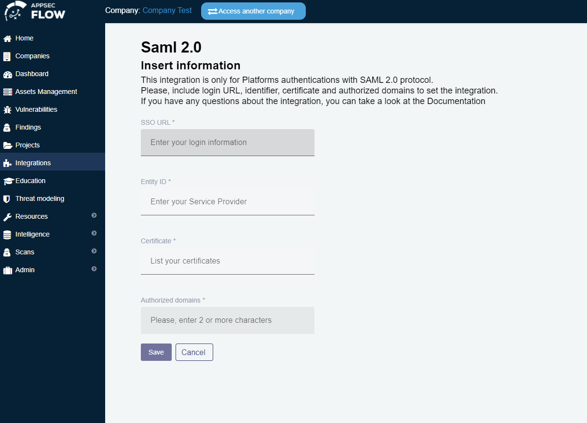

## Jira Integration Fixes, Enhancements and new UX 

In this release you will be able to easily configure new Jira boards as well as custom attribute mapping for two-way integration with Conviso Platform. Your feedback was heard and the team focused on enabling you with a more practical Jira integration user experience.

Adding new boards is easy-peasy now, as well as editing previous configurations.
With this integration, your developers will gain productivity by getting notified with new Jira issues when vulnerabilities are being found.
Also, by using webhooks, both Jira and Conviso Platform will be synced.

## Generic SAML 2.0 Integration

There are already a variety of Single Sign On integrations within Conviso Platform but now it is possible to configure custom Identity providers that support SAML 2.0 protocol. 

In a nutshell, if there is no specific integration for your tool, you can just use the generic SAML 2.0 integration instead.

For example, if you use Oracle Access Management (OAM) you can now use this integration to set it up as your identity provider for logging in to Conviso Platform without user/password authentication.

## Bug Fixes

We take bugs seriously. In order to make Conviso Platform a more reliable product, these are some of the most important bugs that were fixed in this latest release.

### Projects

**Fixed**: Misleading behaviour when trying to create a new project

**Fixed**: Unable to change status to in progress for some project types

**Fixed**: CSS issue while using the filter option

**Fixed**: Misleading message when deallocating an analyst from a project

### Vulnerabilities

**Fixed**: CSS issue while using the filter option

**Fixed**: Inaccurate english translations

**Fixed**: Unable to search for specific vulnerabilities by their name

**Fixed**: Unable to properly filter vulnerabilities by date range

### Home

**Fixed**: Unable to load home page for specific users 

### Education

**Fixed**: Unable to add or remove user access

### Integrations

**Fixed**: Inaccurate english translations within integrations list

**Fixed**: Priority is not being set when Jira Issues are created

### API

**Fixed**: Wrong response format of scope attribute in GraphQL Project query