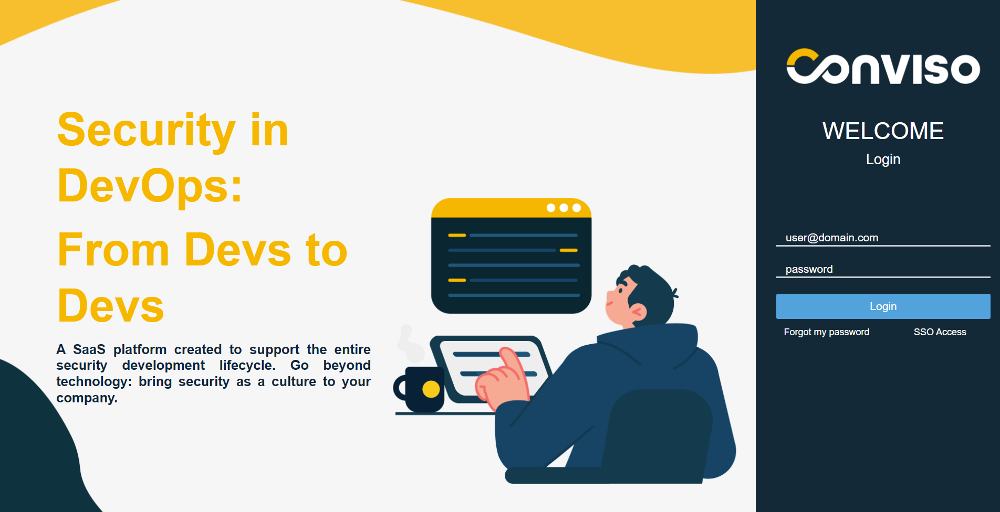
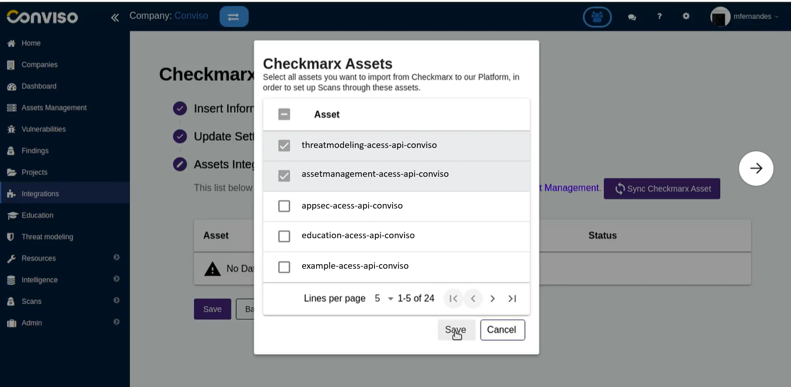

## New product brand positioning

In this release, we bring you our new product positioning, now called Conviso Platform. This new positioning's goal is focused on offering products as a solution to empower developers to build secure applications, as our new slogan is **Security in DevOps: From Devs to Devs**.

<div style={{textAlign: 'center'}}>



</div>

## Global Domain

Our application domain was updated to a global positioning as ```app.convisoappsec.com```. Check it out!

## Checkmarx Integration Fixes, Enhancements and new UX

Now you are able to easily configure recurrence and periodicity (daily or weekly) for automatic synchronization between Checkmarx and Conviso Platform.

<div style={{textAlign: 'center'}}>



</div>

## Bug Fixes

We keep taking bugs seriously. In order to make Conviso Platform a more reliable product, we fixed bugs related to Integrations, general Configuration and Notification in this latest release. 