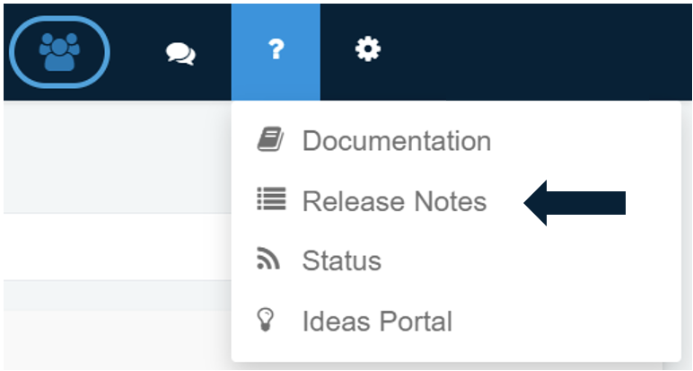
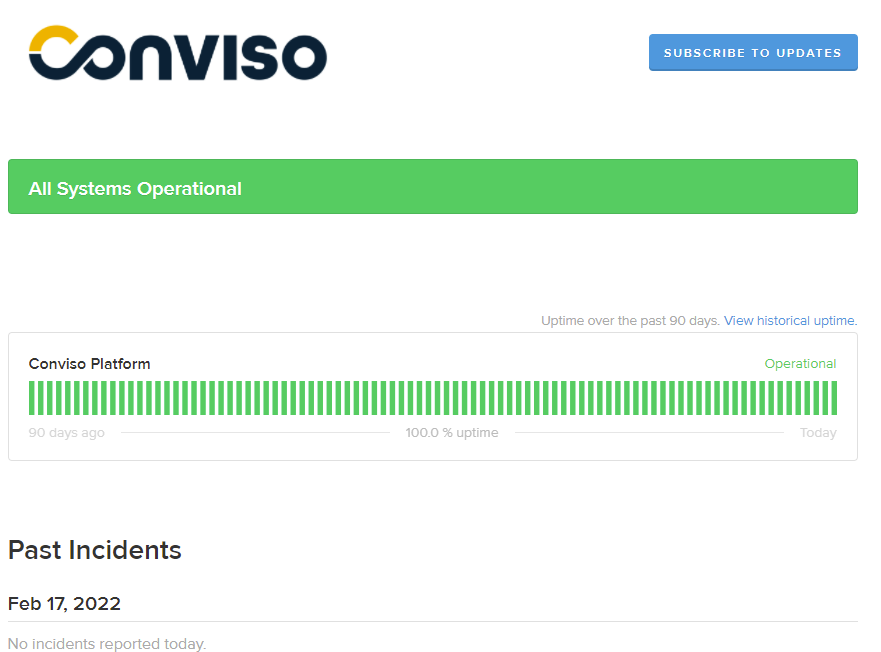

## Playbooks as Requirements

Playbooks will now be found in the Platform as Requirements. We believe that the term _requirements_ shares a better understanding of this functionality within the product. Requirements are used to guide the user to perform specific activities, using these to organize and validate the outcome of a Project.

## Release Notes

Release notes are an essential artefact when a new product release goes live to production. There you can find detailed information about what is new to the product, as well as enhancements and a summary of bug fixes. Now, you can find this information more easily in the Help's top menu bar section.

## Status Page

We also included in the Help's top menu bar section, a way to stay up-to-date with the status of our services in our platform [Status Page](https://conviso.statuspage.io/). We believe that transparency is the best way to grow and build up trust between our customers and us.

