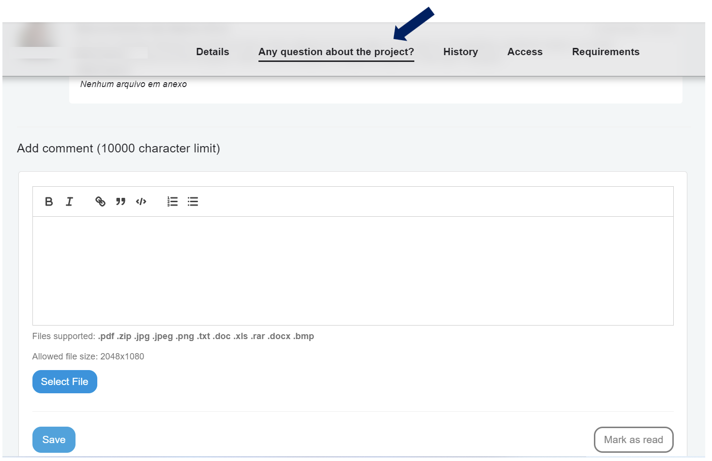
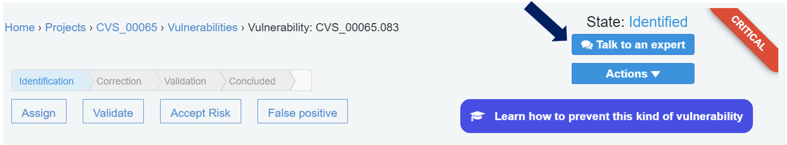

## New Security Champions positioning

Looking for a better concept and understanding of Security Champions on the Conviso Platform, we have updated our positioning as following:

### For Projects:

You can find Security Champion now as "**Any question about the project?**". The experience remains the same for now, but usability improvements are on the way. Remember: through this channel, we should exchange content about the specific project you are in

### For Vulnerabilities:

You can find Security Champion now as "**Talk to an expert**". The experience also remains the same after clicking the buttom. The difference is that this communication has lost one additional step to the user through an easier access. 

