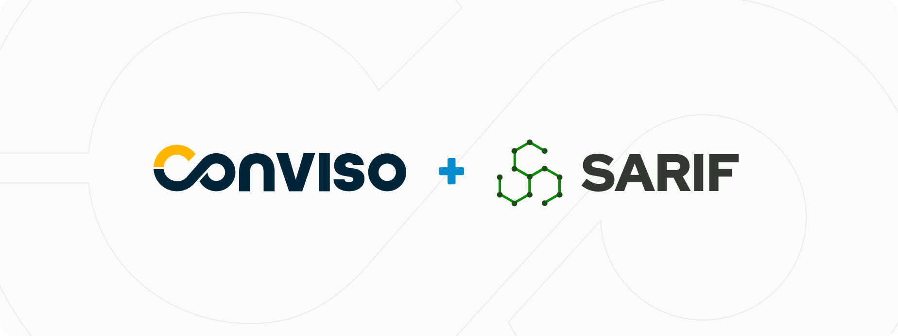
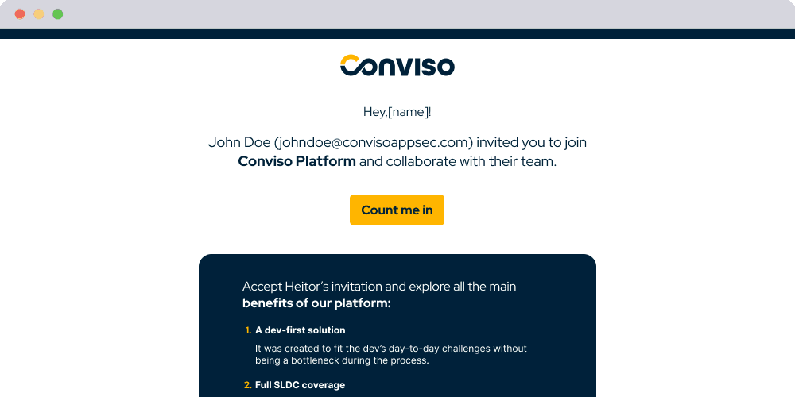

Release date: March 10th, 2023

# Key Benefits

This new version includes the ability to import results from external scanners that use [SARIF](http://docs.oasis-open.org/sarif/sarif/v2.1.0/sarif-v2.1.0.html) format as their output and a simpler way to invite your team to Conviso Platform

- Increased productivity for developers;
- Less manual work;
- Aggregate results and manage vulnerabilities from different tools like [Trivy](https://github.com/aquasecurity/trivy), [Semgrep](https://github.com/returntocorp/semgrep), Conviso Scan tools and other tools supporting SARIF format;
- Bring your team to Conviso Platform and start embracing AppSec cultural change 

With these enhancements, you can easily bring your team to the platform to manage and address vulnerabilities across different tools, saving time and effort while ensuring the security of your applications.

## What's New

#### *New Feature*
### SARIF Support now available!

<div style={{textAlign: 'center'}}>



</div>

Developers can now automate the entire vulnerability management process within Conviso Platform by integrating it with tools that use SARIF as the output format. That means you can now focus on fixing vulnerabilities instead of doing manual work - our automation handles it for you!
Configuring this feature with your preferred CI/CD tool is easy. Simply use our CLI and follow a few easy steps. 

This is an example that shows how to run a Trivy scan an send the results to Conviso Platform using Github Actions:


```yaml

name: Trivy Security Scan + Conviso importation

on:
  push:
    branches:
      - main

jobs:
  scan:
    # In this example we are using Trivy, but you can change the Scanner to any who performs SARIF output
    name: Trivy Scan
    runs-on: ubuntu-20.04
    steps:
      - name: Checkout code
        uses: actions/checkout@v3

      - name: Run Trivy vulnerability scanner in repo mode
        uses: aquasecurity/trivy-action@master
        with:
          scan-type: 'fs'
          ignore-unfixed: true
          format: 'sarif'
          output: results.sarif
          severity: 'CRITICAL'

  import:
    name: Importation SARIF results to Conviso Platform 
    needs: scan
    runs-on: ubuntu-20.04
    container:
      image: convisoappsec/flowcli:1.12.0-rc.2
      env:
        CONVISO_API_KEY: ${{secrets.CONVISO_API_KEY}}
    steps:
      - name: Checkout code
        uses: actions/checkout@v3

      - name: Download result from previous scan
        uses: actions/download-artifact@v3
        with:
          name: results.sarif

      - name: SARIF Importation
        run: |
          conviso findings import-sarif --input-file results.sarif
```

Check [our documentation](https://docs.convisoappsec.com/cli/findings/#import-findings) to learn more and start making use of it! 

<br />

#### *Enhancement*
### A new, simpler and redesigned User Invitation process

<div style={{textAlign: 'center'}}>



</div>

We believe effective application security requires the whole team to participate and engage. From Developers, Security Champions, Security Analysts, Engineering Managers, CISOs to CTOs, all need to have the proper tools and information to make that culture shift to bring security to the entire software development life-cycle.
That's why you can and should invite team members to Conviso Platform without any extra cost.

In this release, we are delivering a simpler experience and redefined design for both, in-app and email design.

#### *Bring the whole team to Conviso Platform and start changing the Culture of Application Security in your company.*

### Keep updated on upcoming deliveries!
To have a better understanding about what's coming next on our platform, have a look at our [Roadmap](https://sharing.clickup.com/3016679/b/h/2w1z7-101803/0f4cd1b4e98d956).


