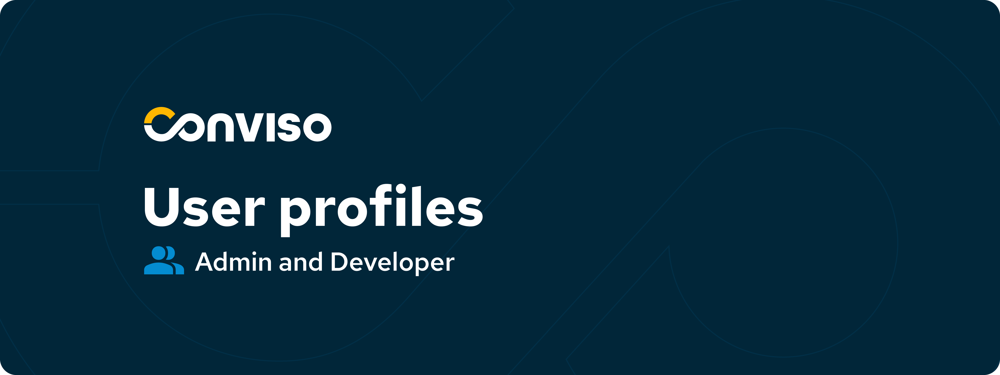
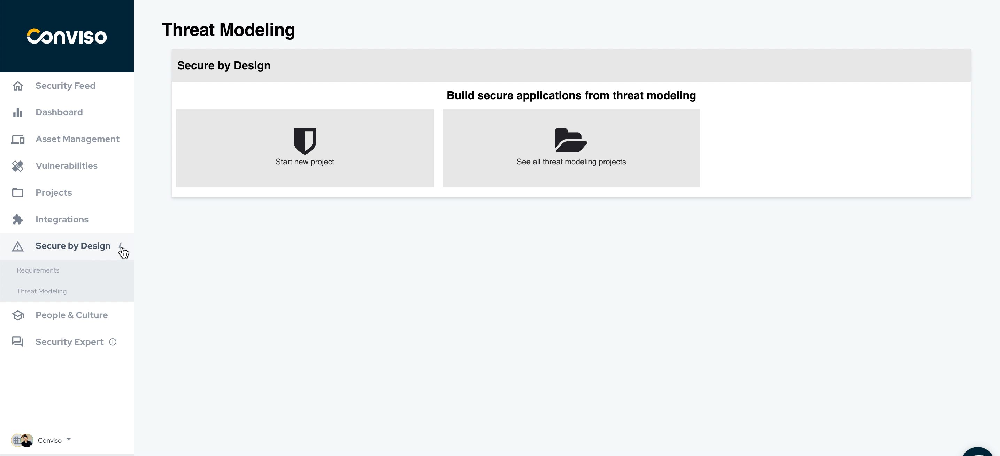

Release date: May 5th, 2023

# Key Benefits

- More flexibility and granularity for users and teams;
- Threat Modelling usability and experience improvements;

## What's New

#### *New Feature*
### Developer and Admin default profiles now available

In February, we released the [Custom Profiles](https://docs.convisoappsec.com/releases/release3.9/) feature, which gave teams flexibility in managing user access. As part of our ongoing efforts to enhance the Access Control module, we are excited to announce two default Profiles that are meant for most businesses with a set of pre-defined permissions to easily manage users within the organization.

- Admin: The Admin profile is designed to provide full access to all the functionalities of the company's platform to which they belong, in addition to the following exclusive accesses: 
  - Full access to Access Control:
    - Management of users in their account; 
    - Profile management; 
    - Team management ;
  - Business unit management.

- Developer: The Developer profile does not have access to any assets by default, but should receive access to assets from another user, such as an Admin or even another Developer.
  Permissions: 
    - Limited vulnerability status update (False Positive and Risk Accepted are not allowed);
    - Create, view, and edit Assets;
    - Create, view, and edit Projects;      

 

With these default Profiles, you can manage users of Conviso Platform to have the specific set of permissions depending on their role in your organization. Let your users do what they are expected to do - and nothing more.

Remember that if some of the permissions do not comply with your internal processes, feel free to create a custom profile instead.

 

#### *Enhancement*
### Threat Modeling improvements

We've made significant improvements to enhance the usability and performance when conducting Threat Modeling. Updates include:
- Attack pattern list was consolidated to better reflect [CAPEC](https://capec.mitre.org/data/index.html);
- Both attack patterns and requirements to be implemented are more clear and structured for an easy user understanding;
- The final step for the creation of the threat modeling project has also been simplified to gain in usability and performance;
- Information within each requirement in the project has been improved with a clearer requirement title and reference;
- Minor label updates for usability improvements.

You can now access Threat Modeling through the "Secure by Design" menu option. 
In future updates, we will add STRIDE categorization for easier identification of attacks within CAPEC.

### Keep updated on upcoming deliveries!

To have a better understanding about what's coming next on our platform, have a look at our [Roadmap](https://sharing.clickup.com/3016679/b/h/2w1z7-101803/0f4cd1b4e98d956).

