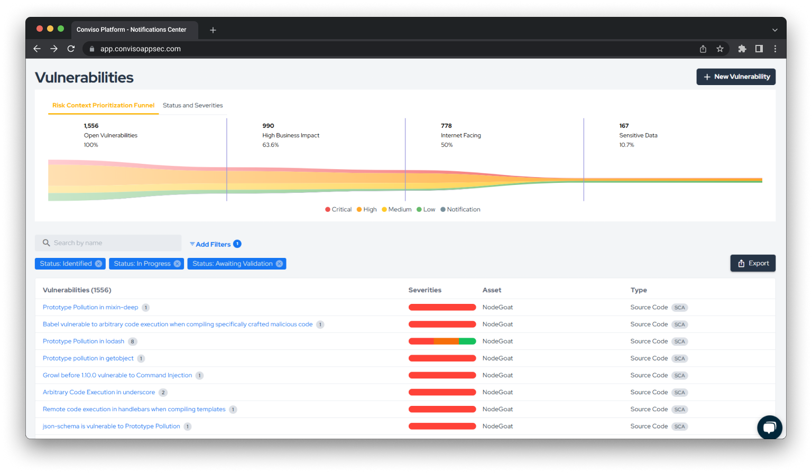
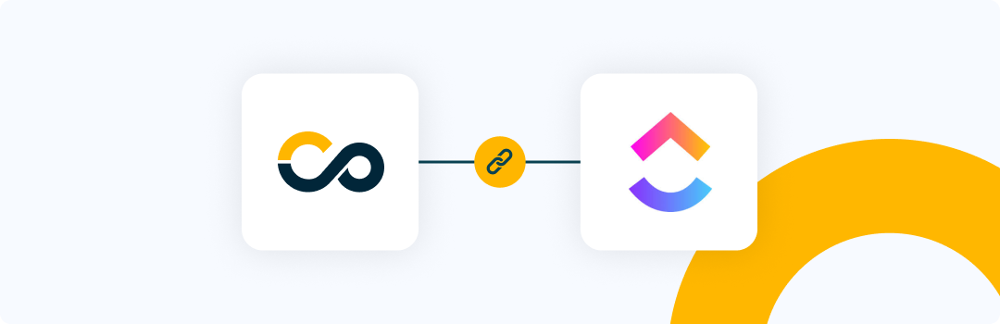
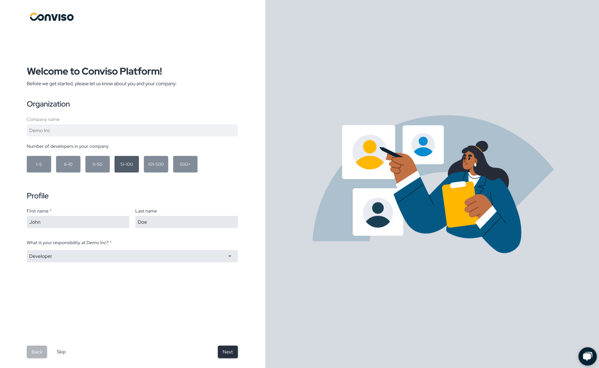

Release date: December 10th, 2024

## Key Benefits

*   Risk-based Prioritization Funnel: Prioritizing vulnerabilities that really matters for your business;
*   Clickup Integration: Improving developers productivity in Vulnerability Management;
*   Better On-Boarding Experience: Improving new users experience in Conviso Platform

## What's New

**_New Feature_**

## Risk-based Prioritization Funnel: Prioritizing vulnerabilities that really matters for your business

We’re excited to announce the launch of the Risk Context Prioritization Funnel, a powerful new feature designed to help development and security teams prioritize vulnerabilities based on contextual risk rather than severity alone.

This feature evaluates vulnerabilities across critical factors such as severity, business impact, exposure, and sensitivity of data. By incorporating these dimensions, the Risk Context Funnel ensures that resources are focused where they matter most, aligning remediation efforts with organizational priorities and reducing overall risk.

Start using the Risk Context Prioritization Funnel today to take your vulnerability management to the next level!
More information [here](../platform/risk-context-funnel).
    

**_New Feature_**
## Clickup Integration: Improving developers productivity in Vulnerability Management

We are glad to announce the release of a native integration with Clickup.
Integrating Clickup in Conviso Platform will let developers gain productivity while we do all the hard
work by automating the whole vulnerability management triage process.

New vulnerabilities identified in Conviso Platform are created in real time directly in Clickup.
With our two-way integration capability, every status update from both solutions are automatically
updated in order to reduce the toil and increase developers productivity.

Check the documentation [here](../integrations/clickup)
    

**_UX Improvement_**

## New Users On-boarding: Enhancing the first experience using Conviso Platform

We’re excited to announce new enhancements designed to make onboarding more intuitive and impactful:

- Personalized Guidance: Onboarding now adapts to your role within the company, providing tailored introductions that focus on the features most relevant to your needs. This ensures you can quickly navigate the platform and understand its value.
- Instant Value with Demo Applications: To help you get started faster, we’ve added pre-configured demo applications. Instead of creating an application from scratch, you can explore the platform’s capabilities through ready-to-use examples.

These updates are aimed at providing a smoother and more meaningful onboarding experience, empowering you to get the most out of the Conviso Platform right from the start.    

## Keep updated on upcoming deliveries!

To have a better understanding about what's coming next on our platform, have a look at our [Roadmap](https://sharing.clickup.com/3016679/b/h/2w1z7-101803/0f4cd1b4e98d956).