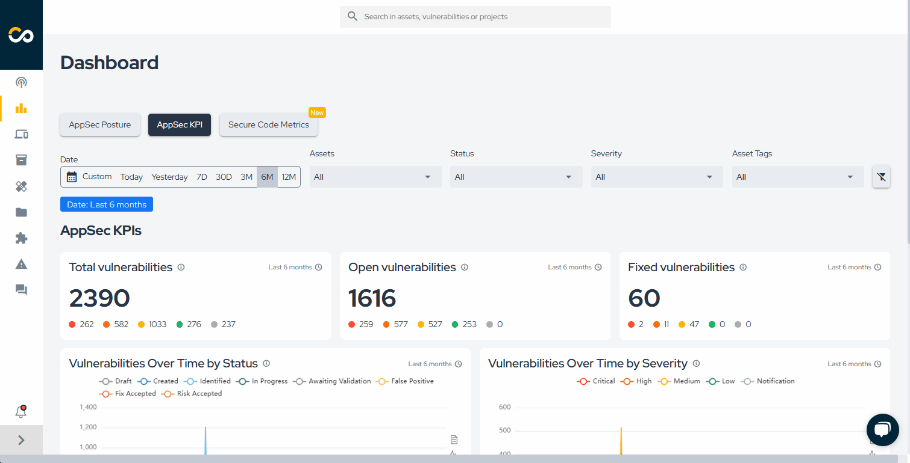
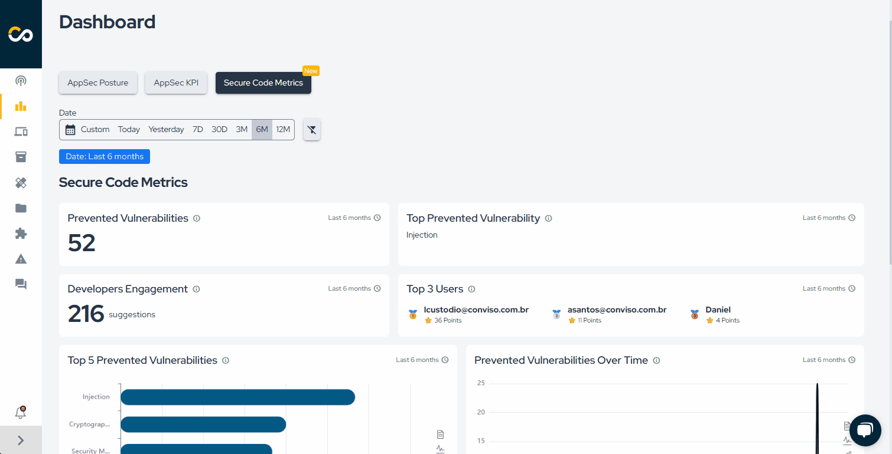

Release date: May 16th, 2025

## Key Benefits

*   [New Analytics Dashboard](#new-analytics-dashboard);
*   [Estimated savings with Secure Code](#estimated-savings-with-secure-code-mentor);

## What's New

**_Feature Improvement_**
## New Analytics Dashboard

You can now track MTTR by severity, total vulnerabilities, and the top 10 issues, with time filters and a consolidated view of your security posture.

- MTTR by severity on Dashboard: View the Mean Time to Remediate (MTTR) by severity level and identify remediation bottlenecks. 
- "In the last X days" on all charts: See the time period directly on the charts without needing to apply filters. 
- Top 10 vulnerabilities: A quick view of the most recurring vulnerabilities to help prioritize actions. 
- Total vulnerabilities displayed: A consolidated overview of your application’s security posture. 

Access the [dashboard](../platform/dashboard.md) to check the updates.

**_New Feature_**
## Estimated savings with Secure Code Mentor

We added a new chart to the Secure Code Dashboard that correlates vulnerabilities prevented using the plugin with estimated cost savings.