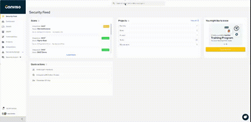
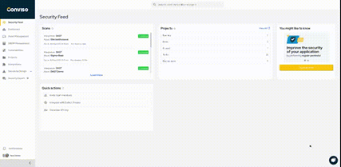

Release date: May 28th, 2025

## Key Benefits

*   [Global searchbar on every page](#global-searchbar-on-every-page);
*   [End of Security Expert](#end-of-security-expert);

## What's New

**_New Feature_**
## Global searchbar on every page

Finding what you need just got easier. The new global searchbar lets you search for assets, vulnerabilities, and projects from anywhere in the platform — right from the top navigation.

- Fewer clicks and faster navigation.
- Discover relationships between items (e.g., an asset and its critical vulnerabilities).
- Easier onboarding for new users, with no need to learn the full navigation structure.

Access the [conviso plataform](https://app.convisoappsec.com) to check the updates.

**_EoF (End of Life)_**
## End of Security Expert

The Security Expert feature will be discontinued as part of a strategic move to consolidate support into a single channel, offering more quality and agility.

From now on, all questions should be directed to our official support channel, accessible via the chat icon in the bottom right corner of the platform.

This area will include a dedicated field to speak with our analysts, replacing the functions previously handled by the Security Expert.

We’re committed to continuing to offer support aligned with your needs.
