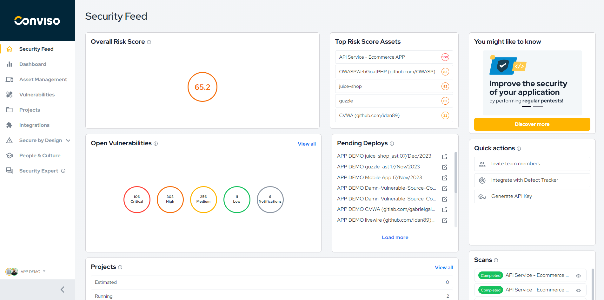
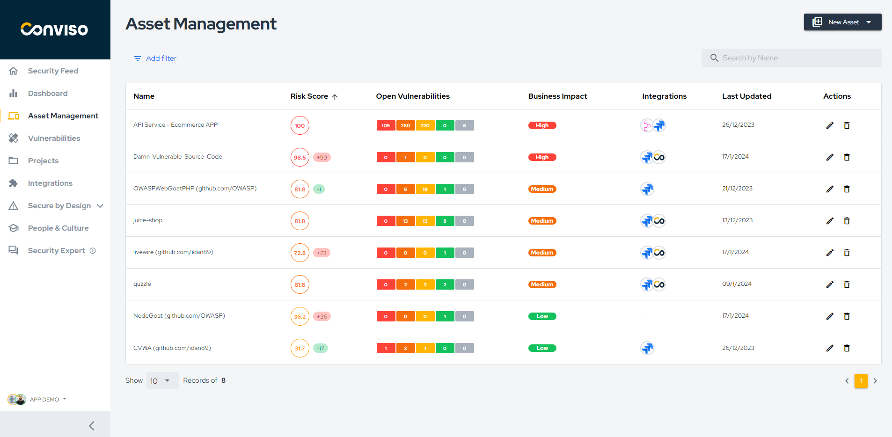
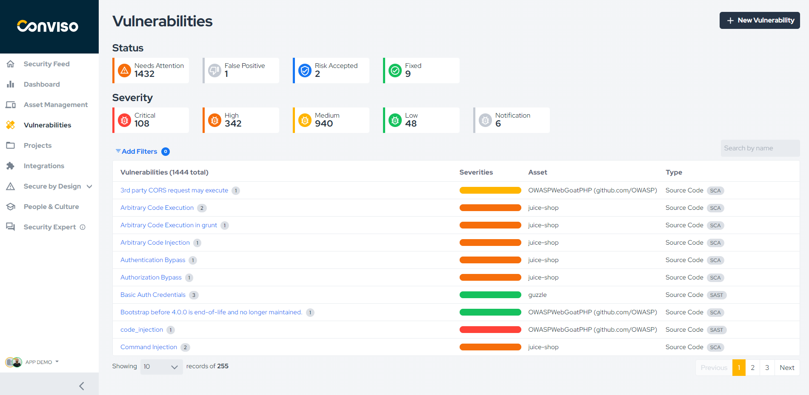

Release date: January 2th, 2024

# We are happy to introduce you to our new experience

We are constantly working to promote a better experience for our users. We rely on your feedback to make this experience even better.

## Overview

- Our **Security Feed** has undergone a significant improvement, aiming to provide the main information so that you can have a holistic view of the security of your applications;
- Thinking about improving the experience, all security initiatives will be carried out **from an asset**, eliminating the need for an associated project;
- The **vulnerability management** experience has been reshaped. Now, the findings and vulnerabilities are unified, allowing centralized management and resulting in more assertive correction and prioritization processes;
- We've made some **visual improvements** to the platform so your experience can be more enjoyable while browsing.

### Security Feed

You are in control of your applications. That was our purpose in building the new Security Feed, to provide you with the vital information and insights you need to make decisions about the security of your products.

- We've added a **Risk Score chart** that provides a holistic view of an asset's risk based on factors such as open vulnerabilities, attack surface, business impact, and data classification. You can also view your highest assets, allowing users to evaluate and prioritize assets with the highest risk scores quickly.
- In "You might like to know" are, you will receive the news that we have prepared for you and suggestions for some practices you can carry out to improve the security of your applications.
- You can get quick access to some essential actions to make your day-to-day easier;  
- Now, you can view a history of security tests performed on the company's applications through the “Scans” section.

### Asset Management

We've launched a new experience in Asset Management. We're dedicated to enhancing your platform experience and empowering you to manage the security of your applications proactively!

- We've improved the way you view your assets and get relevant information about each one;
- View all vulnerabilities pending remediation associated with your assets and grouped by their severity;
- Get access to all integrations related to the Asset. Example: Jira, Slack, Qualys, Fortify, etc;
- Check when the asset was last updated and sort by date;

### Vulnerability Management

We have made several improvements in the experience related to registering,  managing, and monitoring vulnerability corrections.  These improvements seek to provide greater context in the vulnerabilities identified, group similar vulnerabilities, and facilitate the management process.

- Our main change is that **findings and vulnerabilities have been unified**, enabling more complete management;   
- We create a **new grouping**, Needs Attention, and its function is to gather all the vulnerabilities that need correction and are already being worked on or are still pending;
- We've added a **new severity**, Notification, to address vulnerabilities with low impact and probability;  
- We have improved how vulnerabilities are recorded on our platform, making the process easier and improving the control of the operation.

___

Our team is working tirelessly to promote better experiences and develop features that add value to your work.

If you have any questions, don't hesitate to contact our support team.
