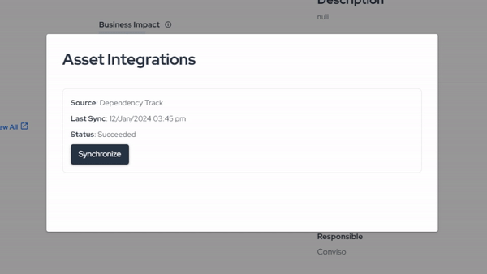

Release date: January 12th, 2024

# Key Benefits

- Enhanced risk assessment with the introduction of asset risk scores;
- Improved Security Feed with the addition of Top Asset Risk Scores card;
- Optimized asset synchronization with external scanners, achieving a 5x speed boost;
- Real-time monitoring of asset synchronization progress;

## What's New

#### *New Feature*
### Asset Risk Scores and Security Feed Upgrade

In our continuous efforts to empower users with comprehensive security insights, we are thrilled to introduce Asset Risk Scores. This new feature provides a holistic view of an asset's risk based on factors such as open vulnerabilities, attack surface, business impact, and data classification. Understanding the real risk of each asset is crucial for informed decision-making and prioritizing security efforts.

To complement this, we have added the Top Asset Risk Scores card to the Security Feed, allowing users to quickly assess and prioritize assets with the highest risk scores. Stay ahead of potential threats by focusing on the assets that matter most to your organization.

#### *Enhancement*
### Accelerated Asset Synchronization and Real-Time Monitoring

Efficiency is at the core of our latest improvements in asset synchronization. We've revamped the synchronization process, boosting its speed by five times compared to the previous version. Now, users can experience faster and more responsive asset updates, ensuring timely awareness of security postures.

But that's not all - with our real-time monitoring feature, users can track asset synchronization progress as it happens. Gain insights into the status of your assets at any given moment, empowering you to take immediate action when needed.