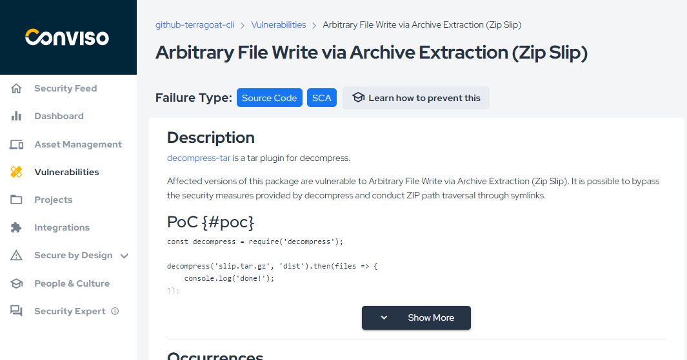

Release date: May 23rd, 2024

## Key Benefits

*   Checkmarx Integration;
*   Azure Boards Integration;
*   General availability of new Conviso AST;
*   Improved UX in Vulnerabilities;

## What's New

**_New Feature_**

## Checkmarx Integration

We are exited to introduce a brand-new native integration with Checkmarx.

This integration consolidates scan results of applications in Checkmarx with Conviso Platform, keeping both solutions synced in real time.
It supports a two-way integration regarding new vulnerabilities and status mapping, so every update in Checkmarx will also update Conviso Platform, as well as updates in the triage of vulnerabilities within Conviso Platform vulnerability management, specifically for False Positives and Accepted Risks transitions.
Aggregating Checkmarx results and other security tools with Conviso Platform will let you have a centralized view for a more efficient prioritization and security risk management of your applications. 

Check out the documentation [here](https://docs.convisoappsec.com/integrations/checkmarx).

**_New Feature_**

## Azure Boards Integration

Yes! We heard you and we are glad to announce the release of a native integration with Azure Boards.

Integrating Azure Boards in Conviso Platform will let developers gain productivity while we do all the hard work by automating the whole vulnerability management triage process.

New vulnerabilities identified in Conviso Platfom are created in real time directly in Azure Boards.
With our two-way integration capability, every status update from both solutions are automatically updated in order to reduce the toil and increase productivity.

Check out the documentation [here](https://docs.convisoappsec.com/integrations/azure-boards/)

**_New Feature_**

## General availability of new Conviso AST version

This new version of Conviso AST brings new and updated scanners that will increase both quality and coverage of security scanners.

What's new?
*   Updated and new SAST scanners support.
*   OSV Scanner for SCA;
*   Gitleaks for Secret Detection;
*   Checkov for IaC

For customers already using Conviso AST, no required changes are needed. 
You can have more information [here](https://docs.convisoappsec.com/conviso-ast/)

**_UX Improvement_**

## Improved UX in Vulnerabilities

In response to user feedback, we've enhanced the user experience in Vulnerabilities:

*   Better formatting of texts like Description, Solution and References when imported from external sources;
*   Show More/Show Less toggle for long texts;
*   CVE direct link to https://cve.mitre.org/ references

### Keep updated on upcoming deliveries!

To have a better understanding about what's coming next on our platform, have a look at our [Roadmap](https://sharing.clickup.com/3016679/b/h/2w1z7-101803/0f4cd1b4e98d956).