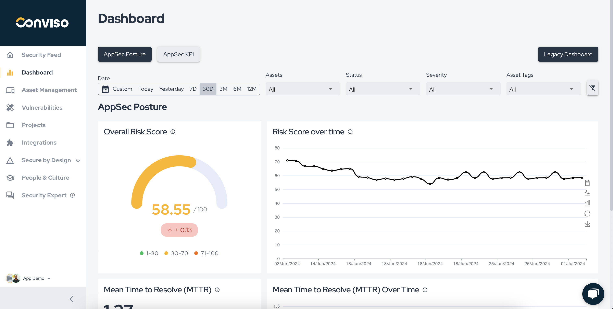
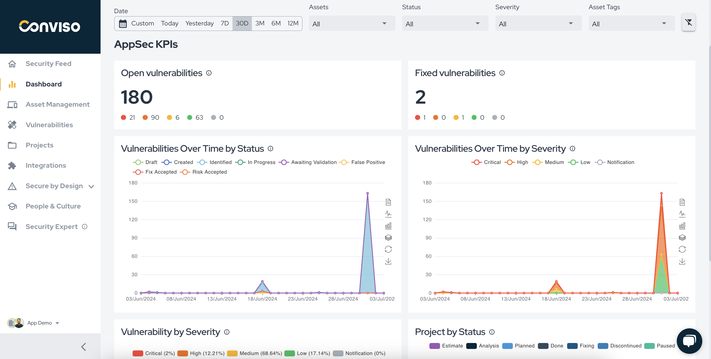
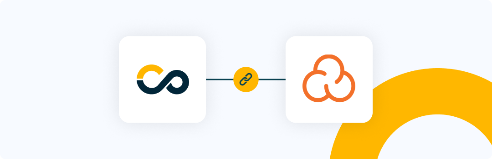
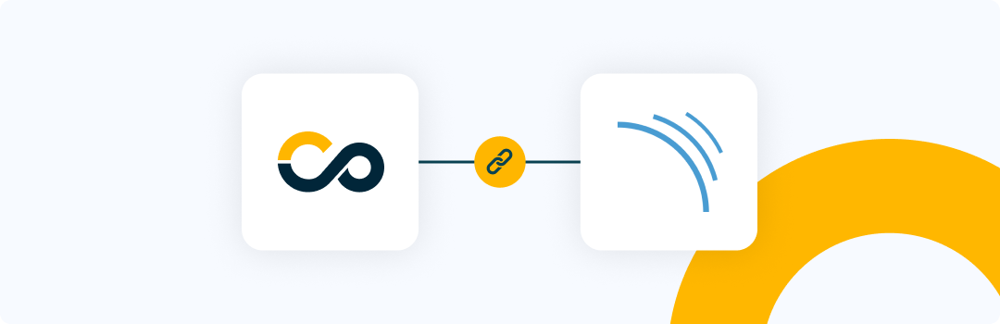
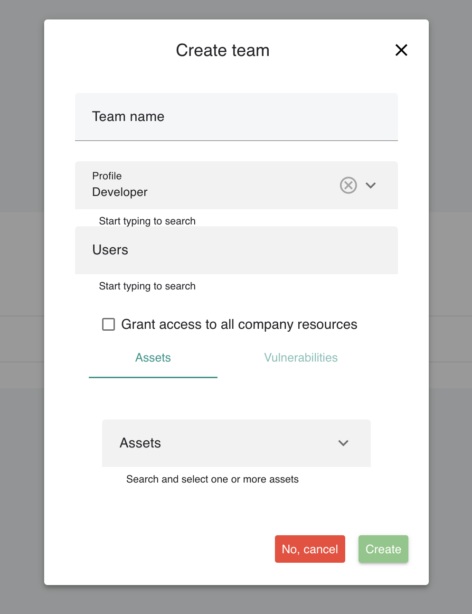

Release date: July 10, 2024

## Key Benefits

*   Redefined Dashboard Experience;
*   SonarCloud Integration;
*   SonarQube Integration;
*   Support for Team Access Control;

## What's New

**_UX Improvement_**

## Redefined Dashboard Experience

### AppSec Posture

We are exited to present a brand-new experience related to Dashboard.
Introducing AppSec Posture insights, tailored by AppSec specialists to guide you and your team to the correct path of AppSec maturity.

Here you will be able to assess how's your Overall Risk Score at the moment, and how is it been given a specific period of time.

Another very important maturity indicator related to MTTR (Mean Time To Resolve), that will guide your time in relation to how fast your devs are fixing new risks in your application from the moment they are identified.

### AppSec KPIs

Also, we introduce you with AppSec KPIs, where you will find the most important indicators for your daily AppSec journey.
We provide different charts that will help you gather information, share it with your team and discuss them regularly.

An important note, is that you will have granularity regarding filters, so you can assess what it matter the most.

We are going to keep improving AppSec Posture and AppSec KPIs Dashboard with new key insights to help you gain maturity in AppSec practices a involve your team in key indicators.

**_New Feature_**

## Sonarcloud Integration

Yes! We heard you and we are glad to announce the release of a brand new native integration with Sonarcloud.

This integration consolidates scan results of applications in Sonarcloud with Conviso Platform, keeping both solutions synced in real time.

It supports a two-way integration regarding new vulnerabilities and status mapping, so every update in Sonarcloud will also update Conviso Platform, as well as updates in the triage of vulnerabilities within Conviso Platform vulnerability management, specifically for False Positives and Accepted Risks transitions.

Aggregating Sonarcloud results and other security tools with Conviso Platform will let you have a centralized view for a more efficient prioritization and security risk management of your applications. 

Check out the documentation [here](https://docs.convisoappsec.com/integrations/sonarcloud/)

**_New Feature_**

## Sonarqube Integration

We are also exited to introduce a brand-new native integration with Sonarqube, the on-premise version of Sonarcloud.

Similar as Sonarcloud, this integration consolidates scan results of applications in Sonarqube with Conviso Platform, keeping both solutions synced in real time.

It supports a two-way integration regarding new vulnerabilities and status mapping, so every update in Sonarqube will also update Conviso Platform, as well as updates in the triage of vulnerabilities within Conviso Platform vulnerability management, specifically for False Positives and Accepted Risks transitions.

Aggregating Sonarqube results and other security tools with Conviso Platform will let you have a centralized view for a more efficient prioritization and security risk management of your applications.  

Check out the documentation [here](https://docs.convisoappsec.com/integrations/sonarqube/)

**_New Feature_**

## Support for Team Access Control

For a better and more efficient way to manage user access, now you can define a Profile and Access to a team so, users will automatically inherit those permissions and accesses of the team.

With this new feature you don't need to configure access control user by user anymore!

### Keep updated on upcoming deliveries!

To have a better understanding about what's coming next on our platform, have a look at our [Roadmap](https://sharing.clickup.com/3016679/b/h/2w1z7-101803/0f4cd1b4e98d956).