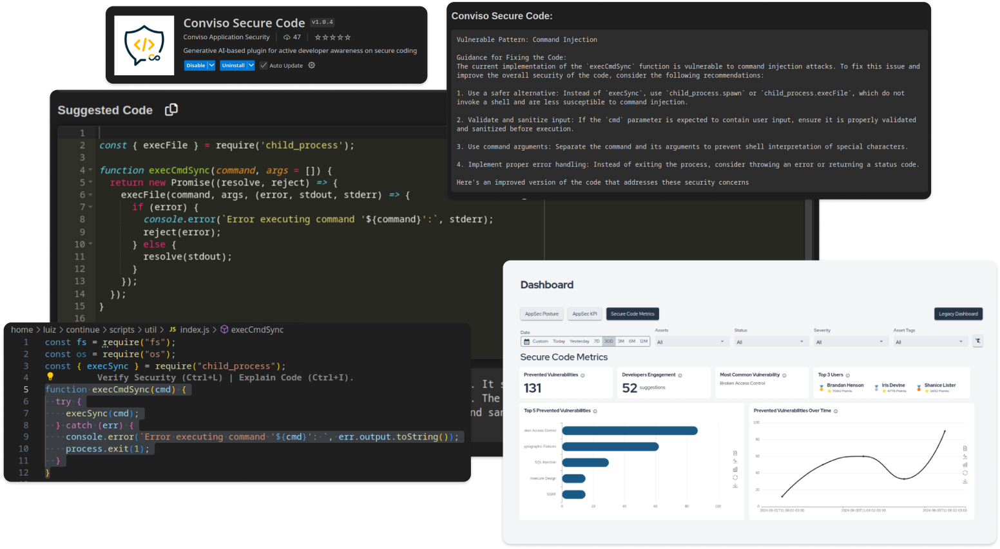
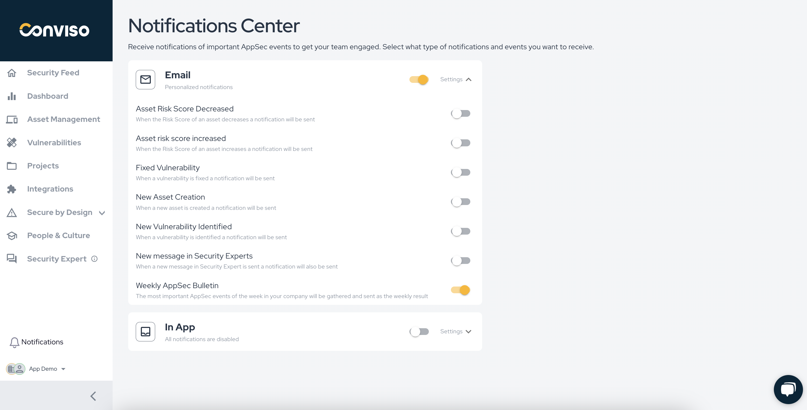
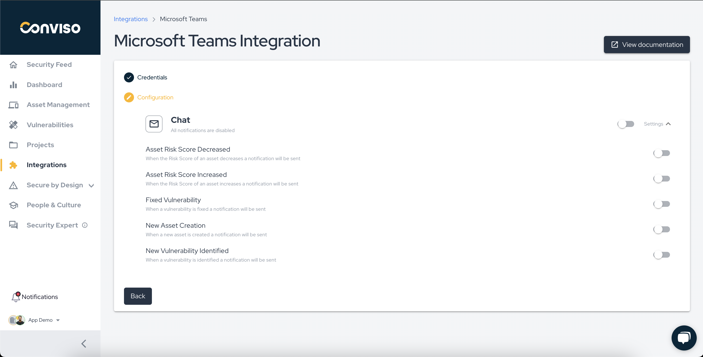
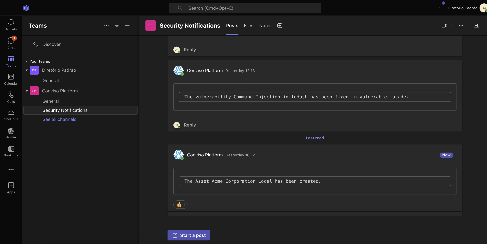
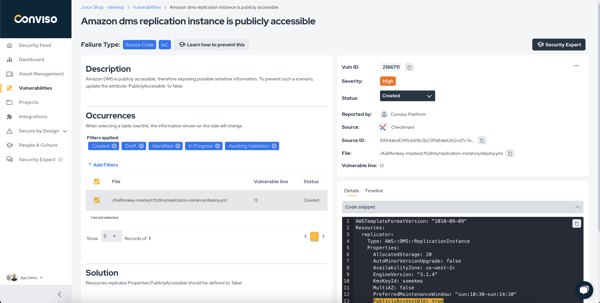
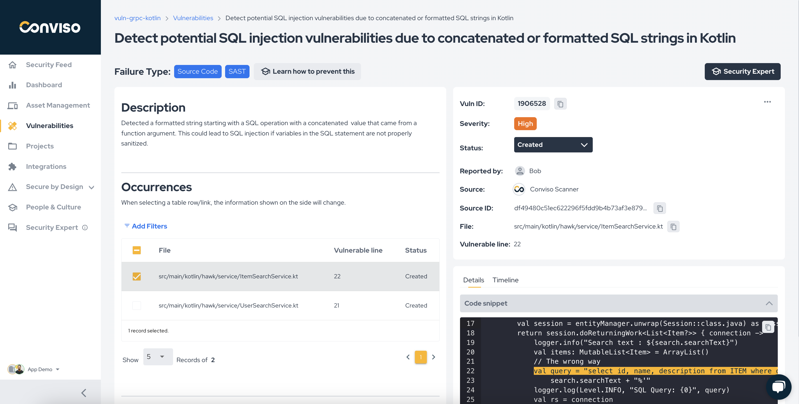

Release date: Semptember 23rd, 2024

## Key Benefits

*   Promoting Secure Code Awareness: Conviso Secure Code Add-on;
*   Your Custom Hub for AppSec Events: Introducing the Notifications Center;
*   Microsoft Teams Integration: A new notification chat channel;
*   Checkmarx IaC Support: Aggregating more scan results from Checkmarx;
*   Conviso AST: Kotlin language Support;

## What's New

**_New Feature_**

## Promoting Secure Code Awareness: Conviso Secure Code Add-on;

Conviso Secure Code (Conviso Platform Add-on) is a plugin integrated with Conviso Platform ecosystem and available within the developer's IDE.

Its main purpose is to promote secure code awareness, helping to prevent, identify, and fix vulnerabilities.

Through specialized generative AI, Conviso Secure Code supports Security Champions programs by providing training insights and performance metrics.

Key features:
- Real-time code correction suggestions, identifying, fixing, and preventing vulnerabilities;
- Information provided directly in the developer's IDE without disrupting their workflow;
- Detailed explanations of the prevented vulnerabilities, ranked by the number of occurrences;
- Dashboard for monitoring the development of Security Champions, with metrics such as prevented vulnerabilities, most engaged developers, top prevented vulnerabilities, and date filters;

Key benefits:
- Increased security maturity from the start of development;
- Cost savings by avoiding the high expense of late vulnerability fixes;
- Continuous learning and awareness of best security practices;

We are offering a free 14-day trial for companies seeking to increase their maturity in secure code development and increase security awareness among developers! 
You can contact our sales team [here](https://www.convisoappsec.com/platform/addons/secure-code) in order to get your hands on it.

**_New Feature_**

## Your Custom Hub for AppSec Events: Introducing the Notifications Center

We're excited to announce the launch of our new Notifications Center, a powerful feature designed to put you in control of the AppSec events that matter most to you. With the Notifications Center, you can now configure custom notifications tailored to your unique needs, ensuring you're always informed about critical security updates.

Key Features:
- Custom Notifications: Choose which AppSec events you want to be notified about, enabling or disabling specific events to suit your preferences;
- Multiple Communication Channels: Receive notifications through your preferred channels, including In-App, Email, Chat, with more options to come in the next release including Slack Chat provider;
- Digest of Notifications: When multiple events occur in a short period of time, they will be consolidated and sent in a single notification for a better user experience;
- Enhanced Control: Gain full control over your notifications, allowing you to stay connected with the security status of your applications without hassle.

The Notifications Center is designed to enhance user engagement and bring everyone closer to AppSec events, fostering a culture of security awareness within your organization.

Next improvements: 
- Slack notification channel.

Start customizing your notifications today and stay ahead in the world of application security!

**_New Feature_**

## Microsoft Teams Integration: A new notification chat channel

We’re thrilled to announce the integration of Microsoft Teams into our Notifications workflow, enhancing your ability to stay informed about the most important AppSec events in real-time. With this new feature, you can now receive notifications directly in your Microsoft Teams channels, ensuring clear communication and collaboration around security updates.

Key Features:
- Microsoft Teams Notifications: Get instant alerts for the AppSec events that matter most to you, delivered straight to your Teams channels.
- Custom Settings: Tailor your notification preferences by choosing specific events to receive, helping you focus on what’s relevant for your team.
- Increase Collaboration: Foster discussions around security events directly within Teams, enabling faster responses and a more coordinated approach to application security.

The Microsoft Teams integration complements our existing Notifications Center, providing you with multiple channels to keep you connected and informed. This enhancement is part of our ongoing commitment to empower you with the tools needed for proactive security management.

**_New Feature_**

## Checkmarx IaC Support: Aggregate more scan results

We’re excited to announce the enhancement of our integration with Checkmarx, now featuring robust support for Infrastructure as Code (IaC) scan results. This new capability allows you to aggregate and analyze IaC security findings alongside your existing application security results within Conviso Platform, providing a comprehensive view of your security posture.

There is no extra configuration needed if you are already using Checkmarx integration.

**_New Feature_**

## Conviso AST: Kotlin language Support

We are happy to announce that support for Kotlin language has been added to Conviso AST.

This new language support is the beginning of a series of upcoming updates in Conviso AST, most specifically for SAST scans. The support has been made through the integration of Semgrep engine as a new scanner in Conviso AST.

Please validate you are using CLI version >= `2.1.22` or using the `:latest` Docker image version.
No additional setup is required to use this new feature.

### Keep updated on upcoming deliveries!

To have a better understanding about what's coming next on our platform, have a look at our [Roadmap](https://sharing.clickup.com/3016679/b/h/2w1z7-101803/0f4cd1b4e98d956).