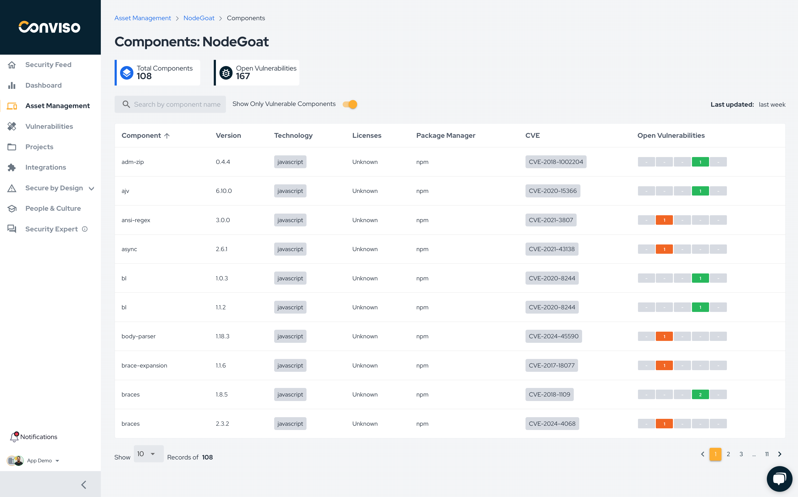

Release date: October 4th, 2024

## Key Benefits

*   Empower your Security Supply Chain: Introducing SBOM Generation Support;
*   Enhanced Access Control: Associate Profiles and Access with Teams in a refreshed UI;
*   Plans & Usage: Better visibility and management;
*   Improvements to vulnerability filtering and perfomance loading time

## What's New

**_New Feature_**

## Empower your Security Supply Chain: Introducing SBOM Generation Support

Gain visibility into the security supply chain of your applications with our new SBOM generation feature in Conviso AST. Stay informed with an up-to-date list of components, ensuring you have the insights needed to manage your application’s security effectively to be compliant and follow best security practices.

Key features:
- Creation of all the dependencies of the application in realtime when new code changes are made in code;
- Lists important information of de dependency like Technology, Dependency Manager, License;
- Links Open Vulnerabilities associated with the dependency;

How does it work: Generate your SBOM effortlessly using Conviso CLI within your repository or CI/CD pipeline through one of the following commands:
- `conviso ast run`
- `conviso sca run`
- `conviso sbom generate`

:::info
This feature is available when using the latest version of Conviso CLI or version 2.2.2 and above.
:::

Next improvements:
- Licensing security compliance validation;
- Dependency Graph generation for each dependency

Enhance the security posture and compliance of your applications with our SBOM generation support!    

**_New Feature_**
## Enhanced Access Control: Associate Profiles and Access with Teams in a refreshed UI

We’re thrilled to introduce an update to our Access Control feature! You can now associate Profiles and Access definition at the Team level, providing a more organized and scalable way to manage roles and permissions across your organization.

Along with this functionality, we've completely refreshed the UI to ensure a smoother and more intuitive experience. The new interface is designed to enhance usability, allowing you to quickly navigate, configure, and manage access with improved clarity and efficiency. 

Dive into these updates today and take full control of your team's security with ease!    

**_New Feature_**

## Plans & Usage: Better visibility and management

Easily manage and have a clear visibility of plans, usage and Add-ons management from a single page.
Plan information;
Basic usage metrics such as Users, Assets and Integrations;
Advance usage information of Active Developers for an easy and transparent assessment;
Add-ons management.

Only users with Admin profile will have access to this page.    

**_UX Improvement_**

## Improvements to vulnerability filtering and perfomance loading time

We have introduced several improvements to enhance the ASPM user experience on the vulnerabilities page:
- Filter Tags: Applied filters are now visible as tags above the list, making it easier to see which filters are active.
- Filter Removal: Removing filters has been streamlined to a single click.
- Tooltip Enhancements: Tooltips have been added to each vulnerability status to clarify their meanings.
- Performance Boost: Screen loading time has been reduced by over 33%.

### Keep updated on upcoming deliveries!

To have a better understanding about what's coming next on our platform, have a look at our [Roadmap](https://sharing.clickup.com/3016679/b/h/2w1z7-101803/0f4cd1b4e98d956).