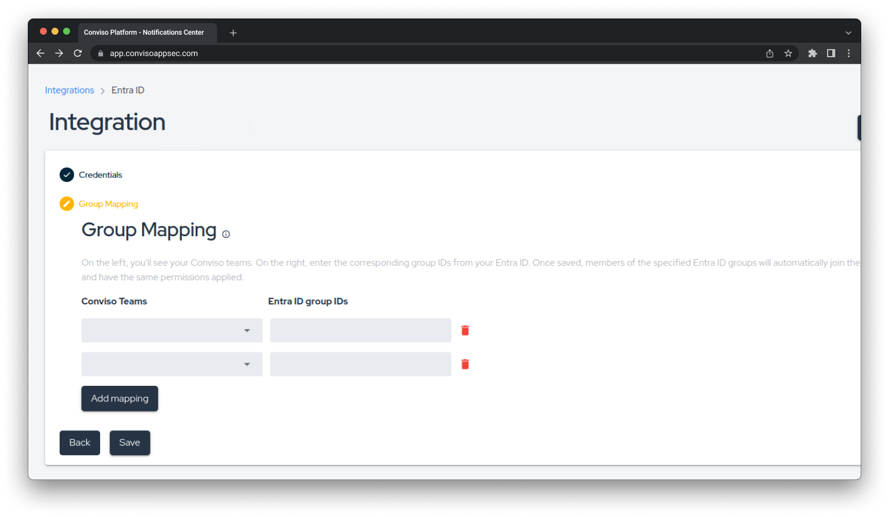
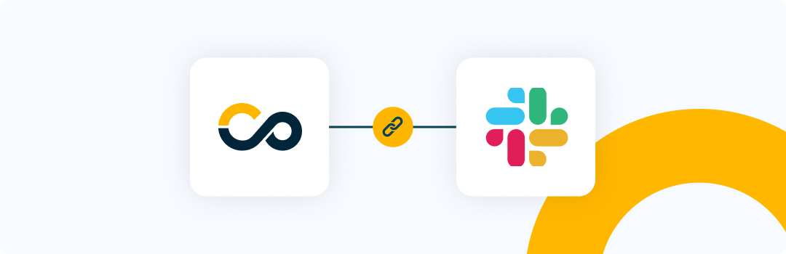
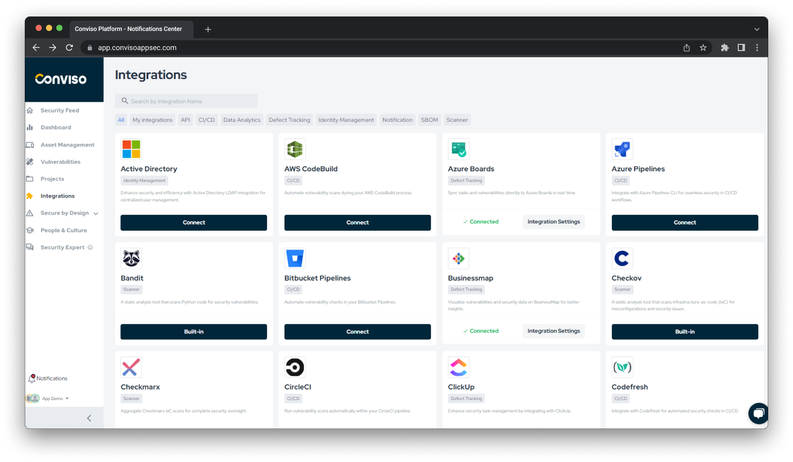

Release date: October 28th, 2024

## Key Benefits

*   SAML Group Mapping: Automatically Assign User Access and Permissions;
*   Slack Integration: A new notification chat channel;
*   Reshaped Integrations Experience: Enhanced UX and Clear Navigation

## What's New

**_New Feature_**

## SAML Group Mapping: Automatically Assign User Access and Permissions

We're excited to introduce SAML Group Mapping into the user management workflow, making it easier than ever to manage user access and permissions. With this new feature, administrators can automatically map users to specific groups within the Conviso Platform based on their SAML attributes, simplifying the assignment of roles and permissions across your organization.

### Key features:
- **Automated Group Mapping:** Simplify user management by mapping Conviso Platform groups to groups in your customer's Active Directory, such as Entra ID, through the SAML 2.0 protocol, reducing the need for manual intervention.
- **Consistent Access Control:** Ensure that users have the right access to the appropriate resources by aligning their group memberships in the Conviso Platform with those in your organization’s directory via SAML 2.0.
- **Customizable Mappings:** Define and manage group mappings that align with your organization’s structure, allowing you to flexibly assign user roles and permissions based on your specific needs.

The SAML Group Mapping feature enhances our existing user management capabilities, helping you maintain consistent and secure access control across your platform. This update is part of our ongoing efforts to deliver powerful tools that simplify administration and bolster security.    

**_New Feature_**
## Slack Integration: A new notification chat channel

Supporting our previous release, we’re thrilled to announce the integration of Slack into the new Notifications workflow, enhancing your ability to stay informed about the most important AppSec events in real-time. With this new feature, you can now receive notifications directly in your Slack channels, ensuring clear communication and collaboration around security updates.

### Key features:

- **Slack Notifications:** Get instant alerts for the AppSec events that matter most to you, delivered straight to your Slack channels.
- **Custom Settings:** Tailor your notification preferences by choosing specific events to receive, helping you focus on what’s relevant for your team.
- **Increase Collaboration:** Foster discussions around security events directly within Slack, enabling faster responses and a more coordinated approach to application security.

The Slack integration complements our existing Notifications Center, providing you with multiple channels to keep you connected and informed. This enhancement is part of our ongoing commitment to empower you with the tools needed for proactive security management.    

**_UX Improvement_**

## Reshaped Integrations Experience: Enhanced UX and Clear Navigation

We're excited to introduce a completely reshaped Integrations experience, designed to manage your integrations smoother and more intuitive. This update focuses on providing a better user experience and clearer navigation within the Integrations module, making it easier than ever to connect with the tools and services you rely on.

### Key Enhancements:

- **Improved User Interface:** Enjoy a cleaner, more intuitive layout that simplifies the process of setting up and managing integrations, allowing you to focus on what matters most.
- **Clear Navigation:** Navigate through the integrations with ease, thanks to a reorganized menu and clearer categorization that makes it simple to find the integrations you need and access configuration settings.
- **Enhanced Workflow:** Experience a more efficient integration setup process with clearer guidance and better-organized steps, helping you get connected quickly and with confidence.

This update is part of our commitment to providing you with a smooth and user-friendly experience, ensuring that you can easily integrate the tools that support your security goals. The reshaped Integrations experience is here to help you stay connected and maximize the value of your integrated ecosystem.    

## Keep updated on upcoming deliveries!

To have a better understanding about what's coming next on our platform, have a look at our [Roadmap](https://sharing.clickup.com/3016679/b/h/2w1z7-101803/0f4cd1b4e98d956).