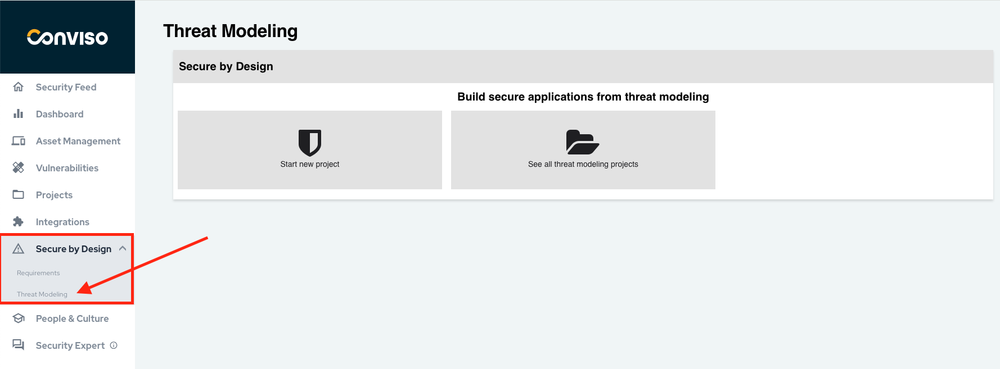
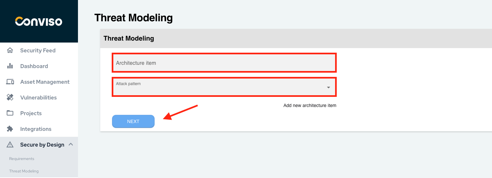
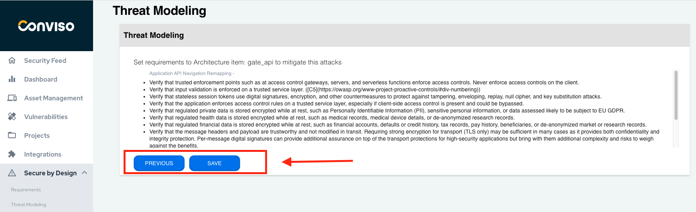
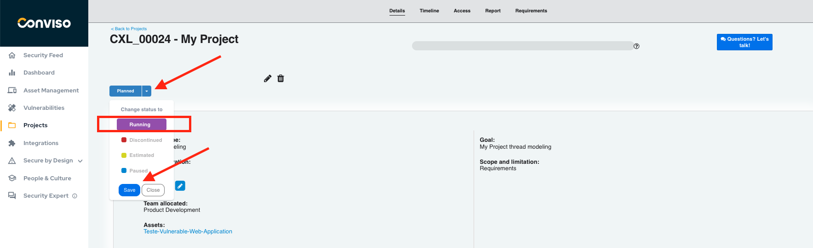
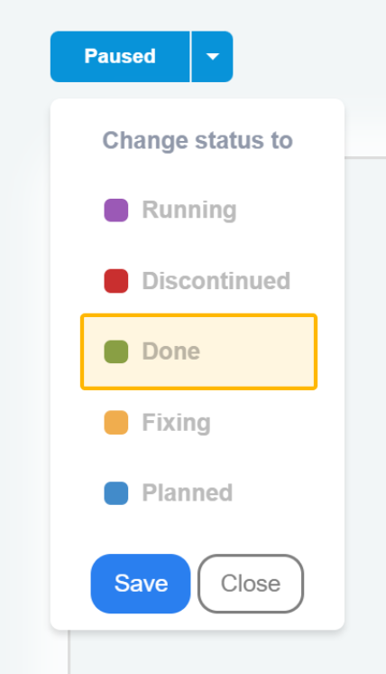

## Introduction
Performing [Threat Modeling](https://bit.ly/3q8JlQw) in Secure by Design allows organizations to proactively address security risks and create robust application architectures. 

In addition to Conviso Platform, organizations can foster a culture of secure coding practices from the initial stages of development, leading to enhanced application security and a stronger defense against potential threats.

### About Threat Modeling
The purpose of Threat Modeling, on which the Secure by Design product is based, is to identify threat scenarios and create security requirements based on them. It is a collaborative process that requires the collective experience of the group of participants. 

It's an essential approach for developers, as it helps to develop more secure applications, reducing rework and avoiding errors in the code.

### Prerequisite
To access Secure by Design, it is necessary to initiate a contract for using this product, [see here to contact the responsible team.](https://www.convisoappsec.com/products/people-culture)

## Usage
To access, click on the "Secure by Design" option in the left menu. In this first moment, let's get to know the Threat Modeling process by clicking on the "Threat Modeling" suboption:

On the product's home page, you have access to create a new Threat Modeling project or see all projects of the type already created:

### Start new Threat Modeling project
To create a new Threat Modeling project in Secure by Design, follow these steps:

1. **Click on the "Start new project" button**

2. **Add a new architecture item**

You can add more than one architecture item to Threat Modeling. The term "architecture item" refers to the relevant architectural components or elements of a system or application. 

These items can include modules, layers, services, APIs, databases, user interfaces, and more. When performing Threat Modeling, it is important to identify and list all architectural items that make up the system under analysis. 

3. **Identify and select the attack patterns**

These attack patterns serve as predefined templates or standardized representations of known attack techniques. In our solution, the attack patterns are based on CAPEC ([Common Attack Pattern Enumeration and Classification](https://capec.mitre.org/)) from MITRE, a widely recognized and comprehensive catalog of attack patterns.

4. **Confirm security requirements**

Once the attack patterns for the specific architecture item have been identified and selected, the platform provides guidance on the main security requirements. 

These recommendations are based on the [OWASP Application Security Verification Standard (ASVS)](https://owasp.org/www-project-application-security-verification-standard/), ensuring comprehensive coverage of security aspects. By leveraging this automated process, organizations can efficiently identify potential attack vectors and establish the necessary security measures to mitigate risks. 

To proceed to the next step, click "**Save**".

5. **Save the security requirements in a new project**

After clicking "Save", a new window will open for you to register the Threat Modeling information in a new project on the Conviso Platform.

**Project name:** Enter a descriptive name for the project.
Estimated hours: Provide an estimation of the total hours required for the Threat Modeling process.
**Goal:** Define the objective or purpose of the Threat Modeling project.
**Scope and limitation:** Specify the scope of the project and any limitations or boundaries that should be considered.
**Team:** Identify the team who will be involved in the Threat Modeling activities.
**Tags:** Assign relevant tags to categorize and organize the project.
**Assets:** List the assets related in the Threat Modeling process.

Once saved, access the project to manage and continuously monitor the implementation of security requirements.

### See all Threat Modeling projects
To view all the Threat Modeling projects, simply click on the "See all projects" option. 

This will give you an overview of all the existing projects of this type that have been created. 

You can browse through the list and select a specific project to view its details, progress and status. This feature allows easy management and tracking of Threat Modeling activities, being able to identify in which stage each project is at.

If you want to better understand how **Project Management** works, we recommend referring to this [documentation](../general/projects_management.md).

### Monitoring the implementation of requirements through the Project Management feature

On this screen, in Projects, you can continuously manage these processes in order to identify their progress. By clicking on our created project, you can understand at which stage you are in modeling:

You already identified right away that it is in the “**Planned**” phase, looking at its status. 

To point out that you've started working on the security requirements generated by modeling, update the status to "**Running**":

After accessing “**Requirements**”, an overview of all the security requirements generated by the platform is shown, based on OWASP’s ASVS from the indicated threats:

On this screen, a **Progress Status** bar allows you to track the implementation progress of the requirements.. In addition, there is also a button to **Download Attachments**.

They are categorized into **statuses** according to their current situation: N**ot Started, In Progress, Not Applicable and Completed**.

### Implementing a requirement
To indicate that you will start implementing a requirement, click the "**Start**" button under Actions:

**Note:** Before you start working on the security requirements, it's important to review them to understand if they are all within the scope of your application. 

Now, you indicate that this requirement is in the implementation phase, that is, you are creating secure code according to its guidance, when clicking on its title:

If, after refining the requirement, you identified that it does not apply to the scope of your application, you can discard it by clicking "**Not apply**":

It is important to clarify why this requirement does not need to be implemented:

It is crucial to provide a clear justification for excluding the requirement, explaining why it does not need to be implemented in your specific context. This step ensures transparency and facilitates effective decision-making regarding the inclusion or exclusion of security requirements.

If the requirement is necessary, after its implementation, click on "**Finish**". It is required to attach the code evidence for analysis by the security team.

A window will open so you can attach the file:

You can put the evidence of the implementation of the requirement in text or attach it in a file, we suggest images to facilitate the analysis of the security team. The platform supports .rar .pdf .zip .jpg .png .txt. pptx .xlsx .docx and .apk files up to X Mb.

The status will be updated to "**Done**":

After completing the implementation of the security requirements, the next step is to await the analysis and testing of the implemented code by the security team. 

### Indicating the assessment to the security team
This phase ensures that the security measures are effectively integrated into the application and provides an opportunity to identify and address any potential vulnerabilities.

Update the status of the project to "**Fixing**", so you can no longer change the requirements:

Now, wait for the security team to analyze and test the implemented code.

Finishing the project, go back to its status and then signal that it is finished with "**Done**":

After performing this process, you will then be taking the initial steps towards building a secure application.

**Note:** After implementing security controls, it is important to establish a continuous monitoring process to identify new threats through the Conviso Platform.

By following this process, performing Threat Modeling and building secure code become much simpler and faster. 

## Support
If you have any questions or need help using our product, please don't hesitate to contact our [support team](mailto:support@convisoappsec.com).
