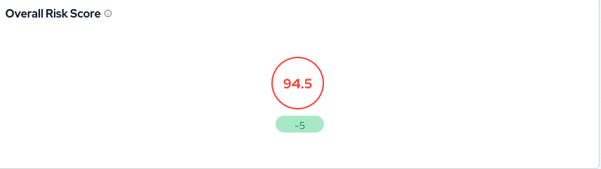

## Introduction

The Security Feed is an essential feature of the [Conviso Platform](https://cta-service-cms2.hubspot.com/web-interactives/public/v1/track/redirect?encryptedPayload=AVxigLKtcWzoFbzpyImNNQsXC9S54LjJuklwM39zNd7hvSoR%2FVTX%2FXjNdqdcIIDaZwGiNwYii5hXwRR06puch8xINMyL3EXxTMuSG8Le9if9juV3u%2F%2BX%2FCKsCZN1tLpW39gGnNpiLedq%2BrrfmYxgh8G%2BTcRBEWaKasQ%3D&webInteractiveContentId=125788977029&portalId=5613826), designed to provide users with real-time AppSec insights and actionable information related to their application security.

It serves as a centralized hub of knowledge, helping users understand the current state of their company's security and guiding them on what actions to enhance to [improve their application security](https://blog.convisoappsec.com/afinal-o-que-e-seguranca-de-aplicacoes/). 

## Usage
To access the Security Feed, simply click on the **“Home”** icon located in the left-hand corner menu:

Upon access, you will encounter the following essential features. These are designed to provide users with relevant information and enable them to perform vital security-related tasks efficiently..

## Discover Your Application's Risk: Overall Risk Score

Our feature offers a comprehensive and real-time view of your application security posture, making it an essential component of [Application Security Program Management (ASPM)](XX). A higher risk score signals a greater level of potential security threats, prompting users to prioritize and address security issues promptly. 

In addition, this feature includes a dynamic graphical representation that allows users to **filter** the risk score for the last 30 days or more, enabling them to monitor security trends and proactively manage their assets' risk. 

Utilize this indispensable tool to make informed decisions, bolster your application security, and effectively strengthen your overall security posture.

## Prioritize Security Efforts: Pending Vulnerabilities

In this section, you'll find all the vulnerabilities detected in the applications, categorized by their severity levels. 

Such transparent categorization allows users to prioritize their efforts based on the criticality of each vulnerability. 

By clicking on "View All," users will access the [Vulnerability Management](../general/vulnerabilities_management.md) page, where they can obtain more detailed information about each vulnerability and take appropriate actions to address them.

## Dive into AppSec Insights: You Might Like to Know

Our platform also provides a "You Might Like to Know" feature, ensuring that you receive relevant and insightful information, enriching your understanding of AppSec and empowering you to elevate the maturity of your applications. 

Delve into and uncover content that aligns perfectly with your interests, making your experience on our platform even more rewarding and valuable.

## Stay Updated with Recent Deploys

Our platform's 'Recent Deploys' section  provides users with an overview of the recent deploys carried out in their company's projects. Deploys are sorted chronologically, displaying the most recent ones at the top. 

Moreover, users have the option to load more deploys by clicking on the "**Load More**" button, revealing an extended list. 

This tool provides a comprehensive view of your application's development history.

## Effortless Project Management: Projects

Providing a well-organized and clear view, our platform enables users to efficiently track project progress and identify areas that need attention. With a simplified approach to [Project Management](../general/projects_management.md), you can easily understand each project's current state without navigating complex interfaces. 

Featuring the number of projects associated with each status, users can assess the workload and prioritize actions accordingly.

## Streamlining Security Tasks: Quick Actions

Our "Quick Actions" section offers users three essential shortcuts to streamline their security-related tasks:

### Invite Team Members

Opting for this action triggers a dialog box which users can input the necessary details (e.g., email, profile, team) to invite new members to the Conviso Platform.

### Integrate with Defect Tracker

Activating this action redirects users to the "[Integrations](../integrations/integrations_intro.md)" page, filtered specifically for [Defect Tracker](../integrations/integrations_intro.md) tools. This facilitates a smoother integration of the Conviso Platform with their preferred Defect Tracker seamlessly.

### Generate API Key

Choosing this action instantly generates an API Key for users. The pop-up window that appears after clicking this action provides the user with the API Key and offers a "**Copy to Clipboard**" button for convenience. 

## Engage with Security Experts: Pending Conversations

Through this feature you can engage in conversations with security experts regarding pending security matters. 

Upon clicking on "**View All**," users can access the complete "**Security Experts**" page, where they can continue and review their previous conversations:

## In-Depth Security Scans

Our platform's 'Security Scans' section provides a comprehensive history of [security scans](https://blog.convisoappsec.com/consolidacao-de-scans-otimize-o-trabalho-do-seu-time-de-desenvolvimento/) performed on the company's applications. 

Initially, the section displays the latest five scans, with the option to load more scans by clicking the "**Load More**" button:

Having a detailed history of security scans equips users with essential information to [monitor application security](https://blog.convisoappsec.com/en/attack-surface-continuous-monitoring-and-management-of-the-application/), identify vulnerabilities, and take timely actions to ensure the safety and integrity of their systems.

**Enhance your development lifecycle's security with the Conviso Platform. Join us today and foster a security-first culture!**

## Support

Should you have any questions or require assistance while using the Conviso Platform, feel free to reach out to our dedicated support team.

## Resources

By exploring our comprehensive content, you’ll discover resources that will enhance your understanding of AppSec.

[Conviso Blog](https://bit.ly/3JtXM8A): Access a wealth of informative videos covering various topics related to AppSec. Please note that the content is primarily in Portuguese.

[Conviso's YouTube Channel](https://bit.ly/3NIbbfM): Engage with our informative podcast, where we discuss AppSec-related subjects, providing valuable insights and discussions. The podcast is conducted in Portuguese.

[AppSec to Go - Conviso's Podcast on AppSec](https://spoti.fi/43UJQwN): Explore our blog, which offers a collection of articles and posts covering a wide range of AppSec topics. The content on the blog is primarily written in English.

