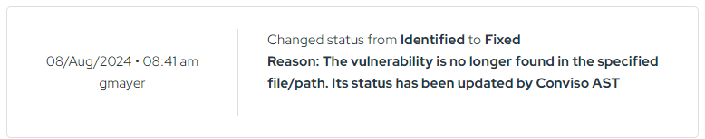

import Tabs from '@theme/Tabs';
import TabItem from '@theme/TabItem';

## Introduction

**Conviso AST** (Application Security Testing) is the command-line scanner that analyzes your source code and dependencies, then consolidates every finding into the **Vulnerability Management** module of the Conviso Platform.

It is distributed as a single CLI — the `conviso` command — that unifies several analysis engines behind one interface. Run it locally from your terminal for fast feedback, or drop it into any CI/CD pipeline so every push and pull request is scanned automatically.

**[At Conviso, we believe that AppSec goes beyond security tools, and we offer a comprehensive approach that includes consulting, training, and support services.](https://cta-service-cms2.hubspot.com/web-interactives/public/v1/track/redirect?encryptedPayload=AVxigLKtcWzoFbzpyImNNQsXC9S54LjJuklwM39zNd7hvSoR%2FVTX%2FXjNdqdcIIDaZwGiNwYii5hXwRR06puch8xINMyL3EXxTMuSG8Le9if9juV3u%2F%2BX%2FCKsCZN1tLpW39gGnNpiLedq%2BrrfmYxgh8G%2BTcRBEWaKasQ%3D&webInteractiveContentId=125788977029&portalId=5613826)**

## What Conviso AST analyzes

A single `conviso ast run` orchestrates the following analyses and sends the consolidated result to the Platform:

| Analysis | Command | What it looks for | Engine |
| :--- | :--- | :--- | :--- |
| **SAST** | `conviso sast run` | Vulnerabilities in your own source code | Semgrep with Conviso-managed rules |
| **SCA** | `conviso sca run` | Known vulnerabilities in third-party dependencies | osv-scanner |
| **IaC** | `conviso iac run` | Misconfigurations in infrastructure code | Checkov |
| **Container** | `conviso container run` | OS-level vulnerabilities in container images | Conviso container scanner |

Results are **aggregated and deduplicated** by a unified security engine before they reach the Platform, so you work from one clean, prioritized list instead of raw scanner output. Everything then flows into the **[Vulnerabilities](../../platform/vulnerabilities)** feature, where your team can triage, prioritize, and fix.

### Supported languages (SAST)

SAST runs Semgrep with Conviso-managed rules for the following languages:

<div style={{columns: '3', maxWidth: '600px'}}>

- C#
- Go
- Java
- JavaScript
- TypeScript
- JSX
- Kotlin
- Python
- Ruby
- PHP
- Scala
- Swift
- Rust
- C / C++
- VB6
- JSON
- Generic

</div>

:::note
Elixir is not yet supported by Semgrep. For Elixir we use **Sobelow**, enhanced with Conviso-managed generic Semgrep rules.
:::

## Prerequisites

Conviso AST orchestrates its analyzers as **Docker containers**, so a working Docker environment is required in every scenario — including local installs via `pip`.

| Requirement | Details |
| :--- | :--- |
| **Docker** | A running Docker daemon the CLI can reach. The SAST engine and other analyzers run as containers pulled on demand. |
| **API Key** | A Conviso Platform API Key to authenticate. See [Generate API Key](../../api/api-overview#generate-api-key). |
| **Python** *(pip install only)* | Python **3.9+**. Not needed if you run the Docker image. |
| **Git** | The repository must be a Git working tree. Conviso AST uses commit history to scope diffs and track deploys. |

## Installation

Choose the method that fits your workflow. The **Docker image** is the recommended option for CI/CD and for machines without a local Python setup; **pip** is ideal for running scans directly from your development environment.

<Tabs groupId="install-method">
<TabItem value="docker" label="Docker (recommended)" default>

The image ships the `conviso` CLI and everything it needs. Nothing to install locally beyond Docker itself.

```bash
docker pull convisoappsec/convisoast:latest
```

Verify it:

```bash
docker run --rm convisoappsec/convisoast:latest conviso --version
```

> Image on Docker Hub: [`convisoappsec/convisoast`](https://hub.docker.com/r/convisoappsec/convisoast)

</TabItem>
<TabItem value="pip" label="pip (PyPI)">

Install the CLI from PyPI. Requires **Python 3.9+** and a running Docker daemon (the analyzers still run in containers).

```bash
pip install conviso-ast
```

Verify it:

```bash
conviso --version
```

> Package on PyPI: [`conviso-ast`](https://pypi.org/project/conviso-ast/)

:::tip Isolate the install
Install inside a virtual environment to avoid conflicts with other Python packages:

```bash
python -m venv .venv
source .venv/bin/activate      # Windows: .venv\Scripts\activate
pip install conviso-ast
```
:::

</TabItem>
<TabItem value="source" label="From source">

For development or to test unreleased changes:

```bash
git clone https://github.com/convisoappsec/convisocli.git
cd convisocli
python -m venv .venv
source .venv/bin/activate
pip install -e .
conviso --help
```

</TabItem>
</Tabs>

### Keeping it up to date

We recommend always running the latest release so you pick up new analyzers, detection rules, and fixes automatically.

<Tabs groupId="install-method">
<TabItem value="docker" label="Docker" default>

```bash
docker pull convisoappsec/convisoast:latest
```

</TabItem>
<TabItem value="pip" label="pip">

```bash
pip install --upgrade conviso-ast
```

</TabItem>
</Tabs>

:::tip Pinning versions
Use `:latest` (Docker) or the newest PyPI release for day-to-day scanning. Pin a specific version — for example `convisoappsec/convisoast:3.0.9` or `pip install conviso-ast==3.0.9` — only when you need fully reproducible runs.
:::

## Authentication

Conviso AST authenticates to the Platform with an **API Key**. Generate one from the Conviso Platform (**Security Feed → Quick Actions → Generate API Key**) as described in [Generate API Key](../../api/api-overview#generate-api-key), then expose it to the CLI.

The recommended approach is the `CONVISO_API_KEY` environment variable:

```bash
export CONVISO_API_KEY="<your_api_key>"
```

Alternatively, pass it inline on any command with `-k` / `--api-key`:

```bash
conviso ast run --api-key "<your_api_key>"
```

:::warning Keep your API Key secret
Never commit the key to source control. In CI/CD, store it as a **secret** / protected variable and inject it as `CONVISO_API_KEY`. See the [integration guides](../../integrations/integrations_intro) for platform-specific instructions.
:::

## Quick start

Run your first scan from the root of a Git repository.

<Tabs groupId="install-method">
<TabItem value="docker" label="Docker" default>

Mount your project and the Docker socket (the CLI needs the socket to launch its analyzer containers), then run the scan:

```bash
docker run --rm \
  -v /var/run/docker.sock:/var/run/docker.sock \
  -v "$(pwd)":/opt/flowcli \
  -e CONVISO_API_KEY="$CONVISO_API_KEY" \
  convisoappsec/convisoast:latest \
  conviso ast run --vulnerability-auto-close
```

The image's working directory is `/opt/flowcli`, so mounting your repository there makes it the target of the scan (`--repository-dir` defaults to `.`).

</TabItem>
<TabItem value="pip" label="pip">

```bash
export CONVISO_API_KEY="<your_api_key>"
cd /path/to/your/repository
conviso ast run --vulnerability-auto-close
```

</TabItem>
</Tabs>

On the first run for a repository, Conviso AST resolves (or creates) the matching **asset** on the Platform from your Git remote. When it can't infer the target automatically, pass it explicitly with `--company-id` and `--asset-name`. When the scan finishes, the findings appear under your asset in the **[Vulnerabilities](../../platform/vulnerabilities)** module.

## Command reference

Every command follows the pattern `conviso <group> <action> [options]`. Use `--help` at any level to explore:

```bash
conviso --help
conviso ast run --help
```

### Global options

These apply to all commands and can be set inline or via environment variables:

| Option | Environment variable | Description |
| :--- | :--- | :--- |
| `-k`, `--api-key` | `CONVISO_API_KEY`, `FLOW_API_KEY` | API Key used to authenticate to the Platform. |
| `-u`, `--api-url` | `CONVISO_API_URL`, `FLOW_API_URL` | Platform API URL. Default: `https://api.convisoappsec.com`. |
| `-l`, `--verbosity` | — | Log level: `CRITICAL`, `ERROR`, `WARNING`, `INFO`, or `DEBUG`. |
| `-c`, `--ci-provider-name` | `CI_PROVIDER_NAME` | Force the CI provider (auto-detected when omitted). |

### `conviso ast run`

The unified scan — runs SAST, SCA, and the deploy/code-review analysis together and reports the consolidated result to the Platform.

```bash
conviso ast run --vulnerability-auto-close
```

| Option | Description | Default |
| :--- | :--- | :--- |
| `-r`, `--repository-dir` | Source code repository directory. | `.` |
| `--asset-id` | Target asset ID on the Platform (env: `CONVISO_ASSET_ID`). | auto |
| `--company-id` | Company ID on the Platform. | auto |
| `--asset-name` | Asset name to report to. | auto |
| `-c`, `--current-commit` | Commit to analyze. Defaults to the branch `HEAD`. | `HEAD` |
| `-p`, `--previous-commit` | Baseline commit. Defaults to the last reported deploy. | last deploy |
| `--vulnerability-auto-close` | Auto-close Platform vulnerabilities no longer found (see below). | off |
| `--cleanup` | Remove temporary files, stopped containers, and unused Docker images/volumes after the run. | off |
| `--traceback` | Show the full traceback on errors. | off |

### `conviso sast run`

Static analysis of your source code. Supports scoping to a commit range and failing the build on a finding threshold — useful for gating pull requests.

```bash
# Full scan, report to the Platform
conviso sast run

# Scan only a commit range
conviso sast run \
  --start-commit "$(git rev-parse HEAD~5)" \
  --end-commit "$(git rev-parse HEAD)"

# Fail the build if there are 5+ findings of HIGH severity or higher
conviso sast run --fail-on-severity-threshold HIGH 5
```

| Option | Description | Default |
| :--- | :--- | :--- |
| `-r`, `--repository-dir` | Source code repository directory. | `.` |
| `-s`, `--start-commit` | Start of the commit range. Defaults to the empty-tree hash (full history). | full |
| `-e`, `--end-commit` | End of the commit range. Defaults to the current branch `HEAD`. | `HEAD` |
| `--fail-on-threshold` | Exit non-zero when total findings reach this count (after reporting). | off |
| `--fail-on-severity-threshold` | Takes a severity and a count, e.g. `HIGH 5`. Exit non-zero when findings of that severity or higher reach the count. Levels: `UNDEFINED`, `INFO`, `LOW`, `MEDIUM`, `HIGH`, `CRITICAL`. | off |
| `--asset-id`, `--company-id`, `--asset-name` | Target selection, as in `ast run`. | auto |
| `--cleanup` | Clean up system resources after the run. | off |

### `conviso sca run`

Software Composition Analysis of your dependency manifests (for example `package-lock.json`, `Gemfile.lock`, `requirements.txt`).

```bash
conviso sca run --repository-dir .
```

Accepts `--repository-dir`, `--asset-id`, `--company-id`, `--asset-name`, and `--cleanup`.

### `conviso iac run`

Scans infrastructure-as-code (Terraform, CloudFormation, Kubernetes, and more) for security misconfigurations.

```bash
conviso iac run --repository-dir ./terraform
```

Accepts the same target-selection and `--cleanup` options as `sca run`.

### `conviso container run`

Scans a container image for OS-level vulnerabilities. Pass the image reference as the argument:

```bash
conviso container run "my-image:latest"
```

For a full walkthrough — including building the image in-pipeline and scanning public images — see **[Scan Container with Conviso](../conviso-containers/conviso-containers.md)**.

### `conviso vulnerability assert-security-rules`

Evaluates a **Security Gate** against your findings and exits non-zero when the policy is breached — the mechanism used to block a pipeline on unacceptable risk.

```bash
conviso vulnerability assert-security-rules --rules-file 'security-gate.yml'
```

| Option | Description |
| :--- | :--- |
| `--rules-file` | Path to a local YAML rules file. If omitted, uses the rules configured on the Platform. |
| `-o`, `--output` | Write the gate result to a JSON file. |
| `--asset-id`, `--company-id`, `--asset-name` | Target selection. |
| `-r`, `--repository-dir` | Repository directory. Default `.`. |

See **[Security Gate](../security-gate)** for the full rules syntax and examples.

## Auto-closing resolved vulnerabilities

Conviso AST does not change your code. Instead, it can automatically **close** vulnerabilities on the Platform once they are no longer detected in a new scan.

After fixing the code and re-running the scan with `--vulnerability-auto-close`:

```bash
conviso ast run --vulnerability-auto-close
```

any finding that is no longer present is moved to a **closed** status on the Platform, and re-opened automatically if it reappears in a later scan. You will see a message confirming the auto-close after validation.

<div style={{textAlign: 'center' , maxWidth: '60%'}}>



</div>

## Dry-Run Mode

**Dry-Run** runs the scanners entirely **locally**, with no interaction with the Conviso Platform. It is built for fast feedback during development — pre-commit hooks, local validation, or pipeline stages where you want results without creating assets or uploading findings.

### Key principles

- **Local only** — all scans run in Docker containers on your machine.
- **No side effects** — nothing is created or uploaded to the Platform.
- **Machine-readable output** — results are printed as JSON to stdout, or written to a file you specify.
- **Fast** — skips non-essential Platform tasks to finish as quickly as possible.

### SAST Dry-Run

Analyzes source code for vulnerabilities. Without flags it performs a full scan; use `--start-commit` and `--end-commit` to restrict analysis to a commit range — ideal for scanning only what changed in a pull request.

```bash
# Full scan
conviso sast dry-run

# Scan only the changes in a PR (base branch → head commit)
conviso sast dry-run --start-commit origin/main --end-commit HEAD

# Write results to a file instead of stdout
conviso sast dry-run --output results.json
```

### SCA Dry-Run

Scans manifest files for vulnerable third-party dependencies using **osv-scanner**.

```bash
conviso sca dry-run --repository-dir .
```

### IaC Dry-Run

Checks infrastructure definitions (Terraform, CloudFormation, Kubernetes, and more) for misconfigurations using **Checkov**.

```bash
conviso iac dry-run --repository-dir ./terraform
```

### AST Dry-Run (combined)

Runs SAST, SCA, and IaC dry-runs sequentially and returns all results in a single, unified JSON structure.

```bash
conviso ast dry-run --start-commit <commit_id>
```

### Command summary

| Command | Scope | Underlying tool |
| :--- | :--- | :--- |
| `conviso sast dry-run` | Source code vulnerabilities (diff-based) | Semgrep + Conviso rules |
| `conviso sca dry-run` | Dependency vulnerabilities | osv-scanner |
| `conviso iac dry-run` | Infrastructure misconfigurations | Checkov |
| `conviso ast dry-run` | All of the above, combined | All of the above |

## CI/CD integration

Conviso AST integrates with every major CI/CD platform — in most cases you run the exact same `conviso ast run` command inside the `convisoappsec/convisoast` container. Follow the dedicated guide for your platform:

- **[GitHub Actions](../../integrations/github-actions)**
- **[GitLab](../../integrations/gitlab)**
- **[Azure Pipelines](../../integrations/azure-pipelines-cli)**
- Jenkins, Bitbucket, CircleCI, CodeFresh, and more — see **[all integrations](../../integrations/integrations_intro)**.

Combine it with the **[Security Gate](../security-gate)** to block a pipeline based on severity, vulnerability count, or other policy criteria, and with an **[SBOM](../conviso-sbom/conviso-sbom.md)** — one is generated and sent to your asset on every `conviso ast run`.

## Troubleshooting

**`conviso: command not found` after `pip install`**
The installation directory is not on your `PATH`, or your virtual environment is not activated. Reactivate the venv, or run via `python -m` / the full path. Confirm with `pip show conviso-ast`.

**Cannot connect to the Docker daemon**
Conviso AST needs Docker to run its analyzers. Ensure the daemon is running (`docker info`) and your user can reach it. When running the CLI *inside* a container, mount the socket with `-v /var/run/docker.sock:/var/run/docker.sock`.

**Authentication / `401` errors**
Confirm `CONVISO_API_KEY` is exported and valid, and that it is available to **every** step or task that runs the CLI. In CI/CD, verify the secret is injected into the job environment.

**`git fetch --unshallow` fails, or no findings on a shallow clone**
Conviso AST relies on Git history. In CI, fetch the full history — for example, set `fetch-depth: 0` on `actions/checkout` (GitHub Actions) or the equivalent for your platform.

## Support

If you have any questions or need assistance while using Conviso AST, feel free to contact our dedicated support team.
