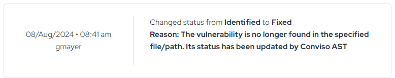

## Introduction

**Conviso AST** (Application Security Testing) is the Conviso security scanner that analyzes your source code, dependencies, infrastructure definitions, and container images, then consolidates every finding into the **Vulnerability Management** module of the Conviso Platform.

It runs through a single `conviso` command that unifies every analysis engine behind one interface. Run it locally from your terminal for fast feedback, or drop it into any CI/CD pipeline so every push and pull request is scanned automatically.

**[At Conviso, we believe that AppSec goes beyond security tools, and we offer a comprehensive approach that includes consulting, training, and support services.](https://cta-service-cms2.hubspot.com/web-interactives/public/v1/track/redirect?encryptedPayload=AVxigLKtcWzoFbzpyImNNQsXC9S54LjJuklwM39zNd7hvSoR%2FVTX%2FXjNdqdcIIDaZwGiNwYii5hXwRR06puch8xINMyL3EXxTMuSG8Le9if9juV3u%2F%2BX%2FCKsCZN1tLpW39gGnNpiLedq%2BrrfmYxgh8G%2BTcRBEWaKasQ%3D&webInteractiveContentId=125788977029&portalId=5613826)**

## What Conviso AST analyzes

A single `conviso ast run` orchestrates the analyses below and sends the consolidated result to the Platform. Each category is handled by one Conviso engine, whose version is pinned by the Conviso AST image so results stay in parity with the Platform parsers.

| Analysis | Command | What it looks for |
| :--- | :--- | :--- |
| **SAST** | `conviso sast run` | Vulnerabilities in your own source code |
| **SCA** | `conviso sca run` | Known vulnerabilities in third-party dependencies |
| **IaC** | `conviso iac run` | Misconfigurations in infrastructure code |
| **SBOM** | `conviso sbom generate` | Full inventory of the components you ship |
| **Secret** | `conviso secret run` | Credentials and tokens committed to the repository |
| **Container** | `conviso container run` | OS-level vulnerabilities in container images |

:::note
`conviso ast run` runs **SAST, SCA, IaC, SBOM, and secret**. Container analysis is **not** part of it: it targets an image rather than the working tree, so it runs as its own step (`conviso container run <image>`).
:::

Results are **aggregated and deduplicated** before they reach the Platform, so you work from one clean, prioritized list instead of raw engine output. What survives flows into the **[Vulnerabilities](../../platform/vulnerabilities)** feature, where your team can triage, prioritize, and fix.

### False Positive Analysis

**[False Positive Analysis](../../ai-capabilities/false-positive-analysis.md)** runs **at the moment a finding is detected**, during the scan itself. A finding classified as a false positive is discarded there and never reaches the Platform — it does not become a vulnerability you have to triage and dismiss later.

The noise is filtered out before it ever reaches your backlog, so what you see on the asset is what is worth looking at.

### Supported languages (SAST)

SAST covers the following languages, backed by Conviso-managed rules:

<div style={{columns: '3', maxWidth: '600px'}}>

- Apex
- Bash / Shell
- C
- C#
- Clojure
- Go
- HTML
- Java
- JavaScript
- Kotlin
- OCaml
- PHP
- Python
- Ruby
- Rust
- Scala
- Solidity
- TypeScript
- VB6
- YAML

</div>

Language-agnostic rules also apply to files outside this list, so configuration and template files are still inspected.

### Custom rules

Beyond the Conviso-managed rules, you can add **your own rules** from the Platform, on the **Conviso AST configuration screen**. They are applied by the scan alongside the managed ones, with no change to your pipeline: the CLI fetches the active policy at the start of every run.

This is also where the managed rules are enabled, disabled, or set to blocking for an asset — the policy lives on the Platform, not in the repository.

## Prerequisites

| Requirement | Details |
| :--- | :--- |
| **API Key** | A Conviso Platform API Key to authenticate. See [Generate API Key](../../api/api-overview#generate-api-key). |
| **Git** | The scan runs against a Git working tree. Conviso AST reads the remote to resolve the asset and the branch to associate the findings with. |
| **Python** | **3.10 or newer** — the oldest release still under active support. It already ships inside the Conviso AST image. |
| **Docker** *(local runs only)* | A running Docker daemon, needed to run the image on your own machine. **Not required in CI/CD**, where the image is the job container and your CI runtime provides it. |

## Installation

Conviso AST is distributed as a Docker image. It carries the `conviso` command and every analysis engine at its pinned version, so a scan in your pipeline behaves exactly like a scan run by the Platform.

In **CI/CD**, you do not install anything: declare the image as the job container and call `conviso` directly. See [CI/CD integration](#cicd-integration).

To run it **locally**, pull the image:

```bash
docker pull convisoappsec/convisoast:latest
```

Verify it:

```bash
docker run --rm convisoappsec/convisoast:latest conviso --version
```

> Image on Docker Hub: [`convisoappsec/convisoast`](https://hub.docker.com/r/convisoappsec/convisoast)

### Keeping it up to date

We recommend always running the latest release so you pick up new engines, detection rules, and fixes automatically:

```bash
docker pull convisoappsec/convisoast:latest
```

:::tip Pinning versions
Use `:latest` for day-to-day scanning. Pin an explicit release tag only when you need fully reproducible runs. Conviso AST checks its own version at startup and fails when it falls behind the minimum the Platform accepts, so a pinned tag has to be refreshed periodically.
:::

## Authentication

Conviso AST authenticates to the Platform with an **API Key**. Generate it from the Conviso Platform (**Security Feed → Quick Actions → Generate API Key**) as described in [Generate API Key](../../api/api-overview#generate-api-key), then expose it to the `conviso` command:

```bash
export CONVISO_API_KEY="<your_api_key>"
```

If your API Key has access to **more than one company**, name the one the scan reports to — otherwise Conviso AST cannot tell which is the target:

```bash
export CONVISO_COMPANY_ID="<your_company_id>"
```

Alternatively, pass either value inline on any command:

```bash
conviso --api-key "<your_api_key>" ast run --company-id "<your_company_id>"
```

:::warning Keep your API Key secret
Never commit the key to source control. In CI/CD, store it as a **secret** / protected variable and inject it as `CONVISO_API_KEY`. See the [integration guides](../../integrations/integrations_intro) for platform-specific instructions.
:::

## Quick start

Run your first scan from the root of a Git repository:

```bash
docker run --rm \
  -v "$(pwd)":/workdir \
  -e CONVISO_API_KEY="$CONVISO_API_KEY" \
  convisoappsec/convisoast:latest \
  conviso ast run
```

The image's working directory is `/workdir`, so mounting your repository there makes it the target of the scan (`--repository-dir` defaults to the current directory). Add `-e CONVISO_COMPANY_ID="$CONVISO_COMPANY_ID"` when your API Key reaches more than one company.

On the first run for a repository, Conviso AST resolves — or creates — the matching **asset** on the Platform from your Git remote. When the scan finishes, the findings appear under that asset in the **[Vulnerabilities](../../platform/vulnerabilities)** module.

## Command reference

Every command follows the pattern `conviso <group> <action> [options]`. Use `--help` at any level to explore — `conviso --help` lists the commands and the environment they read, and `--help` on a command describes that command:

```bash
conviso --help
conviso ast --help
conviso container --help
```

### Scan options

Every scan command accepts the same set of options:

| Option | Description | Default |
| :--- | :--- | :--- |
| `-r`, `--repository-dir <dir>` | Directory to scan. | current directory |
| `-o`, `--output <file>` | Where to write the session result zip. | `output.zip` |
| `-b`, `--branch <name>` | Branch this scan covers. Overrides every automatic detection. | auto-detected |
| `--asset-id <id>` | Report to this asset, bypassing repository lookup and asset creation (env: `CONVISO_ASSET_ID`). | auto |
| `--company-id <id>` | Company the scan reports to (env: `CONVISO_COMPANY_ID`). | from environment |
| `--dry-run` | Run without writing to the Platform. See [Dry-Run mode](#dry-run-mode). | off |
| `-d`, `--debug` | Verbose output: execution flow, timeouts, and API responses. | off |
| `-h`, `--help` | Show the command's help. | — |

`conviso container run` adds `-i` / `--image_name`, and takes the image as a positional argument — see [`conviso container run`](#conviso-container-run) below.

`-k` / `--api-key` and `-u` / `--api-url` are also accepted, before the command, as an alternative to the environment variables:

```bash
conviso --api-key "<your_api_key>" ast run
```

An option this CLI does not know is dropped with a warning instead of failing the run, so a pipeline written for the previous CLI keeps scanning. See [Migrating from the previous CLI](#migrating-from-the-previous-cli).

### `conviso ast run`

The unified scan — runs SAST, SCA, IaC, SBOM, and secret analysis, then reports the consolidated result to the Platform.

```bash
conviso ast run
```

### `conviso sast run`

Static analysis of your source code.

```bash
conviso sast run
```

### `conviso sca run`

Software Composition Analysis of your dependency manifests (for example `package-lock.json`, `Gemfile.lock`, `requirements.txt`, `go.sum`, `pom.xml`).

```bash
conviso sca run --repository-dir .
```

### `conviso iac run`

Scans infrastructure-as-code (Terraform, CloudFormation, Kubernetes, and more) for security misconfigurations.

```bash
conviso iac run --repository-dir ./terraform
```

### `conviso sbom generate`

Generates the Software Bill of Materials for the project and sends it to your asset. It is also produced automatically by `conviso ast run`.

```bash
conviso sbom generate
```

See **[Conviso SBOM](../conviso-sbom/conviso-sbom.md)** for how to consume it on the Platform.

### `conviso secret run`

Scans the repository for credentials, tokens, and other secrets committed to the code.

```bash
conviso secret run
```

### `conviso container run`

Scans a container image for OS-level vulnerabilities. Pass the image reference as a positional argument, or through `-i` / `--image_name`:

```bash
conviso container run "alpine:3.19"
conviso container run --image_name "alpine:3.19"
```

Without an image the command prints its help and exits non-zero with `conviso: name the image to scan.` — it never scans the working tree by mistake. For the same reason `-r` / `--repository-dir` has no effect here: the target is the image.

**Where the image is read from** — the engine resolves it in one of two ways, and one of them has to work:

| The image is | What you need |
| :--- | :--- |
| Pullable from a registry (`alpine:3.19`, or your own registry) | Nothing. It is pulled during the scan; no Docker daemon involved. |
| Built or loaded locally, in this pipeline | A Docker daemon the scan can reach: mount `/var/run/docker.sock`, or set `DOCKER_HOST`. |

When neither applies, the scan stops with a message naming the image it could not reach.

For a full walkthrough — including building the image in-pipeline and scanning public images — see **[Scan Container with Conviso](../conviso-containers/conviso-containers.md)**.

### `conviso vulnerability assert-security-rules`

Evaluates a **Security Gate** against your findings and exits non-zero when the policy is breached — the mechanism used to block a pipeline on unacceptable risk. It runs as a **step of its own**, after the scan: a scan never fails the build on findings.

```bash
conviso vulnerability assert-security-rules
```

| Option | Description |
| :--- | :--- |
| `--rules-file` | Path to a local YAML rules file. If omitted, uses the rules configured on the Platform. |
| `-o`, `--output` | Write the gate result to a JSON file. |
| `-b`, `--branch` | Branch to evaluate. Defaults to the checked-out branch. |
| `--asset-id`, `--company-id` | Target selection. |
| `-r`, `--repository-dir` | Directory the asset is resolved from. Default: current directory. |

## Auto-closing resolved vulnerabilities

Conviso AST does not change your code. Instead, it automatically **closes** vulnerabilities on the Platform once they are no longer detected in a new scan.

This is the **default behavior** — there is nothing to enable. After fixing the code, simply re-run the scan:

```bash
conviso ast run
```

Any finding that is no longer present is moved to a **closed** status on the Platform, and re-opened automatically if it reappears in a later scan.

<div style={{textAlign: 'center' , maxWidth: '60%'}}>



</div>

## How the scan is routed

### Asset resolution

Conviso AST decides which asset receives the findings in this order:

1. **`--asset-id`** (or `CONVISO_ASSET_ID`) — an exact match, bypassing every lookup.
2. **`--asset-name`** (or `CONVISO_ASSET_NAME`) — **deprecated**, and only when given: the name outranks the asset the remote matches, and the scan warns when the two disagree. **It will be discontinued** — identify the asset with `--asset-id` (or `CONVISO_ASSET_ID`), which points at exactly one asset and never depends on a name staying unique.
3. **Git remote URL** — the remote is normalized (SSH rewritten to canonical HTTPS, credentials stripped, every Azure DevOps spelling reduced to one) and matched against the repository of each asset in your company.
4. **Creation** — when no asset matches, one is created from the repository name.

No manual configuration is required: run the scan from inside a directory with a valid Git remote.

### Branch detection

Findings are associated with a branch so the Platform can track their lifecycle. Detection follows a strict priority order:

1. **`-b` / `--branch`** — overrides everything else.
2. **CI environment variables**, in this order: `CONVISO_BRANCH`, `GITHUB_HEAD_REF`, `GITHUB_REF_NAME`, `CI_COMMIT_REF_NAME`, `BITBUCKET_BRANCH`, `SYSTEM_PULLREQUEST_SOURCEBRANCH`, `BUILD_SOURCEBRANCH`, `CIRCLE_BRANCH`, `BRANCH_NAME`.
3. **Local Git detection** — reads the checked-out branch, resolving detached `HEAD` states by exact commit match.
4. **No branch** — if detection fails entirely, the scan still runs and reports to the asset's main timeline.

Branch names are normalized before submission: whitespace is trimmed and a `refs/heads/` prefix is removed. A variable holding a ref that names no branch — `refs/pull/12/merge`, which Azure DevOps puts in `BUILD_SOURCEBRANCH` on pull-request builds — is skipped, and detection moves on to the next source.

## Environment variables

| Variable | Requirement | Default | Description |
| :--- | :--- | :--- | :--- |
| `CONVISO_API_KEY` | **Required** | — | Your Conviso Platform API Key. |
| `CONVISO_COMPANY_ID` | Conditional | — | The company the scan reports to. Required when your API Key has access to more than one company. |
| `CONVISO_API_URL` | Optional | `https://api.convisoappsec.com` | Base URL of your Conviso Platform instance. |
| `CONVISO_ASSET_ID` | Optional | — | Report to this asset, bypassing repository lookup and asset creation. `--asset-id` takes precedence. |
| `CONVISO_BRANCH` | Optional | — | Highest-priority CI variable for branch detection. |
| `BASELINE_REF` | Optional | — | Baseline branch ref for diff-aware scans: only what changed since it is analyzed. |
| `BASELINE_COMMIT` | Optional | — | Baseline commit hash for diff-aware scans. Takes precedence over `BASELINE_REF`. |
| `CONVISO_FINISH_TIMEOUT_SECS` | Optional | `900` | Maximum wait, in seconds, for the scan lifecycle to finish. |

:::note Legacy variable names
`CONVISO_APIKEY` is accepted as an alternate spelling of `CONVISO_API_KEY`. Variables prefixed with `FLOW_` (for example `FLOW_API_KEY`) are still read for backward compatibility, and each one logs a deprecation warning — rename them to their `CONVISO_` equivalents.
:::

## Dry-Run mode

**Dry-Run** runs the engines without any write to the Conviso Platform: no asset is created, no finding is uploaded, and no scan is registered. It is built for fast feedback during development — pre-commit hooks, local validation, or pipeline stages where you want results without touching the Platform.

Every scan command has a `dry-run` verb:

| Command | Scope |
| :--- | :--- |
| `conviso sast dry-run` | Source code vulnerabilities |
| `conviso sca dry-run` | Dependency vulnerabilities |
| `conviso iac dry-run` | Infrastructure misconfigurations |
| `conviso secret dry-run` | Committed secrets |
| `conviso sbom dry-run` | SBOM generation |
| `conviso container dry-run <image>` | Container image vulnerabilities |
| `conviso ast dry-run` | Every source scan above, combined |

```bash
# Every scanner, nothing sent to the Platform
conviso ast dry-run

# One category, writing the session result where you want it
conviso sast dry-run --output results.zip
```

Passing `--dry-run` to a `run` command does the same thing:

```bash
conviso ast run --dry-run
```

### Scanning only what changed

For pull-request feedback, set a baseline so only the changed code is analyzed:

```bash
export BASELINE_REF="origin/main"
conviso ast dry-run
```

## CI/CD integration

Conviso AST integrates with every major CI/CD platform — in most cases you run the exact same `conviso ast run` command inside the `convisoappsec/convisoast` container. Nothing has to be installed on the runner and no Docker daemon is needed: the image *is* the job container, and your CI runtime pulls it. The one case that does need Docker is `conviso container run` against an image your pipeline just built — see [`conviso container run`](#conviso-container-run).

The recommended setup is the **AST Orchestrator**: a single repository holds the pipeline, and Conviso triggers it whenever a pull request is merged on any mapped repository. Application repositories need no Conviso workflow at all.

- **[GitHub AST Orchestrator](../../integrations/github-ast-orchestrator.md)**
- **[GitLab AST Orchestrator](../../integrations/gitlab-ast-orchestrator.md)**
- **[Bitbucket AST Orchestrator](../../integrations/bitbucket-ast-orchestrator.md)**
- **[Azure DevOps AST Orchestrator](../../integrations/azure-devops-ast-orchestrator.md)**

To run the scanner from a pipeline you maintain yourself, see the platform guides under **[all integrations](../../integrations/integrations_intro)**.

Combine it with the **[Security Gate](../security-gate)** to block a pipeline based on severity, vulnerability count, or other policy criteria, and with an **[SBOM](../conviso-sbom/conviso-sbom.md)** — one is generated and sent to your asset on every `conviso ast run`.

## Troubleshooting

**Missing environment variables**
The scan aborts before the first engine runs when `CONVISO_API_KEY` is not set, or when your API Key reaches several companies and `CONVISO_COMPANY_ID` is not set. In CI/CD, confirm the secret is injected into **every** job that runs a scan, not only the first one.

**Authentication / `401` errors**
Confirm the API Key is valid and belongs to the same environment (production or staging) as the `CONVISO_API_URL` you are pointing at.

**Branch or repository URL detection fails**
Run the scan from inside a valid Git repository (`.git` present) with a configured remote (`git remote -v`). When the checkout belongs to another user — common in containers — Git refuses to read it; the image already sets `safe.directory`, but a custom image may need `git config --global --add safe.directory '*'`.

**Asset conflict / ambiguity error**
The repository URL belongs to an asset the API could not locate unambiguously. Check the asset on the Conviso Platform and set `CONVISO_ASSET_ID=<id>` to point directly at it.

**Cannot create the session directory**
The scan writes its working directory inside the scanned path. Mount the path writable, or point `-r` / `--repository-dir` at a writable copy of the code.

**Outdated version**
Conviso AST validates its version at startup and stops when it falls behind the minimum the Platform accepts. Pull `convisoappsec/convisoast:latest`.

## Support

If you have any questions or need assistance while using Conviso AST, feel free to contact our dedicated support team.
