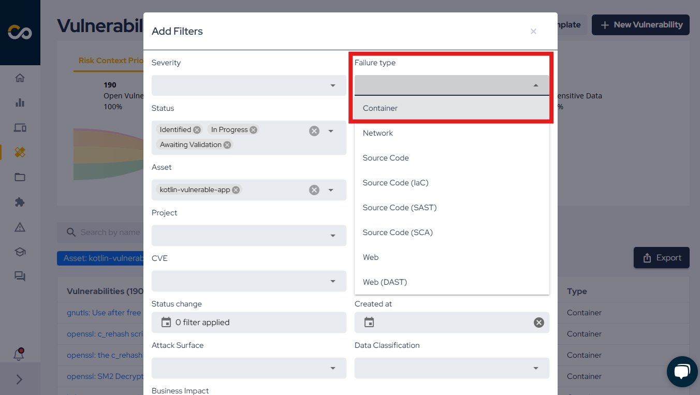

## Introduction

As modern software development increasingly relies on containers and images to streamline application deployment, it's essential to ensure that these containers are free from vulnerabilities and misconfigurations. Containers often include multiple layers, and with this complexity comes the risk that one or more of those layers may contain outdated or vulnerable components.

Scanning containers and images allows organizations to identify potential security risks, ensuring that applications remain secure and compliant throughout their lifecycle. By performing a container/image scan, organizations can:

1. **Identify Vulnerabilities**: Quickly detect vulnerabilities within the container image, including known CVEs (Common Vulnerabilities and Exposures) that may affect the application's runtime environment.

2. **Ensure Compliance**: Verify that the container’s components adhere to necessary licensing policies and that there are no conflicting or unapproved licenses within the image.

3. **Enhance Security Posture**: By proactively identifying issues before they reach production, container scanning helps to eliminate potential entry points for malicious attacks and reduces the attack surface of the application.

4. **Simplify Audits**: Container image scans provide detailed, actionable insights into the components, libraries, and dependencies within the image, streamlining the audit and review process.

5. **Improve Incident Response**: With real-time scanning and vulnerability reporting, you can quickly identify affected containers and take swift action to mitigate security threats or breaches.

Performing regular scans of your container images is vital for ensuring software security, reducing risks, and maintaining operational integrity. It helps organizations build trust by offering transparency into the contents and vulnerabilities of their containers.

You can always learn more in our blog:
- [How to increase the security of your container](https://blog.convisoappsec.com/en/how-to-increase-the-security-of-your-container/) to learn more about Container Security.

## Prerequisites

Before proceeding, ensure you have the following:

- [Conviso CLI Image](https://hub.docker.com/r/convisoappsec/convisocli/) \(for development or local testing environments, you can also install the Conviso CLI via [PyPI](https://pypi.org/project/conviso-cli/)\);
- A built container image available or a pulled public image.

## Running the Conviso Image Scan

To run the Conviso Image Scan, you first need to build the container image. The steps for building the image may vary depending on your environment, and the commands below are provided as examples of how this can be done:

```bash
export DOCKER_BUILDKIT=1
export IMAGE_NAME="my-image"
export IMAGE_TAG="latest"
docker build -t $IMAGE_NAME:$IMAGE_TAG .
conviso container run "$IMAGE_NAME:$IMAGE_TAG"
```

Alternatively, you can pull an existing public image from Docker Hub and run the scan on it directly, without building your own image. Here's how to pull and scan a public image:

```bash
export IMAGE_NAME="vulnerables/web-dvwa"
export IMAGE_TAG="latest"
docker pull ${IMAGE_NAME}:${IMAGE_TAG}
conviso container run "${IMAGE_NAME}:${IMAGE_TAG}"
```

:::note
These are only examples. You are required to provide the image for scanning, and you can use alternative methods based on your environment.

The `IMAGE_NAME` and `IMAGE_TAG` are variables that should be adjusted based on your project. For example, you may want to name the image after your project or version it differently.
:::

If you want to integrate the Image Scan into your CI/CD pipeline, follow the instructions in the respective integration guides:

- [Azure Pipelines Integration](../../integrations/azure-pipelines-cli.md#running-the-conviso-image-scan).
- [Azure Pipelines Graph Mode](../../integrations/azure-pipelines-graph.md#running-the-conviso-image-scan).
- [Bitbucket Pipelines](../../integrations/bitbucket-pipelines.md#running-the-conviso-image-scan).
- [GitHub Actions](../../integrations/github-actions.md#running-the-conviso-image-scan).
- [GitLab](../../integrations/gitlab.md#running-the-conviso-image-scan).

:::note
To obtain detailed insights from our image scans, we utilize Trivy, a robust tool that efficiently scans container images and filesystems for vulnerabilities.
:::

## How to View Container Vulnerabilities in Conviso Platform

When you run the command `conviso container run`, the identified vulnerabilities are automatically sent to the Conviso Platform. These vulnerabilities can be accessed as follows:

After completing the scan, navigate to the asset within the platform, where you'll find the `Open Vulnerabilities` field. Click `View All` to access the details:

<div style={{textAlign: 'center'}}>


</div>

On the vulnerabilities page, you can view all open vulnerabilities associated with the asset. To focus on container-specific vulnerabilities, use the filters, as illustrated below:

<div style={{textAlign: 'center'}}>


</div>

<div style={{textAlign: 'center'}}>



</div>

## Support

Should you have any questions or require assistance while using the Conviso SBOM feature at any stage of the process, feel free to contact our dedicated support team.

[](https://cta-service-cms2.hubspot.com/web-interactives/public/v1/track/redirect?encryptedPayload=AVxigLKtcWzoFbzpyImNNQsXC9S54LjJuklwM39zNd7hvSoR%2FVTX%2FXjNdqdcIIDaZwGiNwYii5hXwRR06puch8xINMyL3EXxTMuSG8Le9if9juV3u%2F%2BX%2FCKsCZN1tLpW39gGnNpiLedq%2BrrfmYxgh8G%2BTcRBEWaKasQ%3D&webInteractiveContentId=125788977029&portalId=5613826)