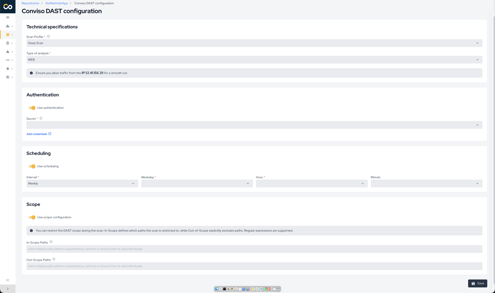
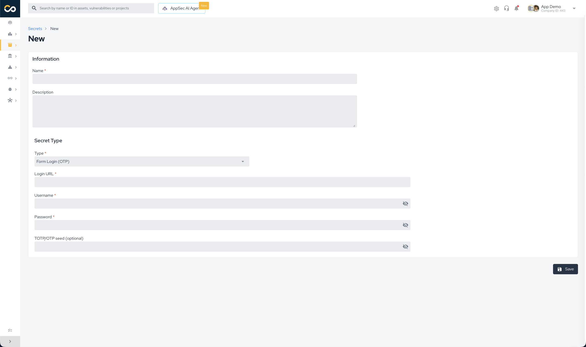

## Introduction

Scan and protect your application with Conviso DAST, consolidating all your vulnerabilities and risks in the Conviso Platform.

Conviso DAST (Dynamic Application Security Testing) analyzes your application **while it is running**, exactly as an attacker would see it — with no access to the source code. It automatically maps the application's attack surface, sends real attacks against it, and reports the confirmed vulnerabilities directly into the Conviso Platform, each with the evidence needed to reproduce and fix it.

:::note
Conviso DAST can be run self-hosted on your local pipeline. Instructions and further information on self-hosting are available on the [Conviso DAST page at Dockerhub](https://hub.docker.com/r/convisoappsec/convisodast).
:::

## Capabilities

Conviso DAST combines several techniques into a single automated scan.

### Attack surface discovery

Before testing, the DAST maps everything it can reach:

- **Automated crawling** of links and forms across the application.
- **JavaScript-aware crawling** with a real browser engine — it fully renders and interacts with modern **single-page applications (SPAs)** (React, Angular, Vue, and similar), following client-side navigation and submitting forms so that dynamically loaded pages are reached.
- **Endpoint recovery from client-side code** — extracts API routes referenced inside the application's JavaScript, recovering endpoints that never appear as static links.
- **Historical reconnaissance** — discovers previously known URLs of the target from public sources.
- **Hidden parameter discovery** — detects undocumented parameters that expand the testable surface (a common blind spot on modern APIs).

### Vulnerability testing

- **Passive analysis** — inspects every response for security misconfigurations, insecure or missing security headers, insecure cookies, information disclosure, and session-handling issues, without sending any attack. Safe to run against production.
- **Active analysis** — sends crafted payloads to detect issues such as SQL/NoSQL injection, OS command injection, server-side template injection, cross-site scripting (reflected and DOM-based), path traversal, insecure HTTP methods, and more.
- **Out-of-band (OOB) detection** — catches **blind** vulnerabilities that produce no visible response, such as blind SSRF and blind injection, by observing out-of-band interactions triggered by the payloads.
- Broad, continuously updated rule coverage, mapped to **CWE** and the **OWASP Top 10**.

### AI / LLM endpoint testing

When the target exposes an **AI / LLM endpoint** (chat or completion style), the DAST additionally tests it against the **OWASP LLM Top 10** — including prompt injection, jailbreak, and sensitive-information disclosure.

### API testing

Point the DAST at an API definition (**OpenAPI/Swagger**, **GraphQL**, or **SOAP**) and it imports every operation — including request bodies — so the full API surface is exercised, not just what a crawler can reach. When no definition is provided, the DAST can also auto-discover common specification endpoints.

### Authenticated testing

Most real risk lives behind the login. Conviso DAST can scan **authenticated areas** using either static credentials or an interactive browser login, including multi-step and single sign-on (SSO) flows and **multi-factor authentication (OTP/TOTP)**. See [Authentication](#authentication).

### Evidence and consolidation

Every finding ships with the **real HTTP request and response** that proves it, plus severity, CWE, description, remediation guidance, and references. Results are automatically **deduplicated** and consolidated in the Conviso Platform, and a vulnerability that is no longer present is **automatically closed** on the next scan.

## Quick Start

The scan is configured on the asset's **CI/CD** tab (see [Running a scan](#running-a-scan)). The settings below are available.

### Scan profiles

The **Scan Profile** controls how deep and how aggressive the analysis is. Choose it based on where the target runs and how much load it can take.

| Profile | What it does | Intrusiveness | Recommended for |
| --- | --- | --- | --- |
| **Basic** | Passive-only checks. Maps the application and inspects responses; sends no attacks. | Non-intrusive — **safe for production**. Fastest. | Quick, low-risk checks and production targets. |
| **Balanced** *(recommended)* | Passive analysis **plus** active testing at **medium** attack strength, with JavaScript-aware crawling. | WAF-safe; moderate load and duration. | The default choice for most applications. |
| **Deep Scan** | The most **comprehensive** and aggressive analysis: intensive JavaScript crawling with form interaction, active testing at **high** strength with a lower alerting threshold (maximum coverage), optional out-of-band detection, and longer time budgets. | Most intrusive and longest-running. | Staging / pre-production, when maximum coverage matters. |

:::tip
Start with **Balanced** for a new target. Move to **Deep Scan** in a non-production environment when you want the widest possible coverage.
:::

### Analysis types

When configuring the scan, choose the **Type of analysis**:

- **Web** — for web applications and SPAs. The DAST crawls and actively tests the rendered application.
- **API** — for APIs. Provide the **API format** (**OpenAPI**, **GraphQL**, or **SOAP**) and the location of the API definition. The DAST imports the definition and tests each operation, including request bodies.

### Authentication

If your application requires login to reach protected areas, configure authentication so the DAST scans **as an authenticated user**. Without it, only the public surface is tested.

Two families of authentication are supported:

**1. Static credentials** — a fixed secret is attached to **every request** the DAST sends. Best for token / API-key based applications. Available methods:

| Method | You provide |
| --- | --- |
| **Basic Auth** | Username and password |
| **Bearer Token** | A token value (sent as `Authorization: Bearer …`) |
| **Custom Header** | A header name and value |
| **Cookie** | A cookie name and value |
| **Query Parameter** | A parameter name and value appended to requests |

**2. Interactive (form) login** — the DAST drives a **real browser** through your login screen, so it works with dynamic SPA logins, multi-step screens, and SSO. You provide:

- The **login page URL**
- The **username** and **password**
- *(optional)* A **multi-factor (OTP/TOTP) secret** — when your login requires a one-time code, provide the TOTP seed and the DAST generates valid codes automatically during login.

### Scope Definition *(optional)*

Restrict what the DAST is allowed to reach using **include** and **exclude** URL patterns (regular expressions), relative to the asset URL:

- **In scope** — only URLs matching these patterns are scanned.
- **Out of scope** — URLs matching these patterns are never scanned (for example, logout, destructive actions, or third-party areas).

The DAST also automatically keeps your own cloud backends in scope while leaving third-party and managed services out.

### Scheduling *(optional)*

Define when the DAST runs automatically — **monthly** or **weekly** — choosing the day and the execution time (in **GMT-3**). You can also run a scan on demand at any time with **Run Now**.

### Understanding the results

1. The scan details page displays comprehensive information about the execution:

- **Target URL**: The URL that was scanned
- **Scanned URLs**: Which URLs were analyzed during the scan
- **Total Vulnerabilities**: The total number of vulnerabilities found
- **New Vulnerabilities**: The number of newly discovered vulnerabilities
- **Fixed Vulnerabilities**: The number of vulnerabilities that were resolved since the last scan
- **Execution Time**: The date and time when the scan was executed
- **Duration**: How long the scan took to complete
- **Execution Logs**: Detailed logs of the scan execution process

You can also generate a detailed report of the scan execution from this page clicking on **Generate report** button.

:::note
When the vulnerability is fixed, running the next scan should identify it, and then change the vulnerability status to "Fixed" automatically.
:::

With the above, you should be able to run DAST on the Conviso Platform.

## Support

Should you have any questions or require assistance while using the Conviso Application Security Testing, feel free to contact our dedicated support team.
