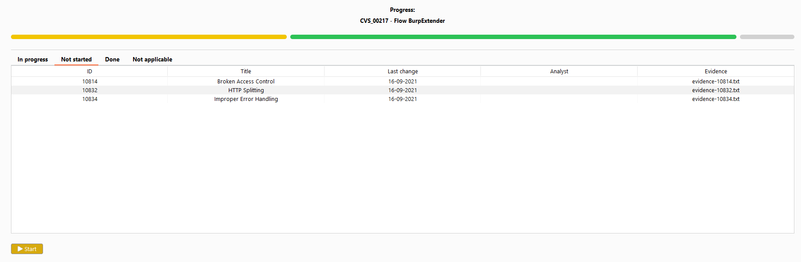
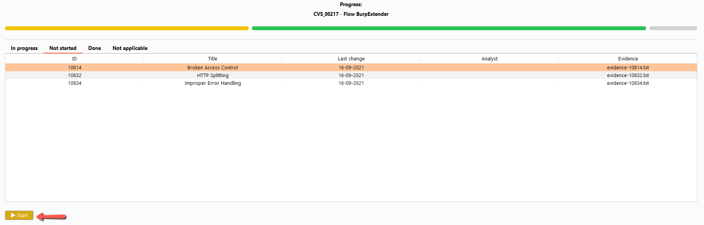
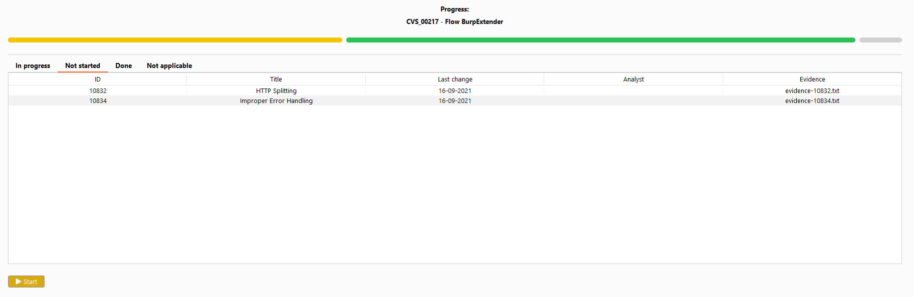

This tab is usually used to start **one or more** activity(ies). It can also be used to view which activities haven't been started yet.

### **1.** 

### **2.** 

### **3.** 
After the click on **start** the activity is removed from this tab, and now can be found at the **in progress** tab.

