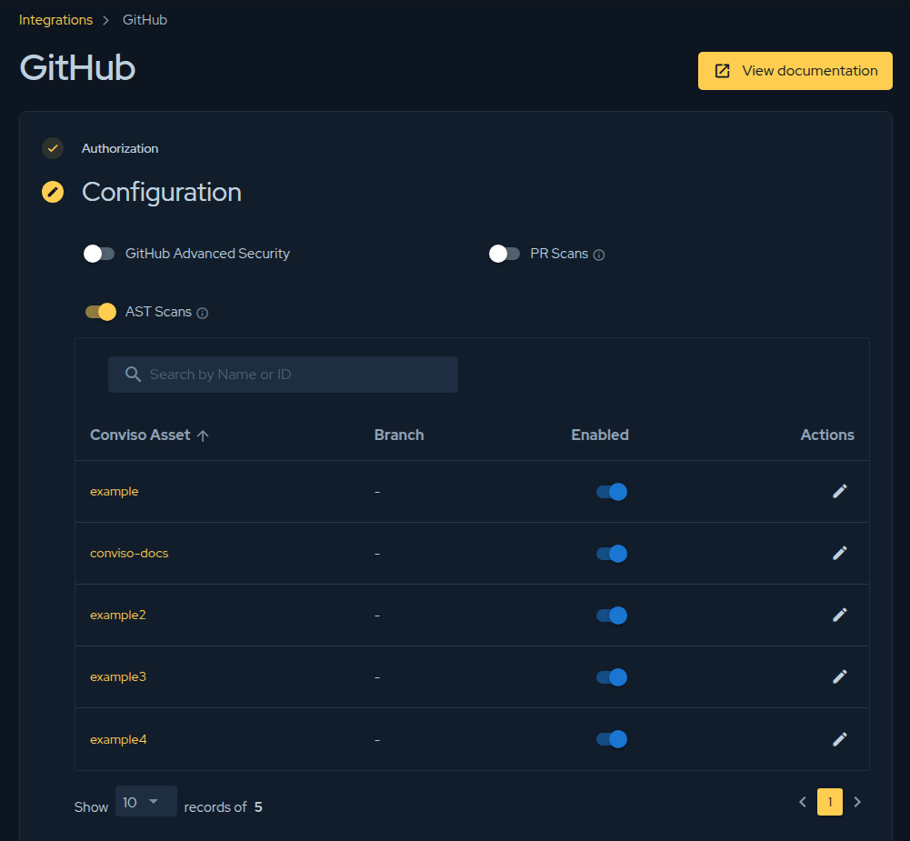

## Introduction

Securing your application starts at the earliest stages of the software development lifecycle (SDLC). By analyzing code changes before they are merged into the main branch, teams can identify and fix security vulnerabilities, insecure coding practices, and other potential risks before they impact production.

**Pull Request (PR) Scanning** is a core capability within the Conviso Platform designed to embrace the "Shift-Left" security methodology. It automatically inspects only the modified lines of code in a Pull Request, providing developers with rapid, actionable feedback directly within their familiar code review environments.

## The Importance of PR Scanning

Integrating security into the Pull Request process offers several critical advantages:
- **Instant Feedback:** Developers receive immediate alerts on the code they just wrote, when the context is still fresh in their minds.
- **Preventative Security:** Vulnerabilities are blocked from ever reaching the main branch or production environment.
- **Efficiency:** Differential scanning (analyzing only changed files) is significantly faster than running full repository scans, ensuring that CI/CD pipelines are not delayed.
- **Developer Enablement:** Security becomes an organic part of the code review process. Actionable remediation advice is provided exactly where developers collaborate.

## How Pull Request Scanning Works

Unlike traditional, time-consuming full scans, PR Scanning leverages differential analysis. The process is fully automated and follows this general workflow:

1. **Trigger:** A developer opens a new Pull Request or pushes new commits to an existing one.
2. **Detection:** The Conviso Platform automatically detects the event via the configured integration.
3. **Differential Scan:** The scanning engine isolates and analyzes **only the modified files** introduced by the PR.
4. **Feedback & Review:** The findings are reported back directly to the Pull Request as comments or status checks. This includes detailed information about the vulnerability, the exact line of code, and how to fix it.
5. **Remediation:** The developer pushes a fix, which automatically triggers a re-scan. Once clear, the PR can be safely merged.

## Supported Integrations

The Conviso Platform seamlessly integrates with major Application Lifecycle Management (ALM) and version control systems to provide native PR Scanning experiences.

### GitHub Integration

By integrating with GitHub, you can enable zero-configuration Automated PR Scanning. When activated, Conviso automatically reports findings as comments directly on the GitHub PR timeline, acting as an automated security reviewer. 

To enable this, navigate to the GitHub Integration settings in the Conviso Platform and toggle the **PR Scans** option.

For detailed instructions on configuring this feature, refer to the [Automated PR Scanning for GitHub](../../integrations/github-pr-scans) documentation.

### Azure DevOps Integration

Similar to GitHub, the Conviso Platform integrates with Azure DevOps to provide PR scanning capabilities within your Azure Repos. By configuring the integration, Azure DevOps pipelines can trigger differential scans on Pull Requests, ensuring that any code merged into your protected branches meets your organization's security standards.

For more information on setting up Azure DevOps, please refer to the [Azure DevOps Integration](../../integrations/azure-devops) documentation.

## Best Practices for PR Scanning

To get the most out of PR Scanning, consider the following best practices:

- **Enforce Branch Protection:** Configure your repository settings (e.g., GitHub Branch Protection Rules or Azure DevOps Branch Policies) to require the Conviso Security Check to pass before a Pull Request can be merged.
- **Address Findings Promptly:** Encourage developers to treat security findings as critical bugs that must be resolved prior to merge.
- **Combine with Full Scans:** While PR Scanning is excellent for rapid feedback on incremental changes, it should be complemented by scheduled, full-repository scans (using [Conviso AST](../conviso-ast/conviso-ast)) to ensure comprehensive coverage.

## Support

If you need assistance configuring Pull Request scanning or have questions about how to optimize your integration workflow, please contact our support team.
