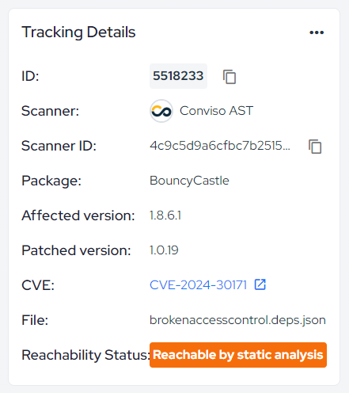
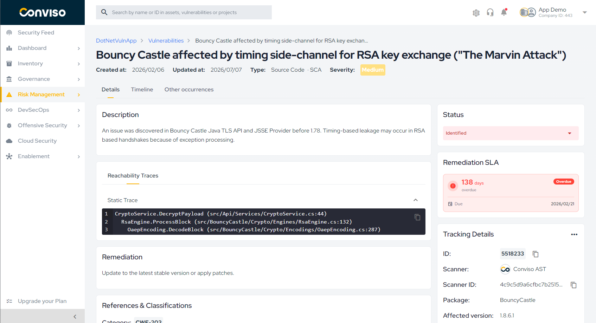
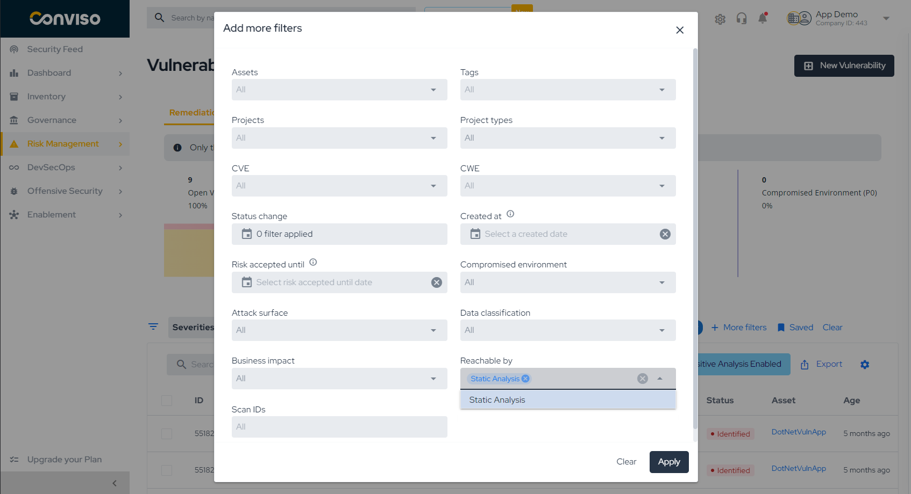

## Overview

**Reachability Analysis** helps you prioritize Software Composition Analysis (SCA) findings by determining whether the vulnerable function of a dependency is actually **reachable** from your application code.

A dependency can have a critical CVE without your application ever calling the affected function. Reachability Analysis adds this missing context automatically, so teams can focus remediation effort on vulnerabilities that represent real risk instead of triaging every CVE with the same priority.

Conviso builds a **call graph** of your application, a map of every function and every call between functions, extracted directly from the source code. For each SCA finding, Conviso checks whether **any path exists in the call graph** leading to the vulnerable function. If a path is found, the finding is marked as **Reachable by static analysis**, along with the specific call chain (file, function, and line for each hop) as evidence.

This runs automatically in the background for eligible assets.

## Eligibility

An asset is automatically picked up for Reachability Analysis when:

* The **SCA** scan type is enabled for the asset.
* Conviso has access to the asset's source code via a connected Git integration.

Reachability results are recalculated as new commits and new SCA findings are detected, so the status and trace shown in the Platform reflect the most recently analyzed code.

### Supported Languages

Call graph generation currently supports: **Ruby, Python, JavaScript, Java, Kotlin, and Go**.

If an asset uses a language outside this list, its SCA findings remain visible as usual, but reachability status is not computed for them.

## Viewing Reachability Results in the Platform

### Reachability Status

On the vulnerability detail page, SCA findings display a **Reachability Status** badge with one of the following values:

* **Undetermined**: no path to the vulnerable function was found.
* **Reachable by static analysis**: a call path was found in the codebase.

<div style={{textAlign: 'center'}}>



</div>

### Reachability Traces

When a finding is marked reachable, a **Reachability Traces** tab becomes available on the vulnerability detail page. It shows the call trace as a sequence of hops (`function_name (file_path:line)`), so you can review exactly how the vulnerable function is reached in your code.

<div style={{textAlign: 'center'}}>



</div>

### Filtering by Reachability

The vulnerability list can be filtered by **Reachable by > Static Analysis**. Use this filter to quickly surface the SCA findings that represent confirmed risk and deprioritize the rest of your backlog.

<div style={{textAlign: 'center'}}>



</div>

## Programmatic Access via GraphQL

Reachability data is available on `ScaFinding.detail` for custom integrations and dashboards:

```graphql
query VulnerabilityReachability($id: ID!) {
  vulnerability(id: $id) {
    title
    ... on ScaFinding {
      detail {
        cve
        package
        affectedVersion
        reachabilityAnalysis {
          staticReachable
          staticLastAnalysisTime
        }
      }
    }
  }
}
```

Notes:

* `staticReachable` is a boolean indicating whether a call path to the vulnerable function was found.
* `staticLastAnalysisTime` indicates when the analysis last ran for that finding.
* The call trace itself (`staticTrace`) is available on the same `reachabilityAnalysis` object and is best fetched on demand, since it can be large for deep call chains.

## Support

If you have any questions or need help understanding Reachability Analysis results, please don't hesitate to contact our [support team](mailto:support@convisoappsec.com).
