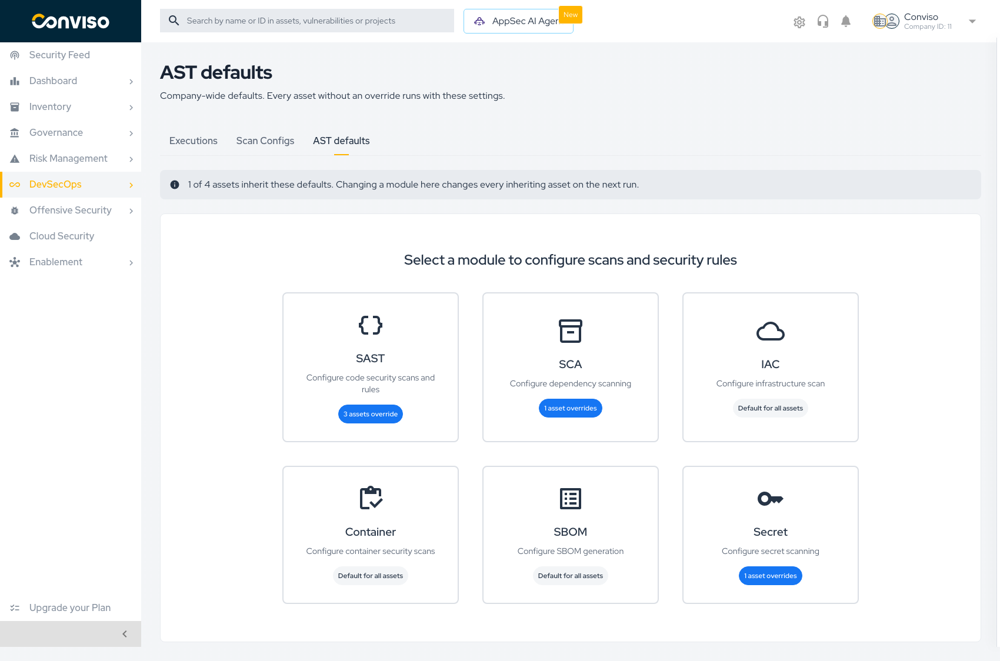
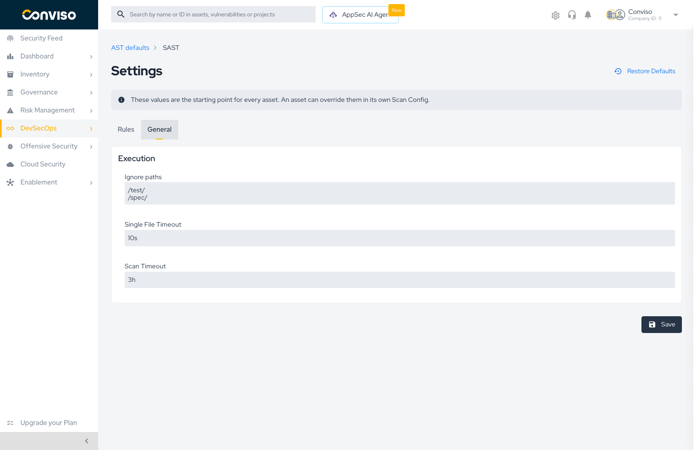
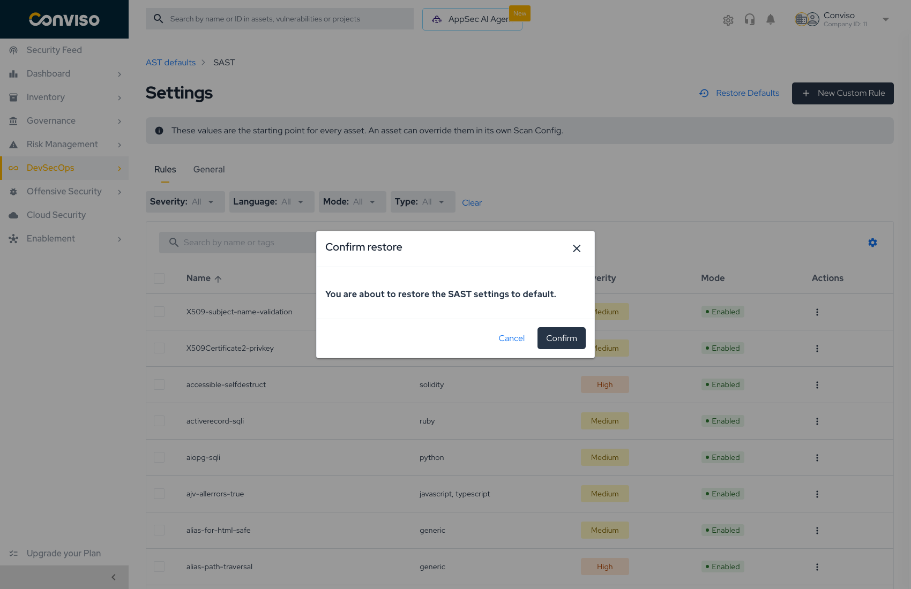
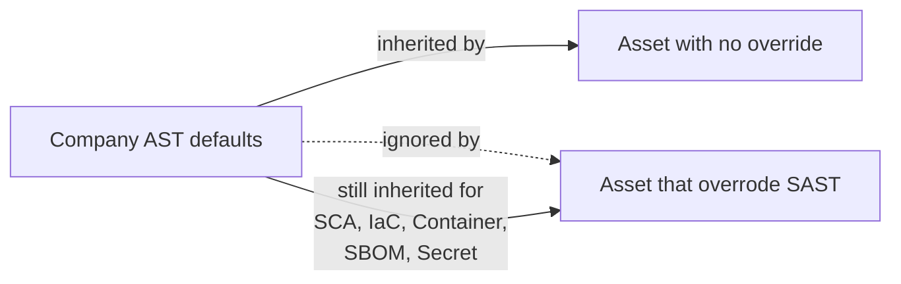

# AST Defaults

**AST defaults** is the company-wide baseline for AST. Every asset that has not overridden a module runs that module with these settings — so a change here reaches every inheriting asset on its next run, without touching a single asset configuration.

Open it from **DevSecOps → AST**, or from the **AST defaults** tab inside the Scans context.

## Reading the screen

### The inheritance banner

The banner states the blast radius of anything you change:

> *0 of 3 assets inherit these defaults. Changing a module here changes every inheriting asset on the next run.*

Read it before editing. If it says every asset inherits, a change here is a company-wide change.

### The module cards

Six cards, one per module. Each card carries a badge describing how the company currently uses it:

| Badge | Meaning |
| :--- | :--- |
| **Default for all assets** | No asset overrides this module. Everything runs the baseline |
| **N assets override** | `N` assets carry their own settings for this module and will **not** see changes you make here |

The badge is a warning as much as a count. A module showing *3 assets override* means those three assets are already detached — editing the default will not reach them.

## Editing a module

Click a card to open that module's settings.

A banner at the top restates the scope:

> *These values are the starting point for every asset. An asset can override them in its own Scan Config.*

Modules expose two tabs where applicable:

| Tab | Contents |
| :--- | :--- |
| **Rules** | The rule catalog — enable, disable, and create rules. SAST only. See **[AST Rules](./ast-rules.md)** |
| **General** | Execution settings for the module |

### General settings

| Setting | What it controls |
| :--- | :--- |
| **Ignore paths** | Paths the scanner skips entirely — vendored code, build output, fixtures |
| **Single File Timeout** | How long the scanner may spend on one file before moving on |
| **Scan Timeout** | Ceiling for the whole module run |

Press **Save** to write the module. Nothing is applied until you save.

:::tip
**Ignore paths** is the highest-leverage setting on this screen. Excluding `node_modules`, `vendor`, and generated code cuts scan time and removes findings you were never going to fix — and it applies to every inheriting asset at once.
:::

### Restoring defaults

**Restore Defaults** discards your company customizations for that module and returns it to the values Conviso ships.

A confirmation dialog names the module before anything is discarded:

> *You are about to restore the SAST settings to default.*

:::caution
Restore applies to the **module you are viewing**, at the company level. Every rule you enabled or disabled and every General setting you tuned for that module is discarded. Asset-level overrides are untouched — they were never following the company values in the first place. There is no undo.
:::

## How defaults interact with overrides

Inheritance is resolved **per module**. An asset that overrode SAST keeps following the company defaults for every other module. That is why the badge counts are per module rather than per asset.

## When to change defaults instead of an asset

| Situation | Where to change it |
| :--- | :--- |
| A rule produces noise across the whole company | **AST defaults** |
| Every repository shares an ignore path (`vendor/`, `dist/`) | **AST defaults** |
| One monorepo needs a longer scan timeout | The asset's Scan Config |
| A release branch needs stricter rules than the rest | A branch execution profile |

## Related

- **[Scan Configs Overview](./scan-configs.md)** — the three-level inheritance model
- **[AST Rules](./ast-rules.md)** — the rule catalog in detail
- **[Creating Scan Configs](./creating-scan-configs.md)** — overriding a module for one asset
