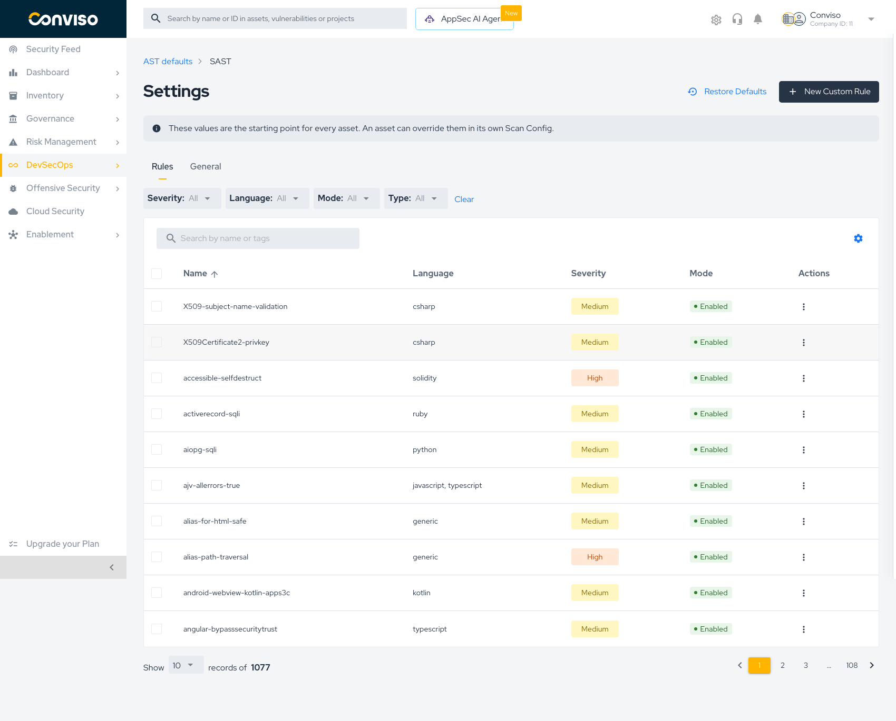
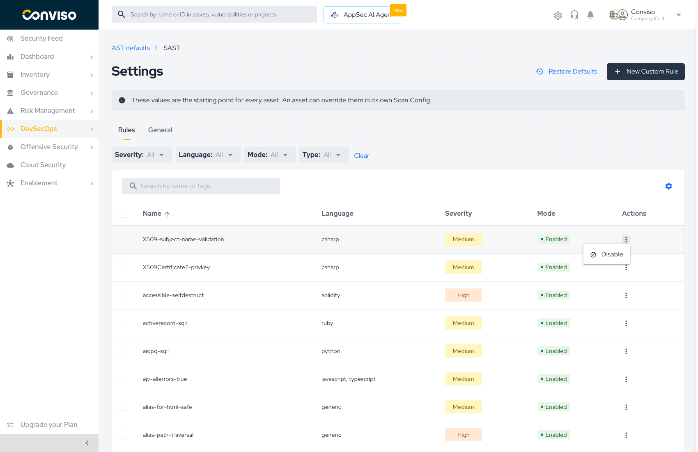
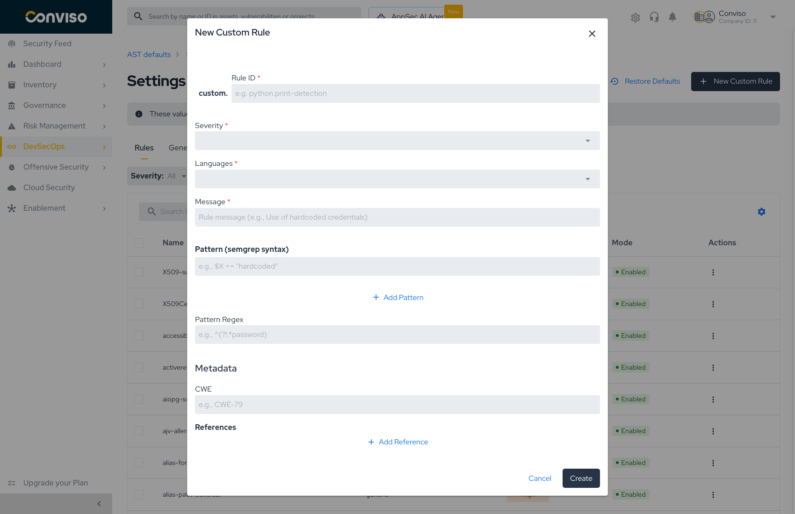

# AST Rules

The **Rules** tab is the SAST rule catalog. It is where you decide which rules run, silence the ones that do not fit your codebase, and add rules of your own.

Reach it from **AST defaults → SAST** for the company baseline, or from a Scan Config's **SAST → Configure** panel to override the catalog for one asset.

## Reading the catalog

| Column | Meaning |
| :--- | :--- |
| **Name** | Rule identifier, e.g. `alias-path-traversal` |
| **Language** | Languages the rule applies to. Some rules are `generic` and match any file |
| **Severity** | `Critical`, `High`, `Medium`, `Low`, or `Info` — the severity a finding gets |
| **Mode** | `Enabled` or `Disabled` — whether the rule runs |
| **Actions** | Per-rule menu |

The catalog is large — over a thousand rules ship by default — so it is paginated. Use the search box (**Search by name or tags**) and the filters rather than scrolling.

### Filters

Four dropdowns narrow the list, and **Clear** resets them all:

| Filter | Use it to |
| :--- | :--- |
| **Severity** | Focus on the severities you actually gate on |
| **Language** | Show only rules relevant to your stack |
| **Mode** | Audit what you have already disabled, or confirm what is enabled |
| **Type** | Separate Conviso-managed rules from your custom ones |

:::tip
Filtering by **Mode → Disabled** is the fastest way to review the silencing decisions your team accumulated. Rules disabled during an incident and never revisited are a common blind spot.
:::

## Enabling and disabling a rule

Every rule row carries an **Actions** menu (`⋮`) with the action that applies to its current state.

| Action | Available when | Effect |
| :--- | :--- | :--- |
| **Disable** | The rule is `Enabled` | The rule stops running. Existing findings are not deleted |
| **Enable** | The rule is `Disabled` | The rule runs again on the next scan |
| **Delete** | The rule is a custom rule | Removes the rule permanently |

Rule mode is saved **as you change it**, for the configuration you are editing — there is no separate Save step for the Rules tab. A banner on the screen states this explicitly.

:::note
Disabling a rule affects **future scans**. Findings already reported stay in Vulnerability Management until they are triaged there. Silencing a rule is not a way to close findings.
:::

### Bulk changes

Each row has a checkbox, and the header checkbox selects the whole page. With rules selected, apply **Enable** or **Disable** to all of them at once.

This is the practical way to act on a filter: filter by language or severity, select all, and disable in one step — for example, silencing every `Info` rule for a language you only vendor.

:::caution
Bulk selection applies to the **currently filtered page**. Change the filter or the page before applying, and you act on a different set than you intended. Confirm the filter still reads what you expect before pressing the action.
:::

## Creating a custom rule

Press **New Custom Rule** to open the editor.

### Identification

| Field | Required | Notes |
| :--- | :--- | :--- |
| **Rule ID** | Yes | Automatically prefixed with `custom.` — you supply the rest, e.g. `python.print-detection`. Use a stable, descriptive id; it appears on every finding |
| **Severity** | Yes | The severity findings from this rule receive. This is what your Security Gate thresholds compare against |
| **Languages** | Yes | Which languages the rule is evaluated against. Scoping it narrowly keeps scan time down and avoids false matches |
| **Message** | Yes | The text shown on the finding, e.g. *Use of hardcoded credentials*. Write it for the developer who will read it in a pull request |

### Detection logic

A rule matches through patterns. You can combine both mechanisms:

| Field | Syntax | Use for |
| :--- | :--- | :--- |
| **Pattern** | semgrep | Structural matches that understand code, e.g. `$X == "hardcoded"` |
| **Pattern Regex** | regular expression | Textual matches, e.g. `^(?!.*password)` |

**Add Pattern** appends more patterns to the same rule. Multiple patterns broaden what the rule catches.

:::tip
Prefer a **semgrep pattern** over a regex whenever the thing you are matching is code. Semgrep understands syntax, so `$X == "secret"` matches regardless of whitespace, variable names, or formatting — a regex for the same idea will drift out of date with your codebase.
:::

### Metadata

| Field | Notes |
| :--- | :--- |
| **CWE** | The CWE identifier, e.g. `CWE-79`. Feeds classification and compliance reporting |
| **References** | Links backing the rule — advisories, internal standards, documentation. **Add Reference** appends more |
| **Short description** | One line explaining what the rule looks for |

Filling CWE is worth the extra few seconds: it is what lets custom findings appear alongside managed ones in classification views and compliance reports, instead of sitting in an *uncategorized* bucket.

Press **Create** to save the rule. It appears in the catalog immediately, marked as a custom rule by the **Type** filter, and runs on the next scan.

### Where a custom rule lives

A custom rule belongs to the configuration you created it in:

- Created under **AST defaults** → available to every asset that inherits SAST.
- Created inside an **asset's Scan Config** → that asset overrides SAST, and the rule applies to that asset only.

## Restoring the catalog

**Restore Defaults** discards every rule customization for the module you are viewing and returns the catalog to what Conviso ships.

:::caution
Restore discards **every enable/disable decision and every custom rule** for that module at that level. There is no undo. Before restoring a catalog your team has curated over time, export or record the disabled list — filter by **Mode → Disabled** to see it.
:::

## A practical workflow

1. Run a scan with the defaults and see what comes back.
2. Filter the findings that are noise for your codebase, and **disable** those rules at the **company defaults** level — noise is rarely specific to one repository.
3. Where one asset genuinely differs, **override SAST** in that asset's Scan Config instead of bending the company baseline.
4. Add **custom rules** for the patterns your team cares about that no managed rule covers — internal APIs, deprecated helpers, forbidden imports.
5. Revisit **Mode → Disabled** periodically so temporary silencing does not become permanent.

## Related

- **[AST Defaults](./ast-defaults.md)** — the company baseline and the General settings
- **[Creating Scan Configs](./creating-scan-configs.md)** — overriding a module for one asset
- **[Running Scans](./running-scans.md)** — putting the configuration to work
