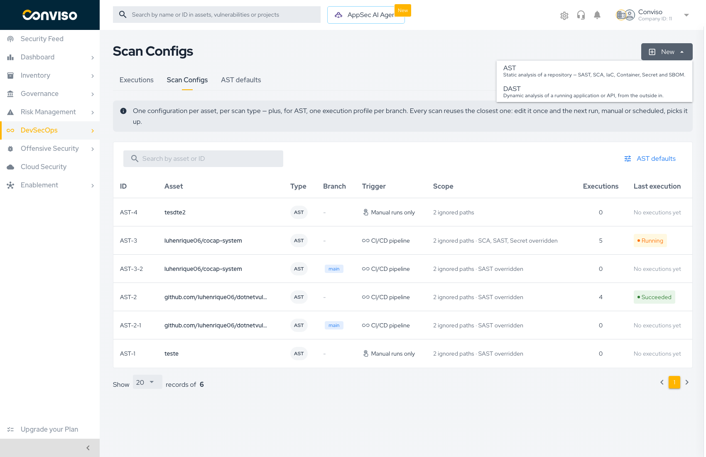
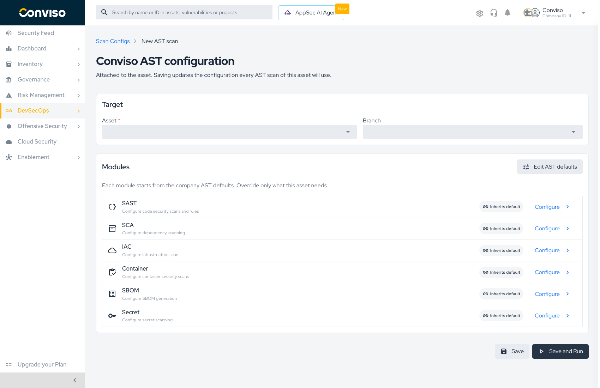
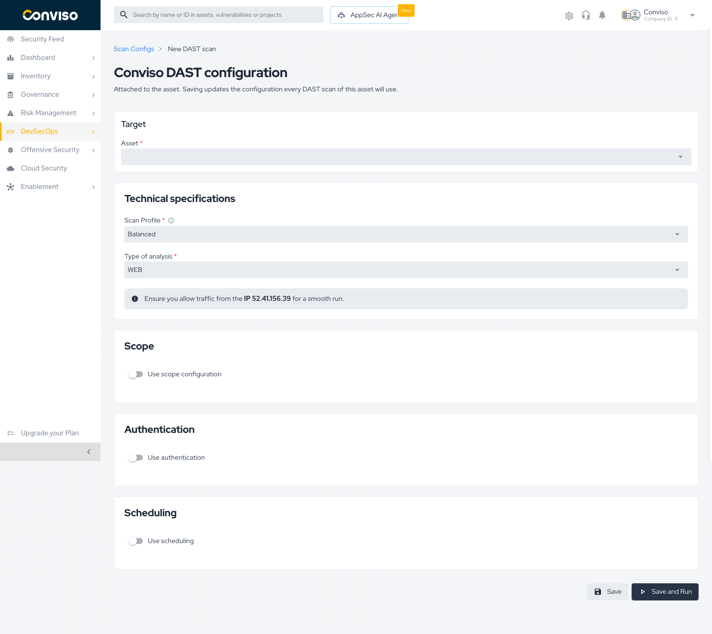
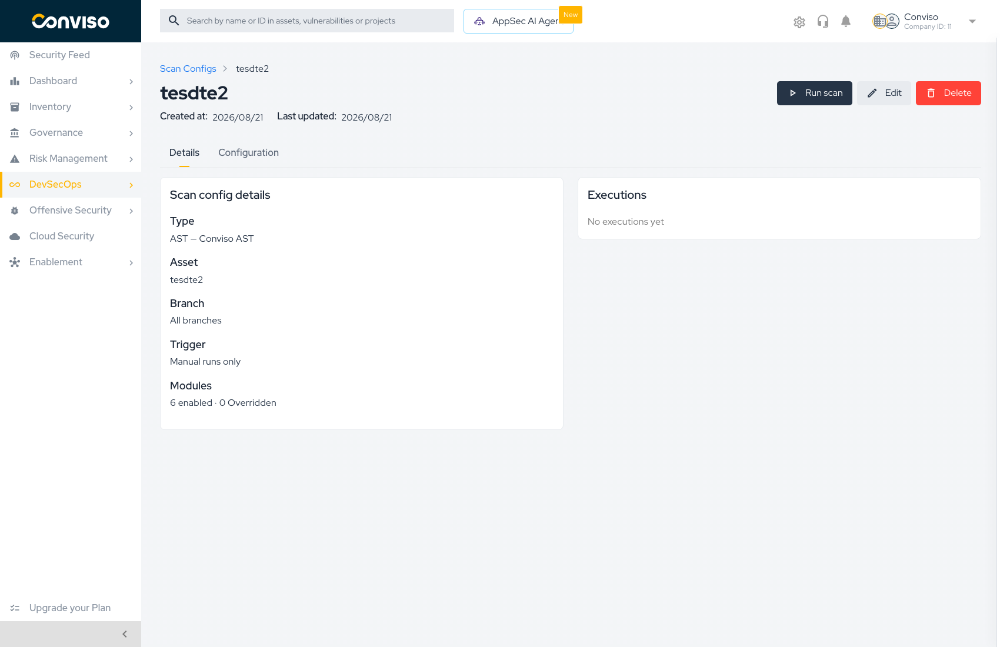

# Creating Scan Configs

A scan configuration is created from the **Scan Configs** tab. The same form is used to create a new configuration and to edit an existing one — the breadcrumb tells you which mode you are in (*New AST scan* vs. *Edit*).

## Starting a new configuration

Open **DevSecOps → AST → Scan Configs** and press **New**. The dropdown offers one entry per scan type:

| Option | Engine | Use when |
| :--- | :--- | :--- |
| **AST** | Conviso AST | Static analysis of a repository — SAST, SCA, IaC, Container, Secret, and SBOM |
| **DAST** | Conviso DAST | Dynamic analysis of a running application or API, from the outside in |

## Creating an AST configuration

### Target

| Field | Required | Notes |
| :--- | :--- | :--- |
| **Asset** | Yes | The asset this configuration attaches to. Only repository assets can run AST |
| **Branch** | No | Leave empty to configure the asset for **every** branch. Pick a branch to create a **branch execution profile** that applies to that branch alone |

Choosing a branch is what separates the two kinds of AST configuration:

- **No branch** → the asset-level configuration. Every branch without a profile of its own inherits it.
- **A branch** → a branch execution profile. It overrides the asset-level configuration for that branch only, and appears in the list as a separate row (`AST-3-2`) with the branch shown in the **Branch** column.

:::tip
Create the asset-level configuration first, then add branch profiles only where a branch genuinely needs different treatment. A profile you never diverge from is a row you have to maintain for no benefit.
:::

### Modules

Each of the six modules shows its current state and a **Configure** link:

- **Inherits default** — the module is still linked to the company AST defaults. A change to the defaults reaches this asset on its next run.
- **Overridden** — the module carries its own settings for this asset, and no longer follows the defaults.

Pressing **Configure** opens that module's settings beside the form, so whatever you already selected on this page survives the edit. Overriding is what the act of saving inside the panel does — modules you never open stay inherited.

**Edit AST defaults** (top right) jumps to the company baseline. Use it when the change you are about to make should apply to every asset, not just this one.

### Saving

| Button | Behavior |
| :--- | :--- |
| **Save** | Writes the configuration and returns to the Scan Configs list |
| **Save and Run** | Writes the configuration, then immediately starts a scan with it |

**Save and Run** never fires a scan on a configuration that failed to save. If the write fails, you stay on the form with the error and no scan is triggered. See **[Running Scans](./running-scans.md)** for what happens after the scan starts.

## Creating a DAST configuration

### Target

| Field | Required | Notes |
| :--- | :--- | :--- |
| **Asset** | Yes | The asset whose URL will be scanned |

### Technical specifications

| Field | Notes |
| :--- | :--- |
| **Scan Profile** | Trade-off between depth and duration. *Balanced* is the default |
| **Type of analysis** | `WEB` for a web application, or an API format when scanning an API |
| **API schema** | For API analysis, supply the schema by URL or by uploading the specification file |

:::caution
DAST runs from Conviso infrastructure. Allow traffic from the IP shown on the form (**52.41.156.39**) or the scan will not reach your application.
:::

### Scope

Scope restricts what the scanner is allowed to touch:

- **In-scope paths** — only these paths are scanned.
- **Out-of-scope paths** — these paths are never scanned.

Leave scope off to scan the whole target.

### Authentication

Point the configuration at a stored secret so the scanner can authenticate and reach pages behind login. Without it, DAST only sees what an anonymous visitor sees.

### Schedule

Enabling scheduling turns the configuration's trigger into **Scheduled** and the Platform runs it on the chosen interval, weekday, and time. With scheduling off, the configuration is **Manual runs only** and runs when you press **Run scan**.

## Viewing, editing, and deleting

Clicking a row in the Scan Configs list opens the configuration.

The **Details** tab summarizes what will run:

| Field | Example |
| :--- | :--- |
| **Type** | `AST — Conviso AST` |
| **Asset** | The asset name |
| **Branch** | The branch name, or *All branches* |
| **Trigger** | `Manual runs only` |
| **Modules** | `6 enabled · 0 Overridden` |
| **Executions** | The runs that used this configuration |

The **Configuration** tab shows the resolved settings — what each module will actually use once inheritance is applied.

Three actions sit in the header:

| Action | Effect |
| :--- | :--- |
| **Run scan** | Starts a scan now using this configuration |
| **Edit** | Reopens the form |
| **Delete** | Removes the configuration |

:::caution
Deleting an **asset configuration** also removes the branch profiles derived from it — those profiles only exist as overrides of the asset-level row. Every affected branch falls back to the company AST defaults on its next run.
:::

## Related

- **[Scan Configs Overview](./scan-configs.md)** — the inheritance model
- **[AST Defaults](./ast-defaults.md)** — the company baseline these configurations inherit from
- **[AST Rules](./ast-rules.md)** — configuring SAST rules inside a module
